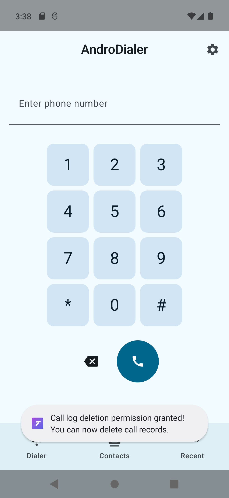
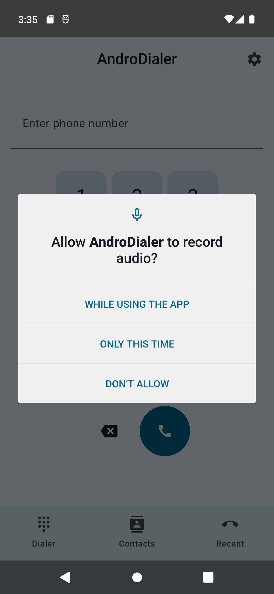
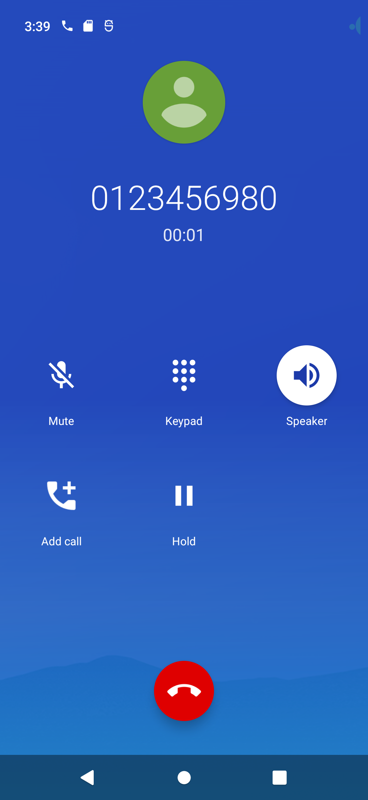
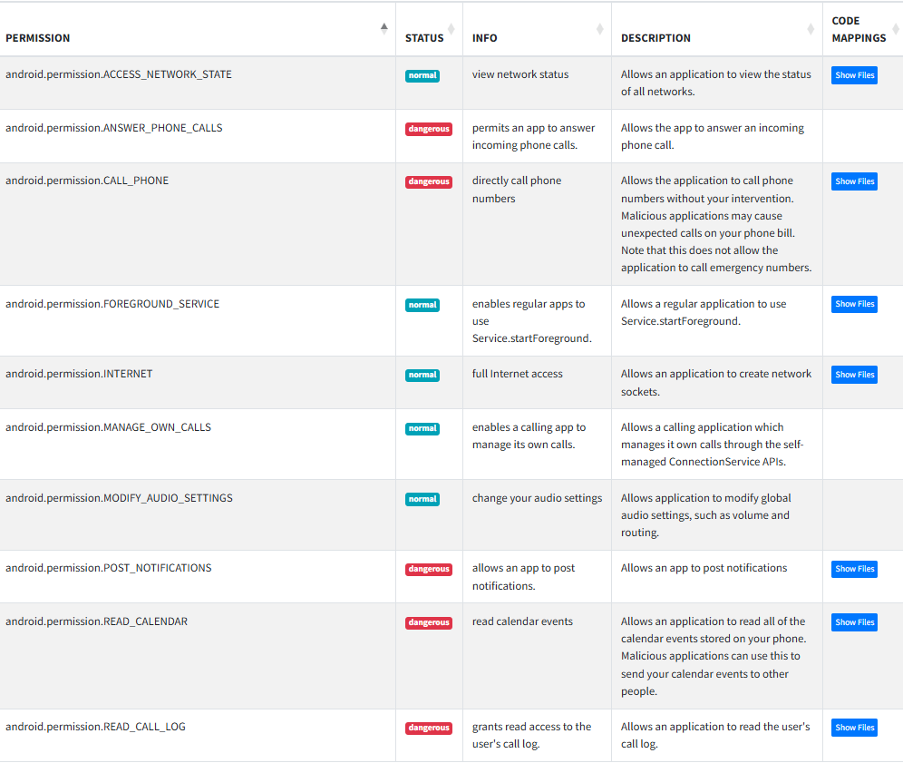

# Objective

Create a malicious application that exploits the AndroDialer application to initiate unauthorized phone calls to arbitrary numbers without the victim's knowledge or consent.

Successfully completing this challenge demonstrates a critical security vulnerability that could lead to financial fraud, privacy violations, and compromised communications security for AndroDialer users.

## The app's functionality

customizable quick‑dial widgets, and a “Business Focus” mode that filters interruptions so you stay in control of every conversation. AndroDialer delivers in‑depth call analytics to help you spot communication trends, plus enhanced security features.

# Reconnaissance

I started by installing the app to see how the UI looks like and works. Firsty, the app requests for *record audio*, *phone call logs*, *contacts*, *make and manage phone calls*,  permissions

After granting all the permissions I see this Dialer screen: 

I can indeed make calls via the app but I noticed that this is still managed by the native android phone dialler app: 

Through the app, ytou see a list of all yopur contacts and all the calls you make are additionally listed on the **Recents** tab. You can also filter by the phone number or bny the missed, incoming and outgoing calls. 

Additionally I can launch the messaging app from AndroDialer which launches the messaging app.

Setting a Focus Schedule from the Settings does seem to be scheduling an alarm. 

There is a privacy policy that launches wikipidia page

## Decompilation and Static Analysis

Next, I decompiled the app using both MobSf and GrapeFruit. I see that the permissions requested by the app are dangerous if hijacked by malicious applications.

