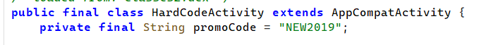
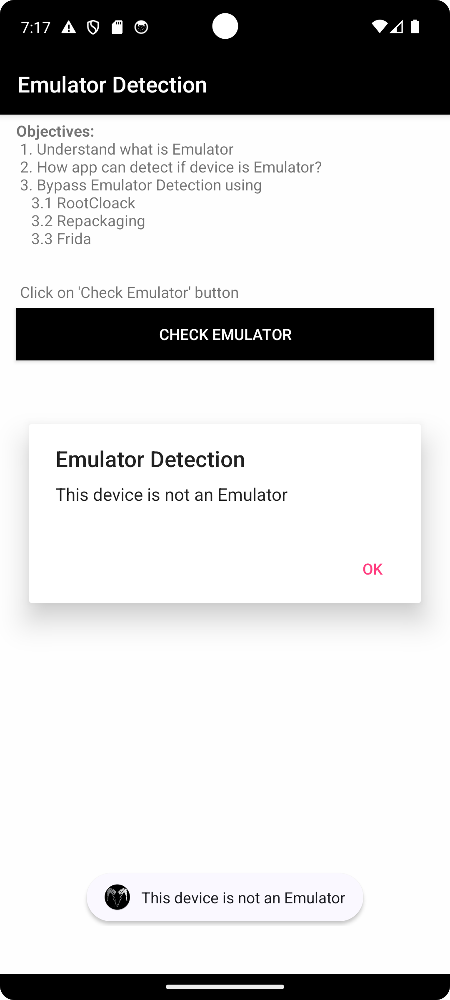
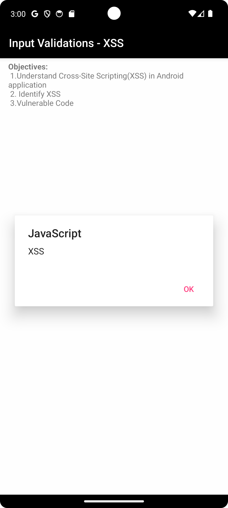
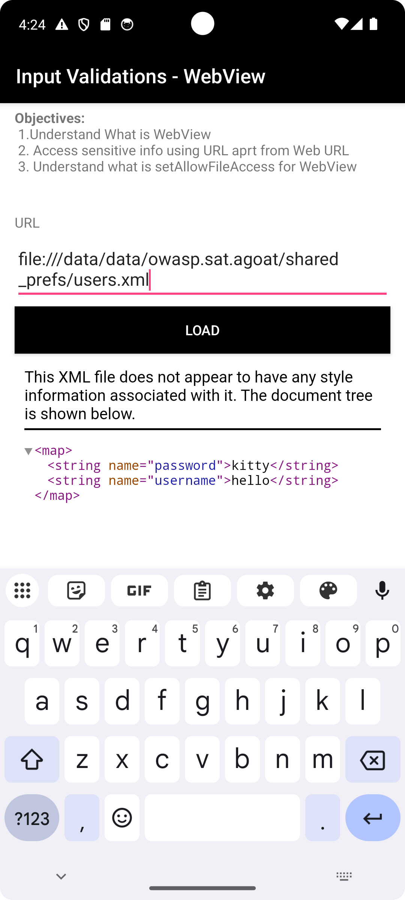
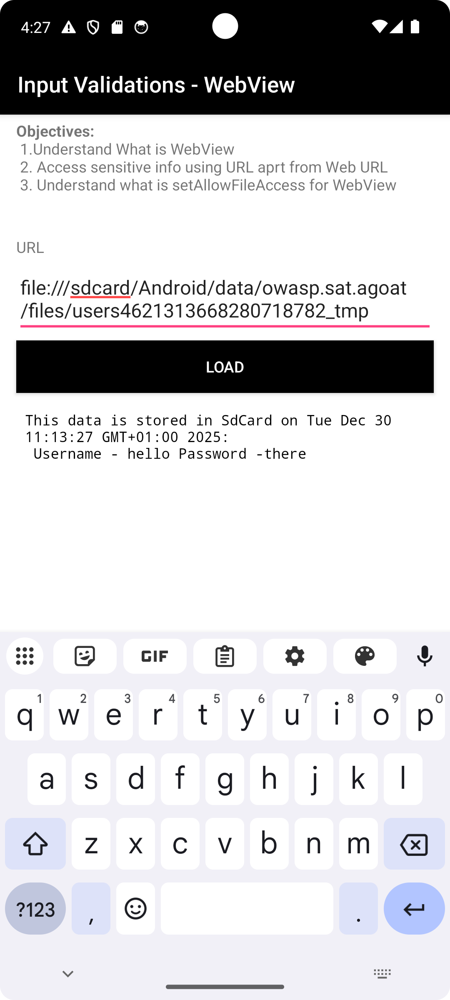

# Android Pentesting

To sharpen my skills, I recently took a deep dive into AndroGoat—a deliberately insecure Android application designed to showcase the most common OWASP Mobile Top 10 vulnerabilities.

In this post, I’ll walk through how I combined both static and dynamic analysis to uncover hardcoded secrets, bypass security checks with Frida, and extract sensitive data from local storage.

My pentesting toolkit:

My pentesting tookit included:

- **Jadx-GUI**: For decompiling and reading Java/Kotlin source code.

- The Android Debug Bridge (adb)**: The "command line" for interacting with the emulator on android studio.

- **Frida**: For dynamic instrumentation. Instrumentation is the art of imjecting new functionality to the application at runtime e.g adding logs, bypassing certain conditional checks e.g check if the device running the app is an emulator etc.

- **MobSF & APKLeaks**: For automated static analysis of the apk.

- **Burp Suite**: To intercept network traffic.

## Reconnaissance with MobSF
I started my recon by first uploading the androgoat apk to [MobSF](https://mobsf.live/). This gave me a high-level overview of the attack surface before I started manual testing. Through MobSF,I was able to verify several high-risk strings:

- **Hardcodes Secrets** including *AWS Credentials* and *OpenAI Key*: Found in the resource strings and app logic.

- Sensitive Information is getting logged

- **SQL Injection**

- **Debug Mode**: The `android:debuggable` flag is set to true.

- **Weak Cryptographic Algorithm** MD5 weak algorithm is used to hash pins and passwords.


## 1. Hardcoded Secrets (High)

I found multiple static credentials in the APK. Because APKs are just ZIPs, anyone can unzip or decompile and steal these keys; obfuscation does not protect them. The exposed OpenAI and AWS keys could be abused for data access and cloud spend.

**How I uncovered them**
1) Manual static review in Jadx: Searched for strings like "key" and "secret" and saw the OpenAI key that automated tools missed. 
2) Automation with [apkleaks](https://github.com/dwisiswant0/apkleaks): Flagged the same OpenAI key and the AWS secret:
    - `abcdef1234567890abcdef1234567890abcdef12` (OpenAI API key)
    - `OviCwsFNWeoCSDKl3ZoD8j4BPnc1kCsfV+lOABCw` (AWS Secret Access Key)
    
3) Cross-check in MobSF: Its Secrets report listed the same tokens in resources/config, confirming they are truly embedded:

```
The following secrets were identified from the app. Ensure that these are not secrets or private information.
-abcdef1234567890abcdef1234567890abcdef12
258EAFA5-E914-47DA-95CA-C5AB0DC85B11
sha256/5gsjyidrmWjcLRClfCk+Dd6O0nx1CyFrVUW5wVkwEx0=
OviCwsFNWeoCSDKl3ZoD8j4BPnc1kCsfV+lOABCw
sha256/mEflZT5enoR1FuXLgYYGqnVEoZvmf9c2bVBpiOjYQ0c=
```

**How to Reproduce**
- Decompile with Jadx; search for `apiKey`, `secret`, `Bearer`, `AWS` across code and resources. 
- Run `apkleaks -f androgoat.apk` to enumerate obvious tokens.
- Upload the APK to MobSF and open the Secrets section to verify what’s embedded.

**Fix**
- Do not ship secrets in the APK. Fetch them at runtime from a backend over TLS and gate with authentication/authorization.
- Rotate the exposed OpenAI and AWS keys immediately; assume compromise.
- Add automated secret scanning tools like **gitleaks** or **trufflehog** in CI before signing and shipping the APK to help detect is there are secrets in the codebase.

---

## 2. Root and Emulator Detection

### Root detection

A **rooted device** has a modified system that allows the user and apps to execute commands as the root;  **su**.

**Why apps care**: Banking and security apps block rooted devices because if a device is rooted, the fundamental security sandbox is compromised. Malware with root access could theoretically read the banking app's memory or keys.

Root detection is done by checking if the device running the application can see the `su` binary, then you must be root E.G.

```
String[] file = {"/system/app/Superuser/Superuser.apk", "/system/app/Superuser.apk", "/sbin/su", "/system/bin/su", "/system/xbin/su", "/data/local/xbin/su", "/data/local/bin/su", "/system/sd/xbin/su", "/system/bin/failsafe/su", "/data/local/su", "/su/bin/su", "re.robv.android.xposed.installer-1.apk", "/data/app/eu.chainfire.supersu-1/base.apk"};
        boolean result = false;
        for (String files : file) {
            File f = new File(files);
            result = f.exists();
            if (result) {
                break;
            }
```

Despite the check being there, I am still able to bypass this filter check on a rooted android emulator (one that ships with Google APIs and not Google playstore).

Google APIs emulator images allow adb‑root and writable partitions but do not include a `su` binary. Any root‑detection logic that relies solely on checking for `su` will incorrectly conclude that the device is not rooted, even though the environment is privileged thus the check will always return false. 

This is why you need to also add an emulator check.

### Emulator Detection

The app grabs almost every identifying string from the Android OS and mashes them into one long string variable called `buildDetails` and then checks for any words associated with emulators e.g `generic`, `sdk`, `genymotion`, `x86`, `emulator` etc


**Bypassing this with Frida**:

Inject code that always returns False when the `isEmulator` function is called.

```java
Java.perform(function () {
    // 1. Target the specific Activity class
    var EmulatorDetection = Java.use("owasp.sat.agoat.EmulatorDetectionActivity");

    // 2. Overwrite the isEmulator function
    EmulatorDetection.isEmulator.implementation = function () {
        // 3. Force return false
        return false;
    };
});
```

I was able to successfully bypass this check:



```Java
private final boolean isEmulator() {
        String buildDetails = (Build.FINGERPRINT + Build.DEVICE + Build.MODEL + Build.BRAND + Build.PRODUCT + Build.MANUFACTURER + Build.HARDWARE).toLowerCase();
        Intrinsics.checkNotNullExpressionValue(buildDetails, "this as java.lang.String).toLowerCase()");
        return StringsKt.contains$default((CharSequence) buildDetails, (CharSequence) "generic", false, 2, (Object) null) || StringsKt.contains$default((CharSequence) buildDetails, (CharSequence) EnvironmentCompat.MEDIA_UNKNOWN, false, 2, (Object) null) || StringsKt.contains$default((CharSequence) buildDetails, (CharSequence) "emulator", false, 2, (Object) null) || StringsKt.contains$default((CharSequence) buildDetails, (CharSequence) "sdk", false, 2, (Object) null) || StringsKt.contains$default((CharSequence) buildDetails, (CharSequence) "vbox", false, 2, (Object) null) || StringsKt.contains$default((CharSequence) buildDetails, (CharSequence) "genymotion", false, 2, (Object) null) || StringsKt.contains$default((CharSequence) buildDetails, (CharSequence) "x86", false, 2, (Object) null) || StringsKt.contains$default((CharSequence) buildDetails, (CharSequence) "goldfish", false, 2, (Object) null) || StringsKt.contains$default((CharSequence) buildDetails, (CharSequence) "test-keys", false, 2, (Object) null);
    }

```

###  Recommendations

**1. Robust Device Integrity**

* **Defense in Depth**: Treat root and emulator checks as **hardening only**, not as a primary security control. Back‑end authorization and server‑side controls must not trust these checks.
* **Enhanced Root Detection**: If you still want stronger detection, use multiple root indicators instead of a single `su` path list. This includes:
* Mount options and build tags.
* Known root apps and writable system paths.
* SELinux state and dangerous system properties.


* **Multi-Factor Emulator Detection**: Complement string‑based emulator checks with:
* **Sensor anomalies**: Identifying a lack of GPS or accelerometer patterns.
* **Telephony inconsistencies**: Checking for IMEI/SIM anomalies.
* **Environment checks**: Searching for emulator‑specific files and properties.


* **Attestation Services**: Consider using **Google Play Integrity API** (or SafetyNet Attestation) to get a server‑validated signal of device integrity.

**2. Runtime Protection**

* **Anti-Instrumentation**: Increase resistance against dynamic instrumentation:
* **Obfuscation**: Obfuscate critical classes and methods, including your `isEmulator` and root check logic.
* **Anti-Hooking**: Add basic anti‑debugging and anti‑hooking checks (e.g., Frida detection, debugger presence, and tamper checks on `Build.*` values).

---

## 3. android:debuggable

In a real app, `android:debuggable` should be false in the release manifest and controlled via Gradle build types, so only debug builds are debuggable and the Play Store APK ships with debugging disabled.

Setting it to `true` lowers the attackers difficulty in learning how the app works or pausing the app and modifying the code while the app is running a dn recompiling it with additional vulnerability. 

**GOAL:** Prevents dynamic analysis tools from hooking and manipulating the app.

## 4. Insecure Data Storage

In AndroGoat, the same sensitive information (usernames and passwords) is written to multiple storage locations on the device: Shared Preferences, SQLite databases, temporary files and even external storage. None of these locations are encrypted. This means that anyone who can get filesystem access (stolen device, rooted device, `adb/run-as`, or a malicious app with storage permissions) can trivially dump and read these values without needing to break any cryptographic algorithms.

### Shared Preferences

The app stores the username and password in `user.xml` under `/data/data/owasp.sat.agoat/shared_prefs`. This file is just an XML key/value store. On a normal (non‑rooted) device it is only readable by the app’s UID, but:

- On a rooted device or emulator, I can simply `cat` this file or pull it off the device.
- With `run-as owasp.sat.agoat` (and `android:debuggable=true`), I can also access it from `adb` without full root.

So even though Shared Preferences feels like a “private” store, it is not secure enough for raw credentials.


### SQLite
Android apps use SQLite for structured data storage (similar to a standard SQL database).

**The Vulnerability**: Standard SQLite databases are not encrypted. If an attacker gains access to the device (physically or via malware with root access), they can copy the .db file and read all contents.

The same problem appears again in the SQLite database under `/data/data/owasp.sat.agoat/databases`. SQLite gives you structure, not security. By default there is no encryption on the `.db` file, so once I have a copy of that file I can open it in DB Browser for SQLite and read all user records in clear text.

In this app, I was able to export the database directory and see all stored usernames and passwords immediately, without any brute‑forcing or reversing.


### Temp File

The application is also writing temporary files under `/data/data/owasp.sat.agoat`. Temp files are often forgotten by developers, but from an attacker’s point of view they are just another place to look for credentials or session data. If these files are not securely deleted, they can survive longer than intended and become an easy loot bag on a rooted device.

### Extrenal Storage / SDCARD

Since we have defined the `READ_EXTERNAL_STORAGE` in the manifest, we can read from external storage. Upon checking the sdcard location of our app, I do see the tmp file with the credentials: `/sdcard/Android/data/owasp.sat.agoat/files`. Finally, the app leaks credentials into external storage under this path.

External storage is shared space: any other app with `READ_EXTERNAL_STORAGE` (or broad storage access on older Android versions) can read these files. So at this point, a low‑privileged malicious app installed on the same device can read the tmp file with credentials, without needing root at all.

### Recommendations

For a real app, the safer pattern is:

- Avoid storing raw passwords or long‑lived secrets on disk at all. Store only what you absolutely need (for example short‑lived access tokens instead of credentials).
- If you need to persist sensitive data, use Android’s `EncryptedSharedPreferences` or a similar wrapper instead of plain XML, and use an encrypted database solution (or store only hashed values with a strong KDF and salt) rather than a clear‑text SQLite file.
- Do not write credentials to temporary files. If a temp file is unavoidable, keep it in internal cache and delete it immediately after use.
- Never write secrets to external storage / SD card. Treat external storage as untrusted and world‑readable. If you must store something there, encrypt it first with a key held in the Android Keystore and never store the key next to the data.

---

## 5. Input Validations
The "Golden Rule" of OWASP is that client-side validation is for user experience, but server-side validation is for security. AndroGoat deliberately breaks this rule in a few places: SQL queries are built by string concatenation, HTML is rendered without sanitisation, and WebView is allowed to load almost anything the user types. This makes it very easy to turn normal user input into executable code on the device.
### 1. SQL Injection

Happens because the app takes user input and processes that as code by directly concatenating it into a SQLite database query. Content Providers are most prone to SQL Injection since this data is shared with all the apps e.g contacts. Successful compromise of the SQLite dbs leads to corruption, deletion or exfiltration of data. 

Bypassed by: `' OR '1'='1` OR `' OR 1=1 --` and the vulnerable piece of code is here: `String qry = "SELECT * FROM users WHERE username='" + ((Object) $username.getText()) + "'";` because we are appending unsanitised user input to the SQL query by string concatenation


In practice this means I can log in as any user I want, or dump large parts of the users table, without knowing a valid password.

#### Solution:

Use prepared statements / parameterised queries when passing user input into SQLite so that the input is always treated as data and not as part of the SQL syntax.


### 2. XSS 
XSS allows an attacker to execute arbitrary JavaScript code in the context of the WebView. Successful exploitation of this vulnerability may allow a remote attacker to steal potentially sensitive information, change appearance of a web page, perform phishing and drive-by-download attacks.

Source of the vulnerability: `webSettings.setJavaScriptEnabled(true);`. By default, Android WebView does not execute JavaScript. Explicitly setting this to true allows the script tags inside the HTML content to run.

Compromise using the Javascript input:  

### 3. Webview

Can be caused by **Unvalidated, Unrestricted WebView URL Loading** using:

```
webViewSettings.setJavaScriptEnabled(true); //1
webViewSettings.setAllowFileAccess(true); //2
webViewSettings.setAllowContentAccess(true);
webViewSettings.setAllowFileAccessFromFileURLs(true); //3
setAllowUniversalAccessFromFileURLs(true);
String url = $urlEditText.getText().toString();
$webView.loadUrl(url); //4
    }


```
The code above allows for an attacker to do the following:
1. This allows for Cross-Site Scripting (XSS) if the user loads a malicious page.
2. **Local File Inclusion**: Allows the WebView to access the Android file system using the `file://` scheme. e.g `file:///data/data/owasp.sat.agoat/shared_prefs/`

E.G Dump shared preferences:


3. Allows JavaScript running in a file scheme context (e.g., `file:///sdcard/exploit.html`)
webViewSettings.

E.G.



4. Disables the Same-Origin Policy (SOP) for file schemes. It allows a script running in a local file to make requests to any origin (including the internet or other local files) and read the response.

The app is loading the user input directly into the WebView without any validations, with universal file access enabled.

### Recommendations

- Validate and sanitise all user input on the server side, and never build SQL queries by string concatenation. Always use **parameterised queries** or **prepared statements**.
- For XSS, avoid rendering untrusted HTML directly. If a WebView is required, keep `setJavaScriptEnabled(false)` unless there is a strong reason, and sanitise any HTML you do render.
- Lock down WebView usage: restrict `loadUrl` to a small whitelist of trusted domains, disable `setAllowFileAccessFromFileURLs` and `setAllowUniversalAccessFromFileURLs` unless absolutely necessary, and do not allow user-controlled `file://` URLs.

---

## 6.Side Channel Data Leakage

This is how sensitive information can be leaked through the Android operating system's features, rather than through a direct flaw in the app's code or network. In other words, nothing is “hacked” in the classic sense; the app is simply not marking sensitive fields correctly or is writing secrets to places where the OS can see and reuse them.

When you type information into standard EditText fields on Android, the operating system's keyboard (like Gboard or Samsung Keyboard) attempts to "learn" your typing habits to offer autocorrect suggestions and predictions. To do this, it stores the words you type in a local dictionary or cache.

If an application does not explicitly tell the OS, "This field contains sensitive data by using the password field, the keyboard will cache sensitive data. An attacker who gains physical access to the device or a malicious app with access to the user dictionary can extract this data.

### 1. Keyboard Cache
Android keyboards (Input Method Editors or IMEs) utilize a user dictionary to provide auto-correction and predictive text. By default, any text typed into a standard `EditText` field is added to this dictionary. In AndroGoat, *the password is defined using `EditText` therefore if i start typing my password, the cached value I had entered is shown in the suggestions*:


### 2. Insecure Logging

The app writes the raw password to Logcat which violates GDPR rules.


### 3. Clipboard Vuln

OTP code is coppied to clipboard. In Android, clipboard data is made available to all the apps that have the `READ_CLIPBOARD` permission. 

**The attack**
A malicious app can constantly monitor the clipboard. As soon as your app generates the OTP and puts it on the clipboard, the malicious app grabs it and exfiltrates this data to a remote server for example. This allows attackers to bypass 2FA.

### Recommendations

- For keyboard cache, mark sensitive fields correctly (e.g. use `android:inputType="textPassword"` and `android:importantForAutofill="no"` / `noExcludeDescendants`) so that the OS does not learn or suggest secrets.
- Never log secrets. Avoid writing passwords, OTPs or tokens to Logcat; if you need logging, log high‑level events only (e.g. "login failed") and strip sensitive values.
- Avoid putting OTPs or passwords on the clipboard. Where possible, auto‑fill the value inside the app instead of copying it, or at least clear the clipboard immediately after use and warn users that clipboard data can be read by other apps.


## 7. BIOMETRIC AUTHENTICATION

Biometric authentication includes the fingerprint reader and the camera for facial recognition. In Android, biometrics can be used in two very different ways: either just as a convenience "unlock" (a boolean callback that says success/fail), or as a way to unlock a real cryptographic key from the Android Keystore.

**The flaw**: In this app, biometrics are only used in the first, weak way. The code just listens for the `onAuthenticationSucceeded` callback and, if it fires, treats the user as fully authenticated. No cryptographic key is unlocked, no token is signed, and nothing is bound to the hardware. The app is basically saying: "If Android tells me success, I will trust it blindly."

**The exploit**: Because there is no cryptographic proof, I can use Frida to fake that callback. Instead of presenting a real finger, I hook the biometric flow and manually trigger success:

- I attach Frida to the process and hook `BiometricPrompt.authenticate()` / the callback path.
- When the app requests a fingerprint and waits for `onAuthenticationSucceeded`, my script intercepts the call and immediately invokes the success path.

From the app's point of view, it looks exactly like a genuine fingerprint match, but no real biometric was used and the user never touched the sensor.
