## Pentesting Broadcast Receivers

**Broadcast Receivers** are the Android components that let apps react to system-wide or app-wide events. When something happens in the background (a boot finishes, the network changes, an alarm fires, a widget updates) the system sends out a broadcast, and every app that registered for that broadcast event gets a chance to run code in its `onReceive()` method.

The classic example is `BOOT_COMPLETED`. Once the boot sequence finishes, the system broadcasts that event to every app that asked to listen for it, which is how apps schedule background work as soon as the device is booted.

**Why does this matter?** Because a `BroadcastReceiver` is another attack surface an app is exposed to. If a broadcast is exposed to other apps and the app's `onReceive()` blindly trusts the intent it receives, an attacker can hand it whatever data they want via intent and the receiver will act on it as if it came from a legitimate source.

There are two ways to register a receiver, and each one has its own security profile.

### Method 1: Declared in the AndroidManifest

A broadcast receiver declared statically in `AndroidManifest.xml` becomes an attack surface the moment it is marked `android:exported="true"`. The implementation lives in an `onReceive()` method that takes an `Intent` as a parameter, and *that intent is fully controlled by whoever sent the broadcast*. If the receiver treats extras as trusted input, an attacker can build a matching `Intent` from their own app and drive the victim's code path directly.

### Method 2: `registerReceiver()`

The second method is to register a receiver dynamically at runtime using `registerReceiver()`. This is what apps do when they only want to listen for events while an Activity is alive, or when they want to catch **implicit broadcasts** that Android no longer lets you register in the manifest.

> The easiest way to think about it is this: manifest-declared receivers are always-on doorways into the app. Dynamically registered receivers are temporary doorways that open only while the app is running on the foreground. Both can be abused if the developer forgets that anything crossing that doorway is attacker-controlled.

## Flag 16: Sending a crafted intent to an exported receiver

To see how this plays out, I worked through the `Flag16Receiver` CTF on Hextree's lab. The goal was to reach the success path of a receiver that lives in another app.

First, I confirmed the receiver is `android:exported="true"` in the target's manifest:


Then I read the `onReceive()` code. It logs the incoming intent, checks the `flag` extra, and if it matches the expected `FlagSecret` it calls `onSuccess()` and logs the flag:

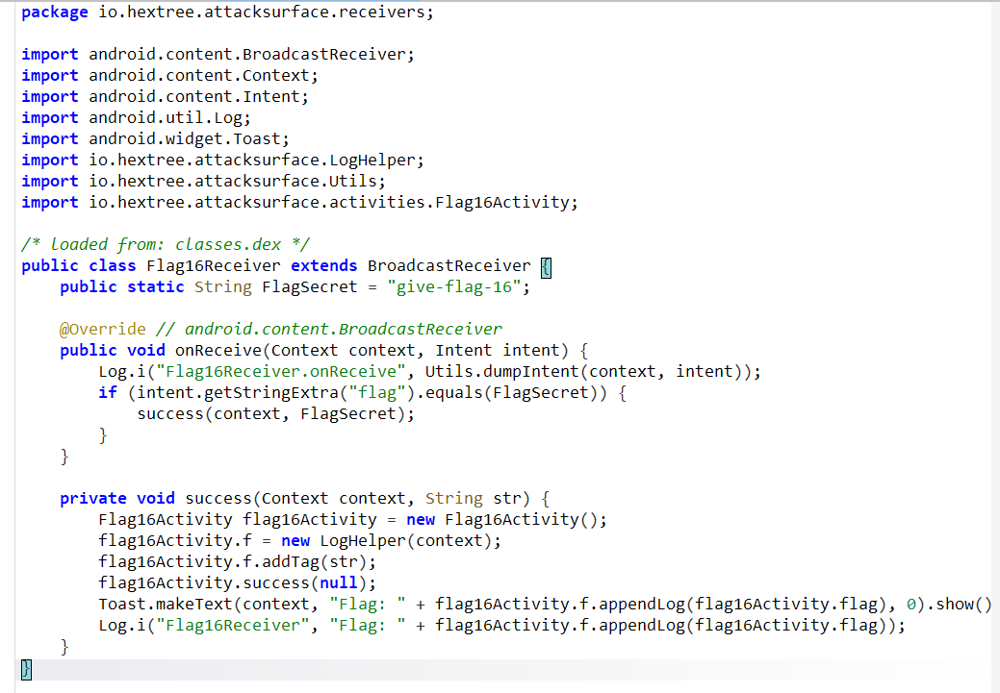

Because the receiver is exported and the intent is fully attacker-controlled, the exploit is just a matter of building the right `Intent` from my own app and firing the code once a button is clicked using the following code:

```java
findViewById(R.id.broadcasts).setOnClickListener(v->{
            Intent intent = new Intent();
            intent.setComponent(new ComponentName("io.hextree.attacksurface", "io.hextree.attacksurface.receivers.Flag16Receiver"));
            intent.putExtra("flag", "give-flag-16");
            sendBroadcast(intent);
        });
```

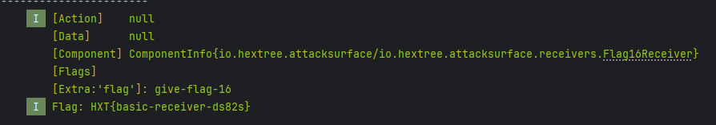

That is the baseline case: an exported receiver plus an `onReceive()` that trusts its extras equals direct access from any installed app.

## Broadcast Hijacking

Broadcast hijacking is the process of **intercepting a broadcast, redirecting it, or feeding malicious data back to the sender through the broadcast return channel**. Mechanically, it works the same way as activity intent redirects, just applied to broadcasts.

There are two main shapes this takes:

- **Broadcast redirects**, where an attacker uses a public, exported entry point to reach a private receiver that should not be reachable directly.
- **Broadcast intercepts**, where an app sends out an implicit intent and a malicious app registers as the receiver, catching data that was never meant for it.

> An intent redirect happens when an Activity receives an attacker-controlled `Intent` through `getIntent()` and then uses that intent to launch or forward to another component. If that inner component is a private broadcast receiver, the redirect effectively lends the attacker the victim app's own permissions to reach it.

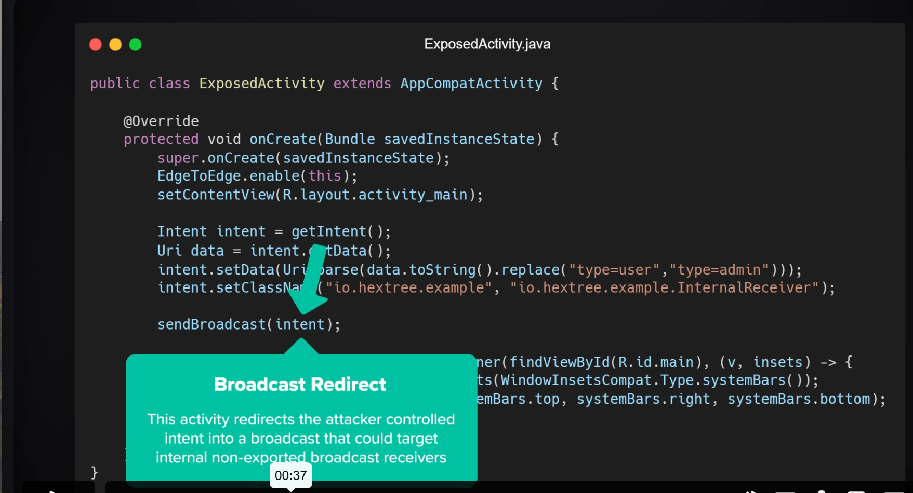

The interception variant works when the target app is sending an **implicit broadcast** without pinning it to a specific component:

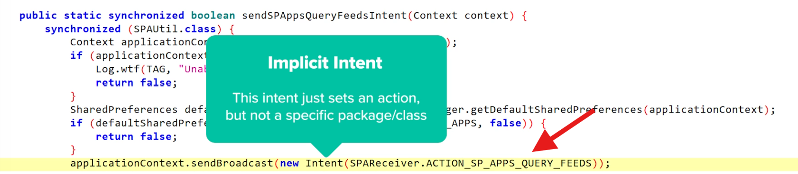

Normally, you would just register your exploit receiver in the manifest to catch that implicit intent. But since Android 8, apps can no longer register most implicit broadcasts in the manifest. To catch them, the receiver has to be registered **dynamically** at runtime.

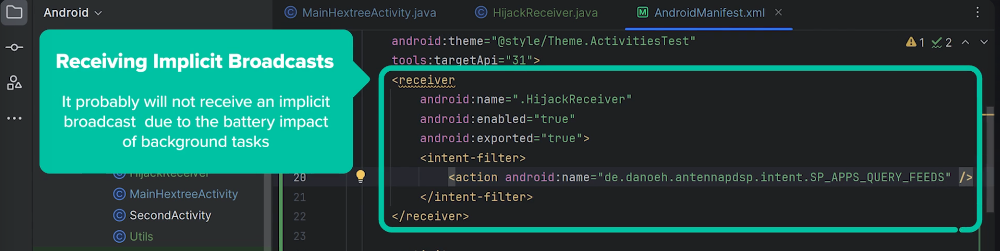

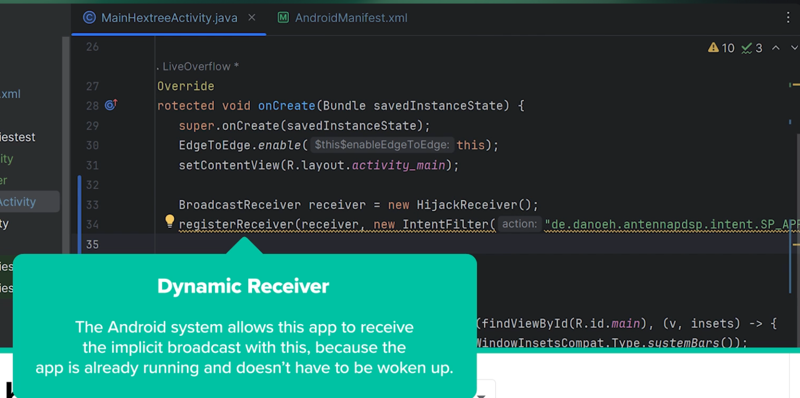

### Ordered broadcasts: the return channel

Broadcasts that expect a result back, sent via `sendOrderedBroadcast(...)`, add a second attack surface. In a plain `sendBroadcast()`, the sender does not get anything back. In an **ordered broadcast**, receivers process the intent one at a time, and each one can attach data that flows back to the sender through a `resultReceiver`:

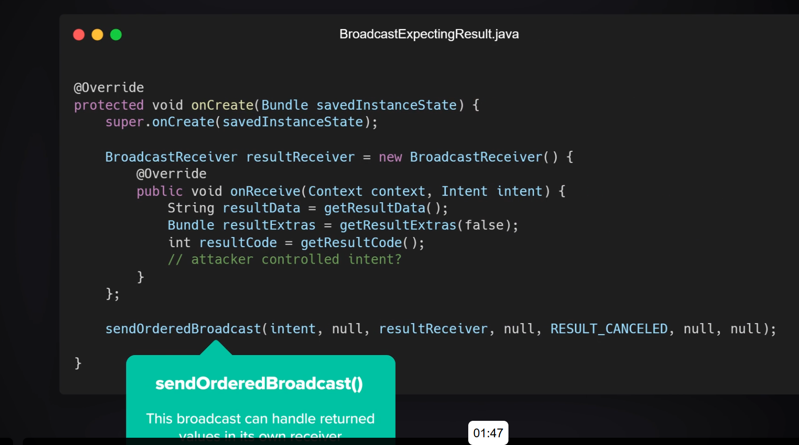

- **Where the weakness lies:** the target app sets up a `resultReceiver` and assumes whatever comes back is trustworthy. An attacker whose receiver runs first can call `setResultData()`, `setResultExtras()`, or `setResultCode()` to inject their own values into that return value.
- **The impact:** that attacker-controlled data flows straight back into the `onReceive()` of the sender's `resultReceiver`. If the app uses those results to make trust decisions, populate UI, or hand data to another internal component, the attacker is now steering that flow.

## Flag 18: Hijacking an ordered broadcast

`Flag18Activity` sends out an ordered broadcast:

```java
sendOrderedBroadcast(intent, null, new BroadcastReceiver() { ... }, null, 0, null, null);
```

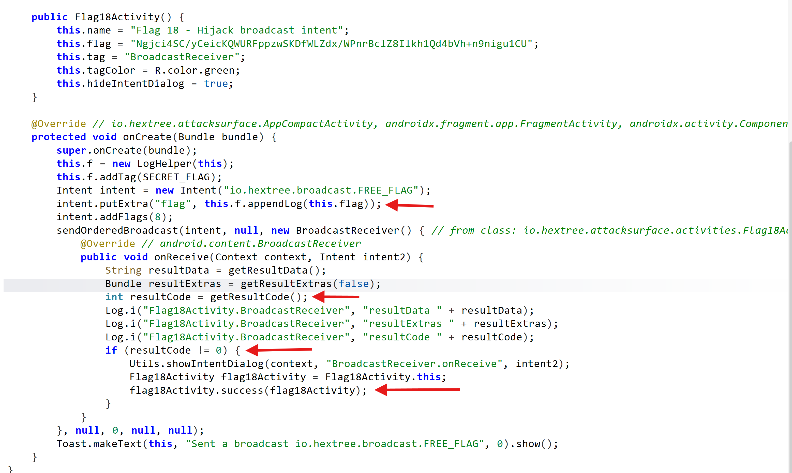

In my exploit app's `MainActivity.java`, I registered a `HijackReceiver` at the highest possible priority so my receiver runs before any legitimate one in the chain:

```java
BroadcastReceiver hijackReceiver = new HijackReceiver();
        IntentFilter filter = new IntentFilter("io.hextree.broadcast.FREE_FLAG");
// Set priority to the maximum value to get the intent first
        filter.setPriority(filter.SYSTEM_HIGH_PRIORITY);
        ContextCompat.registerReceiver(
                this,
                hijackReceiver,
                filter,
                ContextCompat.RECEIVER_EXPORTED
        );
```

Once that is in place, every time `Flag18Activity` sends its broadcast my exploit app is the first receiver to respond to it. In `HijackReceiver.onReceive()` I pull the flag out of the intent with `intent.getStringExtra("flag")` and then call `setResultCode(42)`. Because this is an ordered broadcast, that result code travels down the chain, and when the target's `resultReceiver` calls `getResultCode()` it sees **42** instead of whatever the app expected.

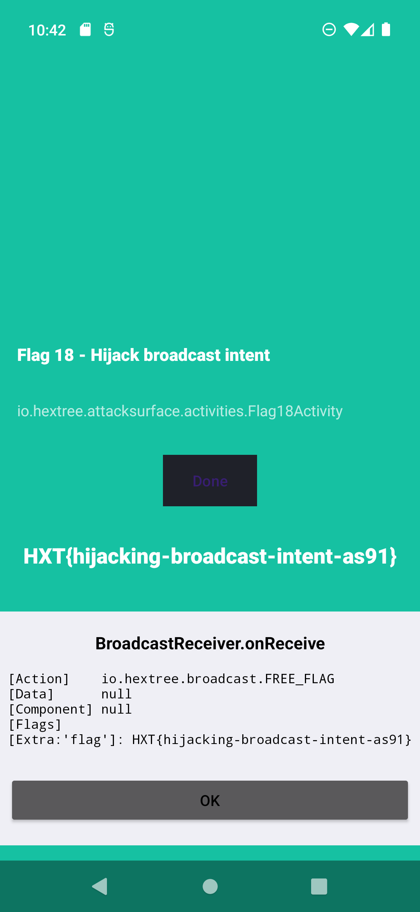

## Flag 17: Sending a matching implicit broadcast

`Flag17Receiver` handles ordered broadcasts and checks whether the `flag` extra matches `give-flag-17`. If it does, it calls the receiver's success path, which then calls `Flag17Activity.success()` and sets the result to `-1`.

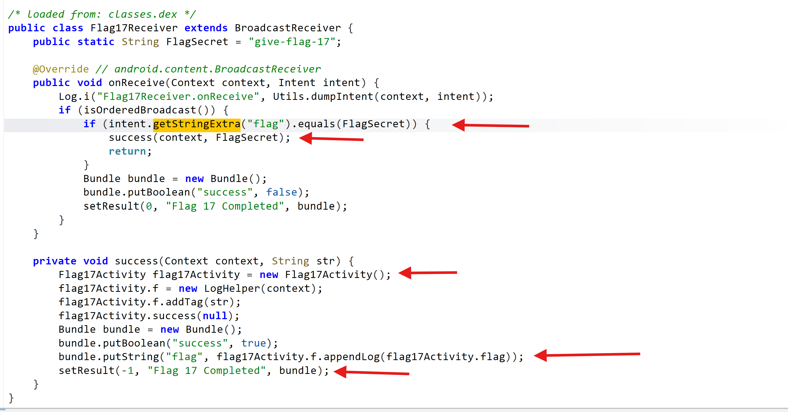

To show how a `BroadcastReceiver` can be fed attacker-controlled values, I registered an implicit broadcast in my exploit app that sends the exact intent the target expects:

```java
findViewById(R.id.hijack_implicit_broadcasts).setOnClickListener(v->{
            Intent intent = new Intent();
            intent.setClassName("io.hextree.attacksurface", "io.hextree.attacksurface.receivers.Flag17Receiver");
            intent.putExtra("flag", "give-flag-17");
            sendOrderedBroadcast(intent, null);

        });
```

The takeaway here is the same as Flag 16: if a receiver's success condition depends only on values inside the incoming intent, any app that can name that receiver and set those extras can trigger it.

## Flag 19: App Widget Provider

In Android, a widget is essentially a specialized `BroadcastReceiver`. Because a widget **needs to receive updates from the system**, it is almost always exported and always declared as a receiver in the manifest:

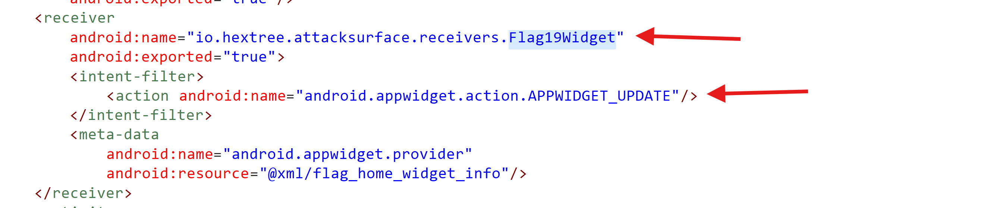

`AppWidgetProvider` is a wrapper around `BroadcastReceiver` that handles updating widget data in the background and reacting to interactions like button presses. Because the widget itself lives inside the launcher / the home screen, those button presses are wired up using **PendingIntent broadcasts** sent with the widget-owning app's permissions.

The widget's `onReceive()` is implemented by the system inside `AppWidgetProvider`, which then dispatches to protected methods like `onUpdate()`. Those system-protected methods are not directly exploitable. **Where the weakness lies** is the custom code the developer overrides on top of them.

For **Flag 19**, the goal is to abuse that custom `onReceive()` path so that it eventually calls `success(context)`. I did that by sending a crafted `APPWIDGET_UPDATE` broadcast with a nested `Bundle` of "secret" widget dimensions that the custom code was checking against:

```java
Intent intent = new Intent();
                    intent.setClassName("io.hextree.attacksurface", "io.hextree.attacksurface.receivers.Flag19Widget");

                    intent.setAction("APPWIDGET_UPDATE");

                // Create the nested Bundle with the "secret" heights
                    Bundle options = new Bundle();
                    options.putInt("appWidgetMaxHeight", 1094795585);
                    options.putInt("appWidgetMinHeight", 322376503);
                    intent.putExtra("appWidgetOptions", options);

                    sendBroadcast(intent);
```

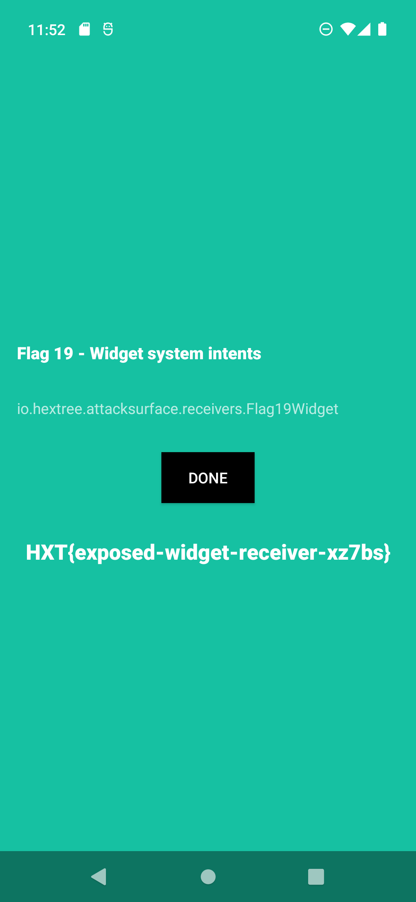

**The pattern to remember:** widgets look like a launcher/system feature, but under the hood they are just another exported `BroadcastReceiver` with a slightly fancier API on top.

## The Notification System

Notification buttons are wired up through `addAction()`, which takes a `PendingIntent` so the button can run code without the user opening the app. The classic example is the **snooze** button on an alarm notification.

The important detail from a security perspective is that the `BroadcastReceiver` behind that `PendingIntent` can be reachable by other apps. If the alarm app (or any app that wires up notification actions) does not lock down that receiver with permissions or restrict its action string, a malicious app can send a matching broadcast and **spoof the notification action** without the user ever interacting with the notification.

### Flag 20

The notification attack works exactly like the widget one: the exploit app implements a plain button that fires a broadcast whose action matches the one the notification's `PendingIntent` was going to send. The receiver on the other end cannot tell the difference between "user tapped the notification button" and "another app faked the intent", so the intended action fires anyway.

## Summary

Every `BroadcastReceiver` is an entry point, and every intent hitting `onReceive()` is attacker-controlled input until proven otherwise. Exported manifest receivers can be called directly from any installed app, dynamically registered receivers can catch implicit broadcasts you did not mean to leak, and ordered broadcasts add a *return channel* that a hijacker at the top of the priority list can poison.

From a pentester's perspective, the review loop is always the same: find the receiver, check whether it is exported, look at how its `onReceive()` treats intent extras and actions, and then ask whether any of that logic can be reached, tricked, or intercepted from an unrelated app. Widgets and notification actions are just specialized versions of the same problem, so the same questions apply to them too.
