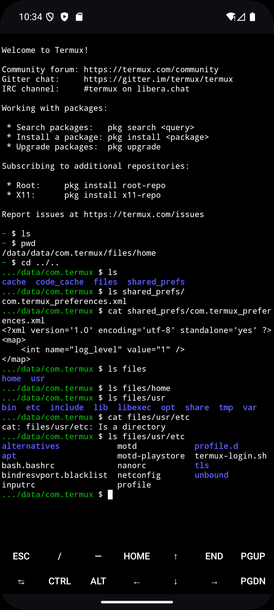
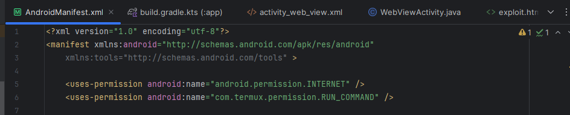
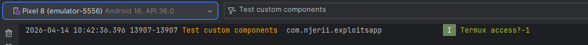
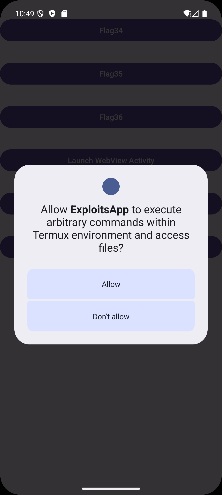
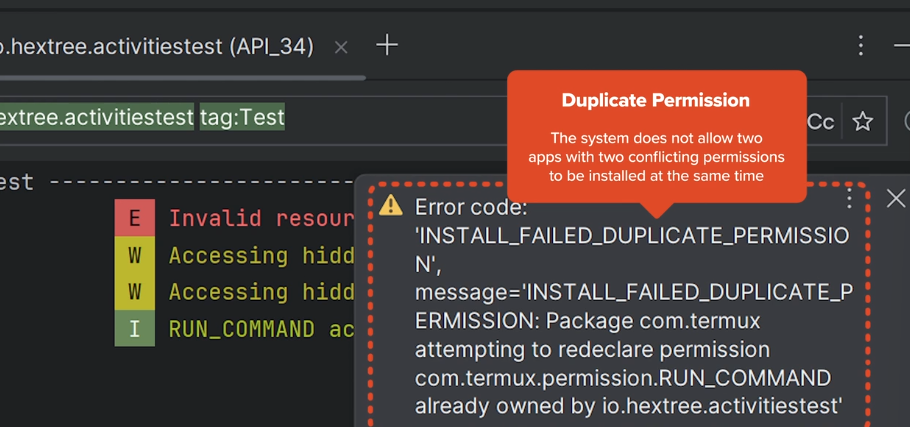

# Android Permissions and Component Exposure

Permissions are the layer that decides *who is allowed to talk to what* on an Android device. During a pentest, this is usually where the interesting bugs live: an app that exports too much, a permission with the wrong protection level, or a receiver that trusts anyone who can send it an intent. This post walks through the pieces you should be checking in every engagement, from the manifest down to custom permissions.

## Exported vs Non-Exported Components

The strongest protection against a malicious app is simple: **do not export the component in the first place**. Exported components can be started from other apps, which turns them into a direct attack surface. Non-exported components live inside the app sandbox and are only reachable from the app's own code.

> The easiest way to think about it is this: exporting a component is the same as poking a hole through your sandbox wall. Everything you export needs its own lock, or the sandbox stops meaning anything.

From a pentesting perspective, `android:exported="true"` on an activity, service, receiver, or provider is always worth a closer look. That single attribute decides whether an outside app can even attempt to reach the component.

## Normal vs Dangerous System Permissions

Android permissions come with a *protection level*, and that level decides how the system hands them out.

* **Normal permissions** are granted automatically at install time, without asking the user. You declare them in the manifest, and that is it.
* **Dangerous permissions** give the requesting app access to private user data or control over the device in ways that can negatively impact the user. From *Android 6* onward, the system does not automatically grant dangerous permissions declared in the manifest. The user has to explicitly grant or deny them, and the developer has to request them dynamically at runtime. On *Android 5 or lower*, they are granted automatically as long as they are defined in the manifest.

You can check a permission's protection level directly from the Android Core [AndroidManifest.xml](https://android.googlesource.com/platform/frameworks/base.git/+/refs/heads/main/core/res/AndroidManifest.xml). For example, `READ_CONTACTS` is declared with `android:protectionLevel="dangerous"`.

**Rule of thumb when developing proof-of-concept malicious apps:**

> *Always attack upwards. The exploit app should require far fewer permissions than the target app being compromised.*

> A sophisticated exploit shouldn't rely on the user being "`tricked`" into clicking "Allow" on a scary-looking permission (like Microphone or GPS). If your exploit can be done using only the normal, non-privileged permissions, it is much more dangerous because the user remains completely unaware.

## Protecting Components with Permissions

Sometimes apps genuinely want to export components so other applications can use them. In that case, guarding the component with a system permission at `protectionLevel="signature"` or `system` invalidates most exploit paths, because the exported component can only be called by trusted callers.

Example:

```java
<service android:name="com.example.weather.WeatherService" 
         android:permission="android.permission.ACCESS_FINE_LOCATION"
         android:exported="true">
</service>
```

In the scenario above, only apps that have been granted `ACCESS_FINE_LOCATION` can use the exported component.

If an attacker wants to exploit the **WeatherService**, their malicious app must also have that same permission defined and granted. This makes the *attack upwards* strategy much harder because:

1. The attacker's app now looks suspicious. *Why does this calculator app want my GPS?*
2. The attacker does not gain much power, because they already had the GPS permission to begin with.

> **Where the weakness lies:** a component is only as safe as the permission guarding it. An exported component protected by a `normal` permission is basically unprotected, because any app can silently claim that permission at install time.

## Custom Permissions

Besides using system permissions, applications can also declare their own permissions in `AndroidManifest.xml`. I used the Termux app to understand how this works in practice. Termux lets users run commands on their Android phone in a way that is similar to the Linux command line:



**Example of a defined custom permission:**

You can also set the `protectionLevel` on the custom permission itself.

```xml
<permission android:label="@string/permission_run_command_label"
    android:icon="@mipmap/ic_launcher"
    android:name="com.termux.permission.RUN_COMMAND"
    android:protectionLevel="dangerous"
    android:description="@string/permission_run_command_description"/>
```

If another app wants to use Termux to run code, it has to request the `RUN_COMMAND` permission, which triggers an explicit consent dialog.

In the exploit app, I first defined the permission in the manifest:



Then I logged whether the permission had been granted:

```java
Log.i("Test custom components", "Termux access?" + checkSelfPermission("com.termux.permission.RUN_COMMAND"));
```

From the logs, the user had not explicitly granted the exploit app permission to run commands through Termux:



After adding the code to request access to Termux's `RUN_COMMAND` dynamically at runtime, the consent dialog appeared in the exploit app:



This is not a bug you would normally report in a pentest, because Termux is doing the right thing: `RUN_COMMAND` is declared as `dangerous`, so the user has to explicitly approve it before another app can use it.

If `protectionLevel` is set to `signature`, only apps signed with the same key as the app that declared it get access to the exported component. In that case, exploit apps cannot abuse the component at all. This is mostly used when apps from the same developer talk to each other.

Attackers also cannot cheat this by first installing a shim app that declares `RUN_COMMAND` with `protectionLevel=normal` and then installing Termux afterwards. The installation of Termux will fail with an error about conflicting permission definitions:



> **The takeaway:** a custom permission is only as strong as its `protectionLevel`. `signature` shuts the door on third-party apps entirely. `dangerous` forces a user prompt. `normal` is essentially decorative.

## Protected Broadcasts

Broadcasts can be locked down using a protected action, or by tagging a dynamic receiver with `DYNAMIC_RECEIVER_NOT_EXPORTED`. Before *Android 13*, if you registered a receiver in code, *any other app on the phone could send a fake message to it*. That was a major attack surface. Now, when an app registers a receiver dynamically, it can tag it as `NOT_EXPORTED`, which means the receiver can only be reached by the system or by the app that defined it.

For a proof of concept, you can usually ignore these during a pentest, since a correctly flagged receiver is not directly reachable from an outside app.

## Summary

Android's permission model is really a chain: the manifest decides what is exported, the `protectionLevel` decides who can actually reach it, and the runtime consent dialog is the last line of defense for anything marked `dangerous`. When any link in that chain is weak, an outside app can start talking to components that were never meant to be shared.

For a mobile pentester, the workflow is straightforward. Start at the manifest, list every exported component, note the permission guarding each one, and check the protection level. Anything exported with no permission or with a `normal`-level permission is a candidate. Custom permissions deserve extra attention because developers often reach for them without realizing that `signature` is the only level that truly keeps third-party apps out. Get comfortable reading these three attributes together — `exported`, `permission`, and `protectionLevel` — and most permission-related bugs will surface on their own.
