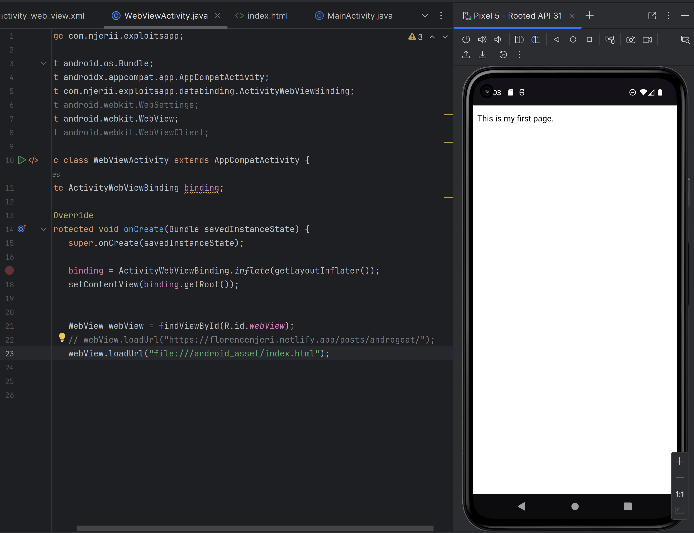
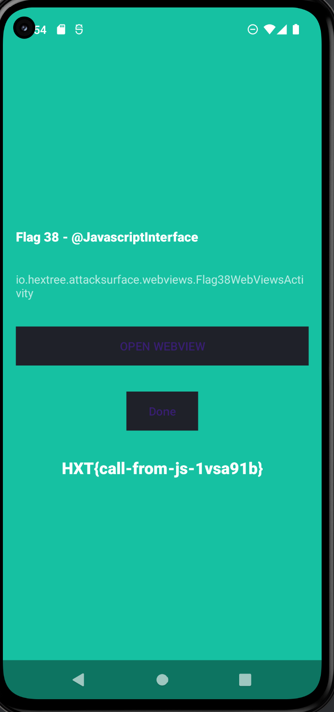
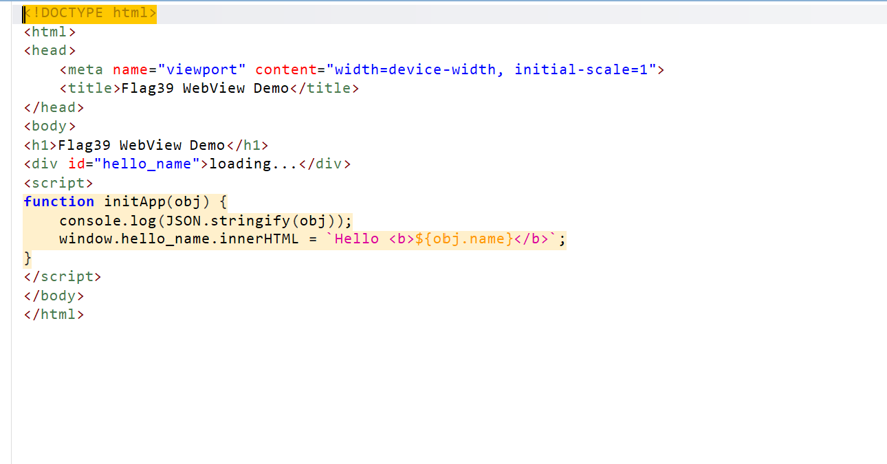
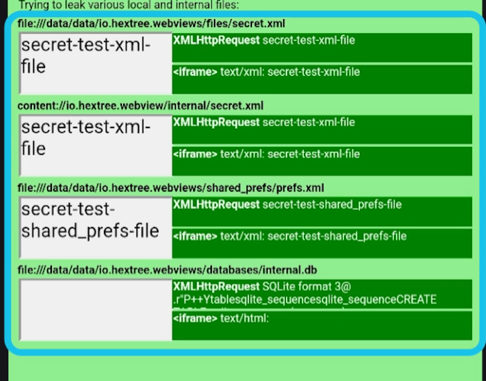

## Exploiting WebViews

WebViews and Custom Tabs let developers overlay browser functionality inside an app instead of navigating users out to an external browser. That convenience increases the attack surface in Android apps. If the WebView loads attacker-controlled URLs, executes untrusted JavaScript, or exposes native Java methods to the page, it can end up leaking private files or launching unexposed activities on the device.

**Why does this matter?** A WebView is not just a UI widget. It is a mini-browser that runs inside your app's sandbox, with access to your app's files, cookies, and any Java objects you hand it. The moment an outside input reaches it, you are effectively giving the web a foothold inside the app process. This also intriduces web command injection vulnerabilities to android apps.

### Attack Surface

- **WebView** is an actual embedded browser inside your app. It is isolated from other apps, so a user logged into a site in Chrome will *not* be logged in inside the WebView on the app.
- **Custom Tabs** are not a UI element you render. They are an Android API that hands the URL to the device's default browser (e.g., Chrome, Brave etc) and shows a customized tab of it in the android app. Because they reuse the installed browser, they share session data, cookies, and accounts with it.

> The easiest way to think about it: a **WebView** is a browser *inside* your app that you are responsible for securing. A **Custom Tab** is the real browser *outside* your app that you are only theming.

## Loading Local Files in a WebView

WebViews load remote pages using a URL, for example `webView.loadUrl("https://florencenjeri.netlify.app");`. When the app is debuggable, you can attach `chrome://inspect/#devices` and step through the JavaScript running inside it.

For offline content, developers drop HTML files into the app's **asset** folder (for example **index.html**) and load them on the Webview with the URI `file:///android_asset/index.html`.



The screenshot above shows the WebView loading a file from the app's internal storage path `/data/data`. That only works when `webView.getSettings().setAllowFileAccess(true)` is enabled.

> **NOTE:** Assets are bundled into the APK, and because the APK is publicly distributed on the Play Store, anything under `assets/` is effectively **public**. Treat it that way when reviewing what a WebView is willing to load.

> Some settings like `setAllowUniversalAccessFromFileURLs` are very dangerous, but might still be required by some apps. We will look deeper into those settings below.

## WebView Misconfigurations: JavaScript Interfaces

### Flag 38

The vulnerable activity takes a URL from an intent extra and hands it straight to `loadUrl()`:

```java
webView.addJavascriptInterface(new JsObject(), "hextree");
webView.loadUrl(stringExtra);
```

Methods annotated with `@JavascriptInterface` expose Java functionality to JavaScript running in the WebView. That is what attackers care about since they can supply the malicious URL with their payload, replacing the original JavaScript payload.

On Android versions **older than 4.2 (API 17)**, this does not just expose the methods the developer intended. Because of how Java reflection works, *every* public method on the object is reachable, including everything inherited from `java.lang.Object`. Starting with **Android 4.2 (API 17)**, Google fixed this and only methods explicitly marked with `@JavascriptInterface` are accessible from `@JavascriptInterface`.

The most dangerous inherited method on the old behavior was `getClass()`. Through `getClass()`, an attacker could pivot into **Java Reflection** and reach the entire Java Runtime from a web page.

**The exploit**

Instead of sending a website URL, the exploit sends a piece of code using the *`javascript:` prefix*. When a WebView *loads* a `javascript:` URL, it does not navigate to a new page. It executes that code immediately in the context of the current page, with access to any registered `@JavascriptInterface` objects.



The exploit intent I built:

```java
Intent intent = new Intent();
        intent.setComponent(new ComponentName("io.hextree.attacksurface", "io.hextree.attacksurface.webviews.Flag38WebViewsActivity"));
        intent.putExtra("URL", "javascript:hextree.success(true)");
        startActivity(intent);
```

What happens step by step:

- The victim app receives the intent and passes the URL to `webView.loadUrl()`.
- The WebView sees the `javascript:` prefix and executes `hextree.success(true)`.
- The Java `JsObject` receives the call. Because the argument is `true`, it triggers the native Java `success()` method.

**The fix**: developers must validate URLs before calling `loadUrl()`. Reject `javascript:`, `data:`, and `file:` schemes unless there is a very specific reason to allow them, and never build a URL directly out of intent input.

## XSS Injections via WebView

This is a **DOM-based Cross-Site Scripting (XSS) attack**. The app *takes unsanitized input from an Intent and passes it into a WebView*, where it eventually gets rendered into HTML without proper escaping.

A common way to deliver payloads to a WebView is a data URI, for example `data:text/html,<script>alert(1)</script>`.

### Flag 39

Here is the HTML being loaded into the WebView:



The JavaScript *sinks* are worth hunting for whenever you review WebView code:

- **Execution sinks:** `eval()`, `setTimeout()`, `setInterval()`, `new Function()`.
- **DOM sinks (XSS):** `.innerHTML`, `.outerHTML`, `document.write()`.
- **Navigation sinks:** `location.href`, `window.open()`.

The developer tries to sanitize the intent extra by wrapping it in `JSONObject.toString()` ,in Flag39's challenge, before injecting it into the page using the following code:

`webView.evaluateJavascript("initApp(" + jSONObject.toString() + ")", null);`

That escaping actually stops the naive quote-breakout payload `flag39.putExtra("NAME", "\"});hextree.success();//");`, because `JSONObject` escapes `"` with `\` and the whole thing gets treated as a string literal instead of a statement.

Where the weakness lies: `JSONObject` keeps the JSON *syntax* intact, but in the JSON standard `<` and `>` are perfectly valid characters. Nothing gets escaped there. So we can still smuggle HTML through the extra, and once `initApp()` in **flag39.html** drops that value into `innerHTML`, we get script execution.

Crafting the exploit:

```java
Intent flag39 = new Intent();
flag39.setClassName("io.hextree.attacksurface", "io.hextree.attacksurface.webviews.Flag39WebViewsActivity");
flag39.putExtra("NAME", "");
startActivity(flag39);
```

> **Tip:** always think about the *sink*. Where is the data flowing from the source, and how is it eventually handled? Encoding at the wrong layer is the same as no encoding at all.

## Stealing App Internal Files

Two WebView settings turn a normal DOM XSS into full-blown internal file theft. If either is enabled, an attacker with script execution inside the WebView can read files like shared preferences or local databases straight out of the app sandbox.

- **`setAllowFileAccessFromFileURLs(true)`**: allows one `file://` URL to access other `file://` URLs.
- **`setAllowUniversalAccessFromFileURLs(true)`**: is the **nuclear option** since it allows a `file://` URL to access **any** other `file://` URL on the device, and even reach `https://` origins.

### How to exploit the misconfigurations above

You can leak files with either `XMLHttpRequest` or an `<iframe>`.

**Method A: leak via XMLHttpRequest (XHR)**

XHR is normally used to fetch data from a server. Here the attacker uses it to fetch data from the phone's internal storage.

1. **`xhr.open('GET', url, true)`**: point `url` at a private file path, for example `file:///data/data/io.hextree.attacksurface/shared_prefs/Flag40Preferences.xml`.
2. **`xhr.send()`**: the WebView fetches the file.
3. **`xhr.responseText`**: because `UniversalAccess` is enabled, the WebView happily hands the script the file's contents — passwords, tokens, or flags stored in that XML.

**Method B: leak via `<iframe>`**

An `<iframe>` is a mini-window inside a page.

1. **`iframe.src = url`**: create a hidden iframe pointed at a private file (for example `file:///data/data/io.hextree.attacksurface/shared_prefs/Flag40Preferences.xml`).
2. **`iframe.contentDocument`**: normally, the Same-Origin Policy blocks a page from reading into an iframe loaded from a different origin.
3. **The theft**: with `UniversalAccess` enabled, the SOP protection is nn-existent and the attacker's script reaches into the iframe, grabs `innerHTML`, and stores the file contents in a variable.



> From a security perspective, `AllowUniversalAccessFromFileURLs` is a sandbox-erasing switch. If you see it enabled during a review, treat every `file://` load and every DOM sink as a critical finding until proven otherwise.

## Custom Tabs

Custom Tabs are a feature offered by the Android browser that lets developers add a customized browser tab UI inside the app instead of launching an external browser application. It is an **Android API**, and *unlike WebViews, Custom Tabs are not actually a UI element*. They lean on the browser installed on the device to provide the interface and functionality.

<video controls src="customtab.webm" title="Custom Tabs demo"></video>

That inheritance is the whole point. The app gets the security features of the external browser without having to handle web data the way a WebView does. A WebView can end up breaking the Same-Origin Policy because Chrome has no access to internal app files or a FileProvider and therefore cannot enforce the same behavior. With Custom Tabs, you rely on the browser's security model and stop worrying about `allowJavascript`-style vulnerabilities.

Because of that, Google generally recommends Custom Tabs over WebViews: https://support.google.com/faqs/answer/12284343?hl=en-GB

### Attack Surface

- **WebView** is an actual embedded browser within the app. It is isolated from other apps, meaning a user logged into a website in their primary browser will *not* be logged in inside the WebView.
- **Custom Tabs** simply drive the default browser on the device (e.g., Chrome). They share session data, cookies, and accounts with that browser, so users are already logged into whatever they signed in to there.

While apps cannot expose native Java methods through Custom Tabs, they can still set up `postMessage()` communication, which opens a different set of attack paths.

## Post Messages

`postMessage()` allows two-way communication between an app and a website loaded in a Custom Tab. From a testing perspective, that channel is worth treating like any other IPC boundary: assume the other side is untrusted, and audit every message handler for the same input-validation issues you would look for on a JavaScript bridge.

## Summary

WebViews and Custom Tabs solve the same product problem — showing web content inside an app — but they sit on very different sides of the sandbox boundary. A WebView runs inside your app process, shares its files, and can bind Java objects into JavaScript through `@JavascriptInterface`. Anything attacker-controlled that reaches `loadUrl()`, `evaluateJavascript()`, or a DOM sink can pivot into script execution, and from there into internal file access when settings like `setAllowFileAccess`, `setAllowFileAccessFromFileURLs`, or `setAllowUniversalAccessFromFileURLs` are enabled.

Custom Tabs push that surface out to the real browser, which is why Google recommends them for anything that just needs to render web content. As a pentester, the questions to keep asking are the same across both: *what URL can I make this component load, what data ends up in the DOM, and what native or cross-origin capability is the developer accidentally handing to that page?*
