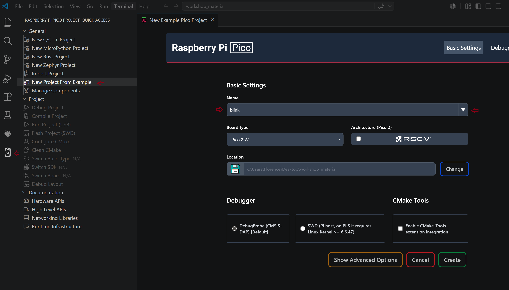
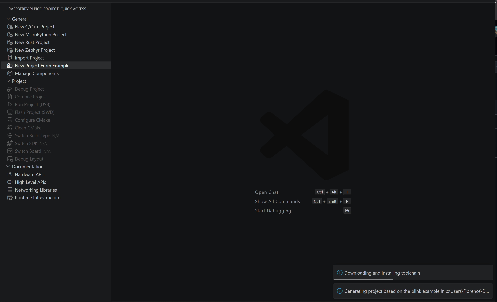
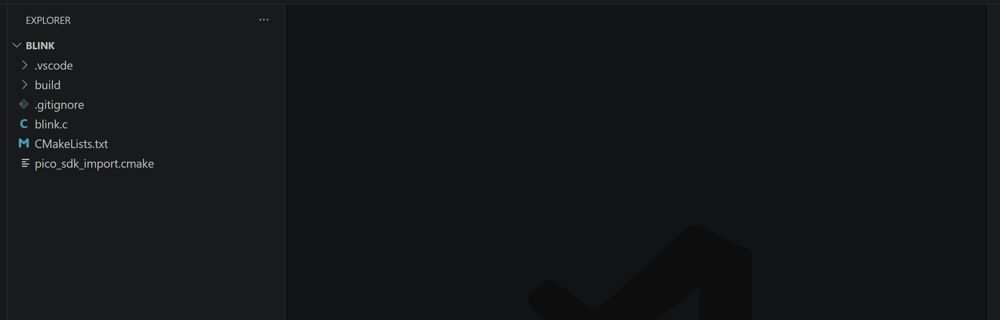
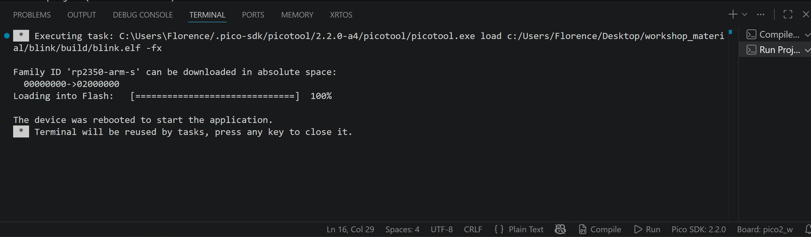
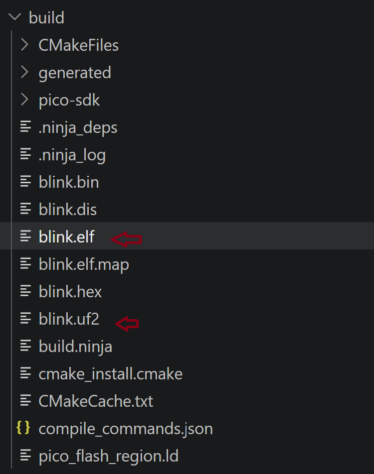
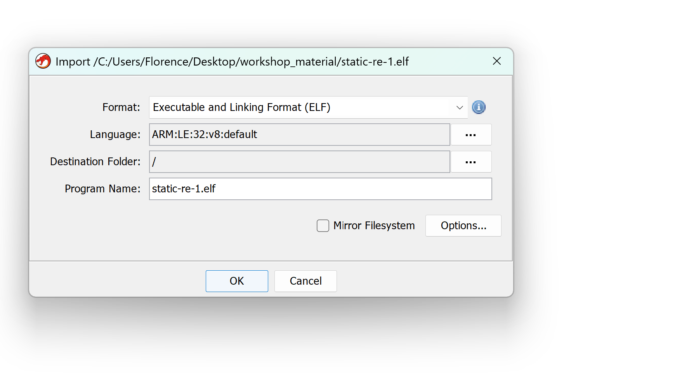
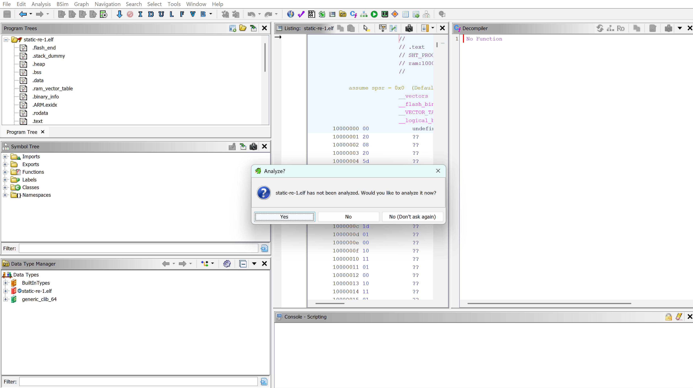
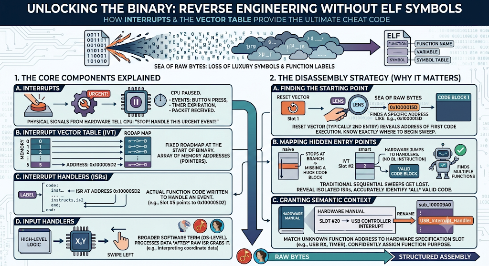
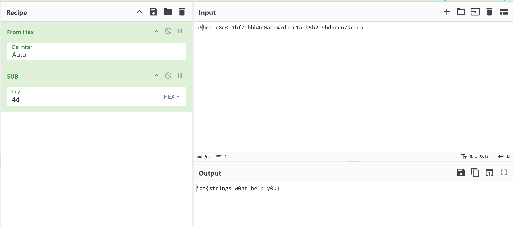

## Goal

1. Familiarize with the Raspberry PI and get a blink an LED and understand how firmware works
2. Reverse engineering to capture some CTF
3. Firmware emulation


### Examples of Firmware

1. IoT devices
2. Co processors on phones e.g WIFI chip etc
3. Medical devices - gold for pentesters
4. Critical Infrastructure

**Hardware**

- Raspberry Pico 2 W

- 

## Step 1: Compile the pico blink project and check that the led on it blinks

I created a new pico project from this [pico_example project on Github](https://github.com/raspberrypi/pico-examples/tree/master/pico_w/wifi/blink). I first select the blink project on VScode, then click the pico plugin on VScode and then using the create from example raspberry pi pico VScode plugin:





It takes a while to setup but once it is setup should look like this:



Once I run the project, it compiles as excepected and the raspberry pi finally blinks:



After compiling and running my project I now see the elf(Executable and Linkable Format) and uf2(USB Flashing Format) files in the build project:



The PICO 2 W's LED is connected to the WIFI chip. In a standard *Raspberry Pi Pico*, blinking an LED is simple: the central processing unit (RP2040) flips a physical switch (GPIO pin) directly wired to the light.

## Disassembler
When reverse engineering software, you start with a compiled binary file (machine code) that the CPU understands, but humans cannot. To make sense of it, you use either a disassembler or a decompiler.


**Disassembler**: Translates raw binary data (machine code) into Assembly language. This is a low-level, 1-to-1 mapping of what the processor is actually executing. As long as it knows the function start and function end, it is lossless.

**Decompiler**: Takes that same binary data and attempts to reconstruct it into a high-level language like C or C++. This is a complex, 1-to-many approximation of the original source code. It often makes mistakes because it guesses alot.

How the disassembly process works:

A disassembler can't just blindly start reading; it has to act like a detective using a few key steps:

### Step A: Finding the Starting Point
* **Base Address:** The tool needs to know where this blob of data lives in the computer's memory (e.g., starting at `0x10000000`). It either reads this from a file header or the user has to guess it.
* **The Entry Point:** It looks for the very first instruction the processor will execute. In this ARM binary, it looks at a specific slot to find the address of the `_reset_handler` (the code that runs right when the device powers on).

### Step B: Sweeping the Binary
* The disassembler scans through the bytes looking for common patterns that signal where a function begins.
* > ⚠️ **The Trap:** This is tricky. If it's too aggressive ("optimistic"), it accidentally treats raw data (like an image or text string embedded in the file) as code. If it's too cautious ("pessimistic"), it might skip actual code entirely.

### Step C: Following the Flow
* Once it finds a function, it decodes it from start to finish.
* It also follows clues. If it sees a branch instruction (like `blx` pointing to `main`), it follows that arrow to decode the next function.
* > ⚠️ **The Trap:** It can easily miss **indirect references**—like virtual method tables (vtables) in C++—where the code says "jump to whatever address is hidden in this variable" instead of naming a clear destination.

Assemblers do not have info about the parameter types in a function, the params or return value. It has registers, memory and stack pointers.

### Data and registers - stores the variables
Register 0 - R0 is also used to hold the return value when a function finishes and also the first variable in the program

### Link register /R14

Is a special purpose register that saves the retuen address once a function call finishes. It points to the address of the next line of code below the function e.g 0x44 but in pico 2 W it is always this address + 1 because it uses the thumb mode not ARM.


### Moving data = 

This is the assignment i.e copying variable values to a register. Uses the cms MOV e.g MOVS RO, #5
The S suffix: The "S" means it updates the CPU's internal status flags. If you MOVS a 0 into R0, the CPU instantly sets its "Zero Flag" to true, which loops and branches rely on.

### Load Register

LDR - Reaches out to the system's memory (RAM or Flash) to grab data and pull it into a register. Used instead of MOV when you need to load a full 32-bit number

### Execution Flow (The "Jumps & Functions")

B - A basic goto statement but it does not remember how to get back after returning from fn call.

BL - branch with link

Calls a function but crucially copies the return address into the LR (Link Register) first.

Memory Management

PUSH - What it does: Copies data from registers and safely stores it away onto the temporary memory Stack (RAM).


Why it's used: If a function needs to use R0 or LR, but doesn't want to overwrite and lose the data currently inside them, it PUSHes them to the stack for safekeeping, then POPs them back out when done.

## Ghidra

We decompile thge elf file from the compilation step we did above on the blink project. Since it is elf, it knows all the file configs. Then you analyze with the default Ghidra settings

Import the elf file: 



Then I double clicked the file and dragged it to the green ghidra icon and then analyzed:



## Memory Map

Happens when you dump the memory of PICO but it os not an elf file.

**ROM** - read only (programmed in factory). bootloader - where tp boot from. starts with 0 e.g 0x00000000
**Flash** - where you flash the program. Starts with 1 e.g 0x10000000
execute in place (XIP) memory - since pico has limited memory
**SRAM** - Startsr with 2 e.g 0x20000000

Advanced preripheral bus APB

**MMIO stands for Memory-Mapped I/O (Input/Output).**

It is the standard method that computers and microcontrollers use to let the CPU talk to hardware peripherals like timers, serial ports (UART), GPIO pins, or Wi-Fi modules. Instead of having special instructions to talk to hardware, the hardware registers are assigned standard memory addresses.

**Example (Turning on an LED)**

The hardware manual tells you that the "Pin Output Control" lives at memory address 0x40020014.

To turn the LED on, you don't use a hardware command. You just use `LDR` and` STR` to write a 1 to that memory address:

```
LDR R0, =0x40020014    ; Load the MMIO address of the LED control register
MOV R1, #1             ; Put the value '1' into R1 (1 = Turn On)
STR R1, [R0]           ; Store the '1' directly into that memory address
```

top of the stack, interrupt handler next which then calls the main function

When you reverse engineer a binary without an ELF file (Executable and Linkable Format), you lose all the luxury of human-readable symbols, variable names, and function labels. You are looking at a raw sea of bytes. 

To find your bearings in this scenario, understanding how hardware interacts with software via **Interrupts** and the **Interrupt Vector Table** is your ultimate cheat code.

---

## 1. The Core Components Explained

Before looking at the disassembly strategy, here is how the puzzle pieces fit together:

* **Interrupts:** Physical signals from hardware (like a button press, a timer expiration, or a received network packet) that tell the CPU: *"Stop what you are doing right now, handle this urgent event, then go back to your work."*
* **Interrupt Vector Table (IVT):** A fixed roadmap located right at the start of the binary file's memory space. It is a simple array of memory addresses (pointers). Each slot in this table belongs to a specific hardware event.
* **Interrupt Handlers (or ISRs):** The actual function code written to handle an event. If slot `#5` in the IVT points to `0x100005D2`, then `0x100005D2` is the memory address where the Interrupt Handler for that specific event lives.
* **Input Handlers:** A broader software term (often operating-system level) for the high-level code that processes data *after* the raw hardware interrupt handler has grabbed it. For example, the *Interrupt Handler* reads raw coordinate data from a touchscreen chip, while the *Input Handler* interprets that data as a "swipe left" gesture in a mobile app.

---

## 2. Why This Matters When Disassembling Without an ELF

If you throw a raw binary into a disassembler without an ELF file, the tool has no idea where functions start, where the code ends, or what any instruction is trying to accomplish. 

Understanding the IVT changes everything for a reverse engineer because of three massive advantages:

### A. It Gives You Your Absolute Starting Point
As seen in your original 32-bit ARM example, a disassembler needs to guess where execution starts. By looking at the very beginning of the raw binary, you can locate the **Reset Vector** (typically the second entry in an ARM table). This entry contains the exact memory address of the first code execution block. You now know exactly where to begin your disassembly sweep.

### B. It Maps Out the Hidden Entry Points
A disassembler trying to follow the flow of code sequentially will easily get lost because **Interrupt Handlers are never explicitly called by your code.** There is no `BL my_button_handler` instruction in the binary; the hardware jumps there automatically. 

Without the Vector Table, an aggressive disassembler might look at an isolated interrupt handler, assume nothing is calling it, and mistakenly categorize that entire section of code as useless raw data. By reading the table, you instantly uncover a directory of valid, hidden entry points.



# Ghidra Decompiler Notes: Recognizing Manually-Built Byte Arrays

## Concept

Compilers sometimes avoid placing a string or buffer in the binary's data section by constructing it byte-by-byte at runtime instead. In Ghidra's decompiled output, this produces a recognizable signature. Learning to spot it lets you retype the variable correctly and recover a clean, readable array.

## The Three Red Flags

**1. A waterfall of single-byte assignments**

A long, vertical sequence of individual array writes, e.g.:

```c
local_2c[0] = -0x4a;
local_2c[1] = -0x44;
local_2c[2] = -0x3f;
// ...continues for many lines
```

This pattern is the compiler assembling a string or data buffer one byte at a time, rather than storing it as a literal.

**2. Negative hex values (e.g. `-0x4a`)**

Memory only holds bits — there is no such thing as a "negative byte." A negative hex literal means Ghidra has defaulted the variable's type to **signed `char`**. Retyping it as **`unsigned char` (`uchar`)** reveals the true byte value (e.g. `-0x4a` → `0xb6`).

**3. Fragmented, adjacent variable declarations**

Check the function's variable declarations. If several differently-typed, differently-named variables sit next to each other and are all touched inside the same loop — e.g. `cStack_2d` (`char`), `local_2c` (`char[24]`), `local_14` (`undefined2`) — Ghidra has likely split one contiguous memory block into multiple unrelated-looking variables.

## The Fix

1. Right-click the **first** variable in the suspected chain → **Retype Variable**.
2. Change its type to a single array: **`uchar[X]`**.
3. Estimate `X` by summing the sizes of all the fragmented variables Ghidra created (e.g. 1 + 24 + 2 = 27).
4. Adjust `X` until the loop collapses into one clean, sequential array walk — that's confirmation you've found the correct size.

## Rule of Thumb

> Negative hex values filling an array inside a loop that bleeds into neighboring variables = one mis-split buffer. Merge it back into a single `uchar[X]` array.

**finding flag in a decompiled binary using cyberchef**



