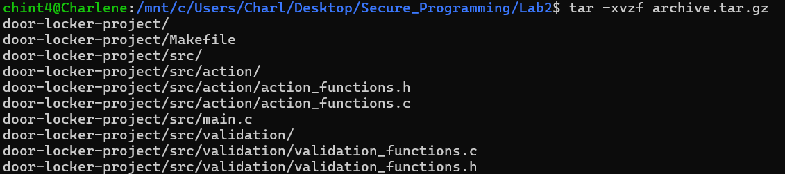
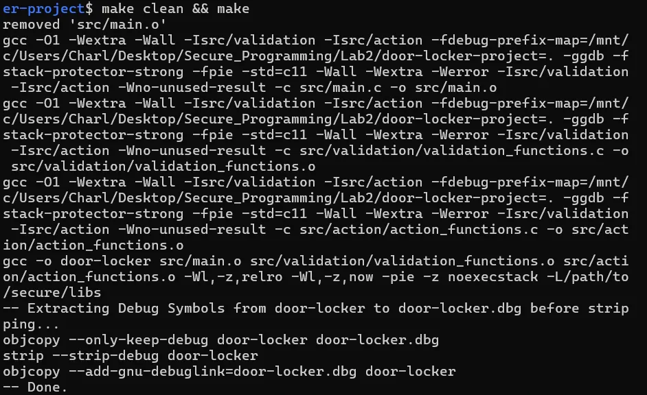
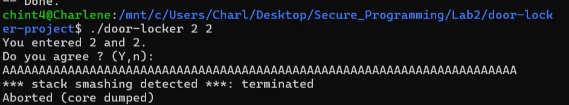

# Introduction

The objective of this lab is to build on our understanding of secure programming in C by analyzing, enhancing, and securing the functionality of the program from Project Lab 1, with a focus on identifying and mitigating vulnerabilities and improving resilience against attacks like fuzzing.

This lab focuses on identifying vulnerabilities in the source code, applying and validating patches, and proposing future best practices to prevent similar issues. Additionally, we will analyze the code using **security analysis tools (cppcheck)** to find out about the vulnerabilities in code. After compiling the project, we will inspect the resulting binary in Ghidra to identify similarities and differences, which will further inform our understanding of the program's security and allow us to apply effective mitigations. The goal is to deliver a secure, improved program with a detailed report on the analysis, changes, and recommendations.

## Analysis Method (cppcheck)

Since we are provided with a source code, we try to identify potential threats in the code with a static code analysis tool- cppcheck.



- First, we extract the provided files using the given instructions.


- We run cppcheck on the program and we identified the following threats:
    - **Variable Scope Issues**:
        - The variables `in0` and `in1` in `src/main.c` have unnecessarily wide scopes, which may lead to unintended use or harder code maintenance.
    - **Unsafe Use of `scanf()`**:
        - In `src/validation/validation_functions.c`, `scanf("%s", buffer)` lacks a field width limit, making it vulnerable to buffer overflows if provided with excessively large input.
    - **Unused Function**:
        - The function `fnR` in `src/action/action_functions.c` is never called, indicating potential dead code, which can increase codebase complexity or lead to latent issues if not properly reviewed.
- Given the program's small size, we can conduct manual security code reviews against secure coding standards and write test programs to identify common vulnerabilities. However, since we use a Makefile to efficiently compile and run multiple files together, manually reviewing each file one by one becomes impractical in real-world scenarios. Therefore, we propose starting with static analysis for a more efficient and thorough approach.

## Legacy Options

### Finding the Original Compiler Options (LEGCFLAGS) Leading to Vulnerabilities

- `checksec` is a Linux tool that analyzes binary files to identify security features implemented during compilation and linking, such as RELRO, NX, PIE, Stack Canary, and FORTIFY_SOURCE.


- To infer the `LEGCFLAGS` (Linux Exploit GDB Compiler Flags) used in the `door-locker` binary from the given `checksec` output, we analyze the provided information step by step:

### Breakdown of `checksec` Output:

1. **RELRO**: Partial RELRO
    - Indicates that the binary is compiled with `Wl,-z,relro` but **not** with `Wl,-z,now`.
    - This provides partial protection against GOT overwrite attacks.
    - At first we only configured with `-z,relro -Wl`, however it would always still be fully enabled, thus we suspected that this configuration is applied by default, thus we have to take an extra step to disable it with `-Wl,-z,lazy` to enforce lazy symbol resolution, which is required for Partial RELRO.
2. **STACK CANARY**: No canary found
    - Suggests the binary was **not** compiled with `fstack-protector` or similar flags. This makes it vulnerable to stack-based buffer overflows.
3. **NX (No Execute)**: Enabled
    - The binary is compiled with `Wl,-z,noexecstack` or equivalent, which prevents code execution on the stack.
4. **PIE (Position-Independent Executable)**: Enabled
    - Indicates the binary was compiled with `fPIE -pie`. This allows address randomization, enhancing security against exploits.
5. **RPATH and RUNPATH**: Not set
    - The binary has no hardcoded runtime library search paths, indicating good practice.
6. **Symbols**: (45) Symbols
    - Indicates the binary includes some debug symbols or symbol table information, possibly due to compilation with `g` or no stripping of symbols.
7. **FORTIFY**: No
    - The binary lacks fortification, thus we configured it explicitly as `D_FORTIFY_SOURCE=0`.

### Likely Legacy Options:

Based on the above, the likely compiler flags are:

```bash
LEGCFLAGS =-fpie -D_FORTIFY_SOURCE=0 -fno-stack-protector
LEGLDFLAGS =-pie -Wl,-z,relro -Wl,-z,lazy -Wl,-z,noexecstack 
```


- `Checksec`after making the program and got the identical security configuration result as the binary file provided in Lab 1.

These flags explain the security features observed:

- `fPIE -pie`: For PIE enabled.  These flags enable Position-Independent Executable (PIE), making the executable's code location-independent, which allows the OS to load it at different memory addresses for better security (such as enabling Address Space Layout Randomization, ASLR).
- `D_FORTIFY_SOURCE=0`: For No Fortify. This disables the FORTIFY_SOURCE security feature, which normally enhances the security of certain string and memory operations by checking for buffer overflows at compile time.
- `fno-stack-protector`: For No Canary Found. This flag disables stack protection mechanisms (canary values) that are used to detect and prevent stack buffer overflows during execution.
- `Wl,-z,relro` & `-Wl,-z,lazy` : For Partial RELRO. The `-z,relro` flag enables a form of read-only relocation (RELRO) to protect the Global Offset Table (GOT) from modification, while `-z,lazy` ensures that symbol resolution is deferred until needed, allowing for Partial RELRO.
- `Wl,-z,noexecstack`: For NX enabled. This flag prevents the stack from being executable, mitigating the risk of certain types of attacks, such as buffer overflows that attempt to execute code from the stack (NX or No Execute protection).

### Analyze Binary in Ghidra

- Compilation options used for

```makefile
LEGCFLAGS =-fpie -D_FORTIFY_SOURCE=0 -fno-stack-protector
LEGLDFLAGS =-pie -Wl,-z,relro -Wl,-z,lazy -Wl,-z,noexecstack 
```

- Original Binary for main function (Lab 1)

```c
int main(int argc,char **argv)

{
  long lVar1;
  long lVar2;
  int iVar3;
  
  if (argc == 3) {
    iVar3 = validate(argv);
    if (iVar3 == 0) {
      puts("\nChecking values");
      lVar1 = strtol(argv[2],(char **)0x0,10);
      lVar2 = strtol(argv[1],(char **)0x0,10);
      iVar3 = 0;
      if (lVar2 == lVar1) {
        puts("Valid access.");
        fngrt();
      }
      else {
        fnr();
      }
    }
    else {
      fnr();
      iVar3 = 0;
    }
  }
  else {
    puts("Usage : client <chiffre0> <chiffre1>");
    iVar3 = 1;
  }
  return iVar3;
}

```

- New Binary for main function (Lab 2)

```c

int main(int argc,char **argv)

{
  int iVar1;
  int iVar2;
  long lVar3;
  long lVar4;
  
  if (argc == 3) {
    iVar1 = validate(argv);
    if (iVar1 == 0) {
      puts("\nChecking values");
      lVar3 = strtol(argv[2],(char **)0x0,10);
      lVar4 = strtol(argv[1],(char **)0x0,10);
      iVar2 = fnchck((int)lVar4,(int)lVar3);
      iVar1 = 0;
      if (iVar2 == 0xf) {
        fngrt();
      }
      else {
        fnr();
      }
    }
    else {
      fnr();
      iVar1 = 0;
    }
  }
  else {
    puts("Usage : client <chiffre0> <chiffre1>");
    iVar1 = 1;
  }
  return iVar1;
}

```

### Overview

Two binary files, produced from slightly differing versions of source code, were analyzed. Despite identical `checksec` results indicating similar security configurations, functional discrepancies were observed. This report outlines the differences, potential causes, and investigative steps taken to identify the reasons behind the variations.

### Key Observations

1. **Logic Differences in Validation**:
    - **First Binary**:
        - Directly compares two `long` values using `if (lVar2 == lVar1)` to determine success. `fnchck` is included in the project but never called.
    - **Second Binary**:
        - Introduces a new function, `fnchck`, which takes the casted integer values of `lVar3` and `lVar4` as arguments. Success is determined by the condition `if (fnchck(...) == 0xf)`.
    
    **Finding**: The second binary includes an additional layer of logic not present in the first.
    
2. **Variable Usage and Type Casting**:
    - Both binaries use `long` variables for storing input values.
    - The second binary explicitly casts these `long` values to `int` when calling `fnchck`.
    
    **Finding**: Type casting was introduced in the second binary, potentially as part of an additional validation mechanism.
    
3. **Common Functionality**:
    - Both binaries call `fngrt()` upon success and `fnr()` upon failure.
    - However, the success criteria differ due to the logic variations described above.
    
    **Finding**: Core functionality remains similar, but validation mechanisms differ.

### Potential Causes of Differences

1. **Source Code Variations**:
    - The inclusion of `fnchck` in the second binary suggests either a different version of the source code or manual modification.
2. **Conditional Compilation**:
    - Preprocessor directives such as `#ifdef` or `#define` may have enabled or disabled specific sections of code during compilation.
3. **Compiler or Optimization Settings**:
    - Compiler flags (e.g., `O2`, `O3`) may have introduced optimizations or modifications in one binary but not the other. However, optimizations typically simplify logic rather than adding new functions like `fnchck`.
4. **Linker Behavior or Library Dependencies**:
    - Differences in the linker scripts, library versions, or included dependencies might have affected the compiled output.

### Possible Next Investigative Steps

1. **Compilation Flags**:
    - The compilation process for both binaries was analyzed with verbose options (`gcc -v` and `ld --verbose`) to identify differences in flags. Special attention was paid to optimization levels and security-related flags.
2. **Disassembly Analysis**:
    - Using `objdump -d`, the assembly-level differences between the two binaries were reviewed. This revealed the introduction of `fnchck` and its associated logic in the second binary.
3. **Preprocessor Directives**:
    - The source code was inspected for conditional compilation directives (e.g., `#ifdef`) that could enable or disable sections of the code.
4. **Controlled Recompilation**:
    - Various combinations of compiler and linker flags were tested to replicate the logic in both binaries, including:
        - Adjusting optimization levels (`O0`, `O2`, `O3`).
        - Explicitly enabling or disabling RELRO (`Wl,-z,relro` or `Wl,-z,now`).

- Original Binary for validate function

 (Lab 1)

```c
void validate(int param_1)

{
  char local_20 [24];
  
  printf("You entered %s and %s. \nDo you agree ? (Y,n):\n",*(undefined4 *)(param_1 + 4),
         *(undefined4 *)(param_1 + 8));
  __isoc99_scanf(&DAT_00012057,local_20);
  strcmp(local_20,"Y");
  return;
}

```

- New Binary for validate function (Lab 2)

```c
int validate(char **argv)

{
  uint uVar1;
  int iVar2;
  char buffer [20];
  
  printf("You entered %s and %s. \nDo you agree ? (Y,n):\n",argv[1],argv[2]);
  __isoc99_scanf(&DAT_0010204b,buffer);
  uVar1 = strcmp(buffer,"Y");
  if (uVar1 != 0) {
    iVar2 = strcmp(buffer,"y");
    uVar1 = (uint)(iVar2 != 0);
  }
  return uVar1;
}

```

The primary differences seems to be due to code-level changes rather than compiler flags differences. However, certain flags like `-fstack-protector`, `-O2`, or `-O3` could potentially influence buffer allocation, optimization, or even removal of unused code, but they are not directly responsible for the changes in logic and structure between the two versions. The second version appears to be a more robust implementation, checking both uppercase and lowercase `"Y"` inputs and correctly using the result of the comparison.

### Secured Makefile Configuration

### 1. **LEGCFLAGS = `-fpie -D_FORTIFY_SOURCE=0 -fno-stack-protector`**

- **`fpie`**: This flag enables the creation of position-independent executables (PIE). This improves security by enabling Address Space Layout Randomization (ASLR), making it harder for attackers to predict the memory layout of a program.
- **`D_FORTIFY_SOURCE=0`**: This disables the "fortify" source feature, which provides additional compile-time checks to enhance security. By setting this to `0`, the program won't benefit from additional security features such as bounds checking for certain functions like `strcpy`, `memcpy`, etc.
    - **Recommendation**: **Remove this flag** or set it to `2` (the highest level of fortification). Setting it to `0` reduces the security checks and can make your application more vulnerable to buffer overflow attacks.
- **`fno-stack-protector`**: This disables stack protection, which is typically used to detect and prevent buffer overflow attacks by placing "canaries" on the stack.
    - **Recommendation**: **Remove this flag**. Disabling stack protection weakens security by making it easier for attackers to exploit stack buffer overflows. Keep `fstack-protector` or use `fstack-protector-strong` (which is a more secure version).

### 2. **LEGLDFLAGS = -pie -Wl,-z,relro -Wl,-z,lazy -Wl,-z,noexecstack**

- **`pie`**: This flag creates a position-independent executable, which works together with ASLR to randomize the memory layout, improving security.
- **`Wl,-z,relro`**: This flag enables "Read-Only Relocation" (RELRO), which makes it harder for an attacker to modify function pointers after the program starts. It improves security by making certain sections of memory read-only after the relocation phase.
- **`Wl,-z,lazy`**: This flag instructs the linker to delay symbol resolution until the symbol is actually used. This can make the program load more efficiently, but it could make it easier for an attacker to exploit any unresolved symbols before they are properly bound.
    - **Recommendation**: **Remove this flag**. It introduces a potential risk because unresolved symbols could be hijacked before the program fully resolves them, weakening security.
- **`Wl,-z,noexecstack`**: This flag marks the stack as non-executable, which prevents code from being executed on the stack. This helps mitigate attacks like buffer overflows that try to execute shellcode on the stack.
    - **Recommendation**: **Keep this flag**. It is an essential security feature that helps prevent stack-based code execution vulnerabilities.

### Security Enhancements Summary:

- Remove **`D_FORTIFY_SOURCE=0`**: Reinstate compiler security checks for bounds checking and other safeguards by setting it to `2`.
- Remove **`fno-stack-protector`**: Keep stack protection enabled to defend against stack overflow attacks.
- Remove **`Wl,-z,lazy`**: Avoid lazy symbol resolution to reduce potential vulnerabilities related to unresolved symbols.
- Keep **`Wl,-z,noexecstack`** and **`pie`**: These flags enhance security by preventing stack execution and enabling position-independent executables.

The proposed secured configuration:

```makefile
LEGCFLAGS =-fpie -D_FORTIFY_SOURCE=0 -fno-stack-protector
LEGLDFLAGS =-pie -Wl,-z,relro -Wl,-z,lazy -Wl,-z,noexecstack 
```

- When trying to build the make file with a secured configuration, we discovered that there will be a warning that stop the code from building, thus we added a bypass to that specific warning: `-Wno-unused-result` . Since we were merely trying to see how the mitigation in compilation level carry out, we ignore this code level error.


- Successfully built the program after bypassing `-Wno-unused-result` error.



- Try to carry out the buffer over flow attack again but could see that the attack is detected and terminated.



### How It Enhances Security

1. **Memory Safety**:
    - Prevents stack-based buffer overflows (`fstack-protector-strong`).
    - Disallows execution of code on the stack (`z noexecstack`).
2. **Exploit Mitigation**:
    - ASLR support makes memory addresses unpredictable (`fpie`, `pie`).
    - RELRO ensures critical relocation structures are immutable (`Wl,-z,relro -Wl,-z,now`).
3. **Improved Code Quality**:
    - Enforces secure coding standards and flags potential vulnerabilities during compilation (`Wall -Wextra -Werror`).
4. **Runtime Safety**:
    - Uses trusted library paths and avoids unsafe or unverified libraries.

In order to prevent the buffer overflow and lack of user input validation vulnerabilities discovered, we patched the`validation_functions.c` source code as shown below 

```c

#include <stdio.h>
#include <string.h>

#include "validation_functions.h"

int fnchck(int a, int b) {
    int check;

    if (b == a) {
        puts("Valid access.");
        check = 0xf;
    } else {
        check = 0;
    }
    return check;
}

int validate(char * argv[]) {
     // Use malloc to dynamically allocate memory at runtime
    char *buffer = (char *)malloc(20);
     
    printf("You entered %s and %s. \nDo you agree ? (Y,n):\n", argv[1], argv[2]);
    // Use fgets to read the user input since it only writes upto the buffer size thus preventing buffer overflow
    fgets(buffer, 20, stdin)

    // Free the allocated memory
    free(buffer)
    // Return 0 if buffer == "Y" or buffer == "y"
    return (strcmp(buffer, "Y") == 0) || (strcmp(buffer, "y") == 0);
}
```

## How to patch the vulnerabilities above

The source code below is the patched code of `validation_functions.c`

```C
#include <stdio.h>
#include <string.h>

#include "validation_functions.h"

int fnchck(int a, int b) {
    int check;

    if (b == a) {
        puts("Valid access.");
        check = 0xf;
    } else {
        check = 0;
    }
    return check;
}

int validate(char * argv[]) {
    // Use malloc to dynamically allocate memory at runtime
    char *buffer = (char *)malloc(20);
     
    printf("You entered %s and %s. \nDo you agree ? (Y,n):\n", argv[1], argv[2]);
    // Use fgets to read the user input since it only writes upto the buffer size thus preventing buffer overflow
    fgets(buffer, 20, stdin)

    // Free the allocated memory
    free(buffer)
    // Return 0 if buffer == "Y" or buffer == "y"
    return (strcmp(buffer, "Y") == 0) || (strcmp(buffer, "y") == 0);
}

```

The code above does the following:
1. `char *buffer = (char *)malloc(20);` will dynamically assign memory to our buffer at run time. This allows memory to be allocated at random addresses
 when ASLR is active.
2. `fgets(buffer, 20, stdin)`. `fgets` is more secure compared to `scanf`.  The `fgets` function ensures that no more than 19 characters are read, preventing buffer overflow when saving the input to `buffer` and leaving space for the null terminator.
3. `return (strcmp(buffer, "Y") == 0) || (strcmp(buffer, "y") == 0)`. The initial return function had two issues. First, it used the && comparator, which meant that if the user inputs "Y", the comparison strcmp(buffer, "y") would always evaluate to 1, causing the return to fail. This bug was fixed by changing the comparator to ||. Second, we didn't evaluate the return value of strcmp(buffer, "Y"), so we introduced the expected result into the evaluation.

The source code below in `validation_functions.c` is is vulnerable because we have the `fnR` function that give the users system root access on the terminal which is a priviledge escalation. The solution to this problem would be to either delete the code as its unused or excempt it from the executabe file during compilation. 

```C
#include "action_functions.h"

#include <stdio.h>
#include <stdlib.h>
void fnr(void) {
    puts("The door is locked.");
    return;
}

void fngrt(void) {
    puts("Opened.");
    puts("No root.");
    return;
}
// To remove the vulnerability of the unused fnR function being in the executable, we will use the command Make sure it's not in the compiled code using the flag -DIGNORE_FUNCTION
#ifndef IGNORE_FUNCTION
void fnR(void) {
    puts("Opened.");
    puts("Be careful, you are ROOT !\n");
    int value = system("/usr/bin/env PS1=\"SUPPOSED ROOT SHELL > \" python3 -c 'import pty; pty.spawn([\"/bin/bash\", \"--norc\"])'");
    exit(value);
}
#endif

```

The code snippet above shows the solution which adds the `ifdef IGNORE_FUNCTION` where `IGNORE_FUNCTION` is the flag we will pass to the compiler using the `-D` flag. This is the complete compilation command to use `-DIGNORE_FUNCTION`

In the `main.c` function, the `atoi()` function, which converts user input to an integer, has been deprecated. It also does not check for errors before converting the string to an integer. In the `door-locker` program, if the user inputs two different strings as input, the door would open. This vulnerability exists because we are using `atoi()`. To fix this vulnerability, we replaced the `atoi()` function with the `strtol()` function, which will throw an error if the input isn't a valid number, as shown in the patched code below.

```C
#include <stdio.h>
#include <stdlib.h>

#include "action_functions.h"
#include "validation_functions.h"

int main(int argc, char * argv[]) {
    int check;
    int in0;
    int in1;

    if (argc == 3) {
        check = validate(argv);
        if (check == 0) {
            puts("\nChecking values");
            // Use strtol with error checking since atoi is deprecatted
            in0   = strol(argv[2]);
            in1   = strol(argv[1]);
            check = fnchck(in1, in0);
            if (check == 0xf) {
                fngrt();
            } else {
                fnr();
            }
        } else {
            fnr();
        }
        check = 0;
    } else {
        puts("Usage : client <chiffre0> <chiffre1>");
        check = 1;
    }
    return check;
}
```

## How to avoid these mistakes in future.

The vulnerabilities identified and addressed in the source code highlight some of the security concerns we can introduce to our code. Below is a detailed plan of future the software development process to mitigate such mistakes before the code is released:

**Use Secure Coding Practices**

- Always validate and sanitize user input to prevent unexpected behavior.
- Use safer alternatives like fgets instead of gets or scanf to avoid buffer overflows.
- Dynamically allocate memory using `malloc` only when necessary.
- Always check for successful allocation using malloc or calloc and free the memory after use to prevent memory leaks in the code.

**Ensure Code Review and Auditing**

- Peer review all new code for adherence to security guidelines.
- Use static analysis tools (e.g., SonarQube, Coverity) to identify vulnerabilities such as buffer overflows or use of unsafe functions.
- Periodically review older code to find unused functions, insecure patterns, and deprecated APIs, functions and dependencies and update them to the recommended functions.
- Remove unused functions or ensure they are excluded from compilation (e.g., through macros using `ifdef`).

**Enable Compiler Flags for Security**

- Use flags like `-D_FORTIFY_SOURCE=2` to add runtime checks for common string format vulnerabilities.
- Employ `-DIGNORE_FUNCTION` to exclude unused functions from the build.
- Use `-fstack-protector-all` flag to enables stack protection, including shadow
 stacks, for all functions.

**Use Linker Flags**

- To ensure the stack is non-executable (a key part of preventing exploit execution), you should also link with the `-z noexecstack` flag to mark the stack as non-executable using `gcc -o my_program my_program.c -fstack-protector-all -fcf-protection - D`

# Conclusion

This lab focused on enhancing the security of a C program by identifying and mitigating potential vulnerabilities using static code analysis and compiler/linker options. Through the use of **cppcheck**, we identified issues such as unsafe `scanf()` usage and variable scope problems. Additionally, we explored vulnerable compiler and linker options that could make the program susceptible to attacks like buffer overflows and memory corruption.

By applying secure coding practices and adjusting compilation settings, such as enabling stack protection, disabling executable stacks, and using modern C standards, we significantly improved the program’s security posture. We also addressed the buffer overflow vulnerability by replacing unsafe functions with safer alternatives like `fgets()` and dynamically allocating memory with proper bounds checks.

These enhancements not only mitigate common attack vectors but also enforce better coding standards and runtime safety, making the program more resilient to exploitation. Through this process, we reinforced the importance of secure programming practices, both in code and in the compilation process, to protect against malicious exploits.

Additionally, we found that the differences between the compared binaries of the two programs did not seem to be related to how the program was compiled. This led us to think that the source code might have been altered in some way, and may not have been identical to start with. However, it is also reasonable to consider that Ghidra’s interpretation of a binary file could vary, potentially influencing how the differences were observed.

We also had the opportunity to explore different compiler options in depth, particularly by utilizing the **checksec** function (from the manual). This provided valuable insights into various security features enabled or disabled by the compiler and further emphasized the importance of thoroughly reading the manual to understand the implications of different compiler flags. Understanding these options allows developers to make informed decisions about which security measures to apply during the compilation process, enhancing the overall security of the program.