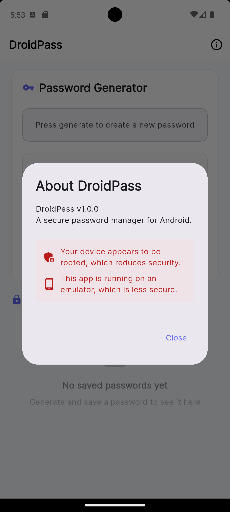

## Anti-Root, Anti-Emulator, and Anti-Tampering checks.
Since we have anti-tampering checks, I cannot modify the smali code and repackage and sign the application to bypass the anti-root and anti-emulator checks. My only option t bypass the root and emulator checks is to use Frida.

## Environment Security Analysis: Anti-Tamper & Root Detection

The application implements a robust defensive class, `com.eightksec.droidpass.SecurityModule`, which serves as a gatekeeper to prevent the app from running in "untrusted" environments.

### 1. The Signature Integrity Check (Anti-Tamper)

The `a()` method retrieves the application's own signing certificate. Because it sends this signature to a **native C++ function** for verification, any attempt to modify the app’s code and re-sign it with a custom key will be detected.

```java
// Snippet from SecurityModule.java: Signature Verification
public final boolean a() {
    Signature[] signatureArr = context.getPackageManager()
        .getPackageInfo(context.getPackageName(), 64).signatures;
    String str = signatureArr[0].toCharsString();
    return checkAppTamperingNative(str); // Native check against hardcoded developer key
}
```

### 2. Multi-Layered Environment Checks

The `b()` and `c()` methods identify Root access and Emulators by searching for known strings and system properties.

*   **Root Detection:** Scans for the `su` binary in 14 different locations and checks for management apps like Magisk.
*   **Emulator Detection:** Inspects `Build.HARDWARE` and `Build.PRODUCT` for strings like `goldfish`, `ranchu`, and `vbox86p`.

```java
// Snippet from SecurityModule.java: Root & Emulator "Indicators"
String[] rootPaths = {"/system/xbin/su", "/system/bin/su", "/data/adb/magisk"};
String[] rootApps = {"com.topjohnwu.magisk", "de.robv.android.xposed.installer"};

// System property check for QEMU/Emulators
b[] props = {new b("ro.kernel.qemu", "1"), new b("ro.hardware", "goldfish")};
```

---

### Bypass Strategy: Runtime Instrumentation (Frida)

Since **Static Patching** (Smali modification) is impossible due to the Native Anti-Tampering check, I must use **Frida** to perform **Dynamic Instrumentation**. By hooking these methods at runtime, I can force them to return `false` before they can trigger a security shutdown.




## Static Analysis with Ghidfra

First, I decompiled the apk code using the apktool then I loaded the `libsecurity-checks.so` into Ghidra to statically analyze the program behavior.