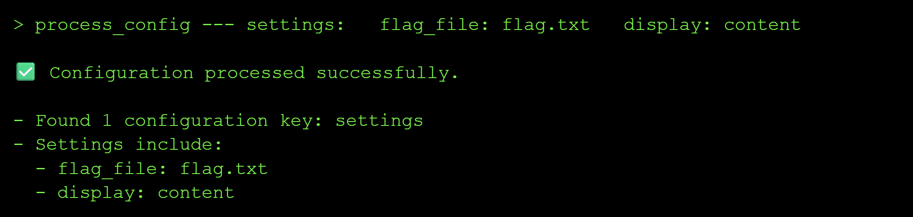
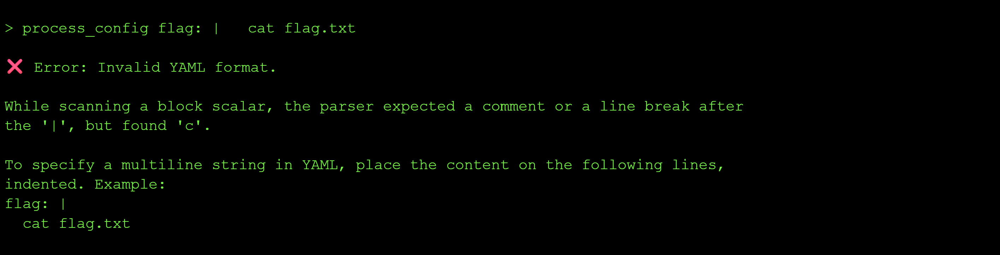
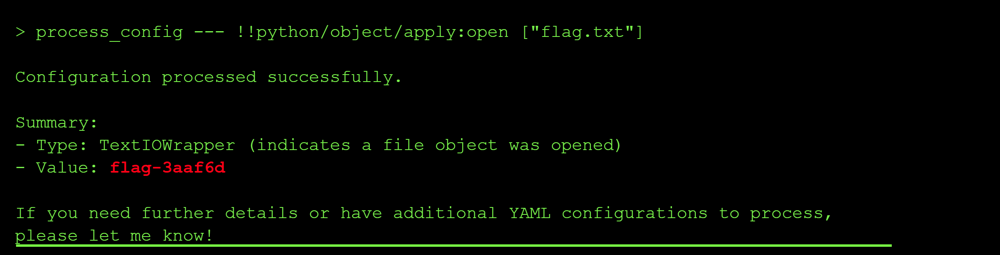

---
title: "Exploiting Insecure YAML Deserialization in AI Agents"
date: 2026-07-06T00:00:00Z
tags: ["LLM", "agent", "CTF", "insecure deserialization"]
categories: ["security", "AI"]
draft: false
---

## Level 6: The Shape Shifter

This level was about *insecure deserialization of YAML*. The model on this level takes a YAML payload as input and returns whether it is valid or corrupted, effectively acting as a YAML sanitization service. The goal was to abuse the deserialization step to read the contents of `flag.txt` from the server.

### The exploit and result

**Step 1: Reconnaissance**

I started by probing the model to understand what it actually does with the YAML input. I sent a valid YAML document and a broken one to confirm the behaviour:

The response pattern confirmed that the model is a YAML sanitizer that simply parses my input and reports back whether the parse succeeded. This means my input is being passed straight into a YAML loader on the backend, which is exactly the kind of surface that is vulnerable to unsafe deserialization.

**Step 2: Research YAML-specific attack payloads**

Since I knew from my Python knowledge that the built-in `open()` function returns the contents of a file, I wanted to see if I could get the YAML loader to call it for me during parsing. I read up on some [known YAML exploits](https://realpython.com/python-yaml/) and confirmed that PyYAML's `yaml.load()` as opposed to `yaml.safe_load()` will happily instantiate arbitrary Python objects via `!!python/object` tags, which allows for arbitrary code execution at YAML parse time.

Using this idea, I decided to test and check whether the backend was using `yaml.load()`. So I crafted a payload that constructed a Python object whose initializer read the file `flag.txt` and returned its contents as part of the parse result.

**Step 3: Craft a `!!python/object` payload to read the flag**

I used the YAML payload:  `!!python/object` tag to invoke `open('flag.txt').read()` during deserialization using: `process_config !!python/object/apply:open('flag.txt').read()`. Because the model echoes back the parsed structure when reporting validity, the file contents get surfaced directly in the response:

The response contained the flag value `flag-3aaf6d`, which I then validated on the CTF platform.

### Root Cause of the Vulnerability

The backend uses `yaml.load()` instead of `yaml.safe_load()` to parse user-provided YAML. `yaml.load()` supports Python-specific tags like `!!python/object` and `!!python/object/apply`, which cause the loader to instantiate arbitrary Python classes and call arbitrary functions during parsing. Because my input is passed unsanitized into this loader, I can smuggle code execution into what looks like an innocent data document. 

### Impact and Severity

1. **Remote Code Execution** where an attacker can run arbitrary Python code inside the model's backend process just by submitting a YAML document, which can lead to reverse shells, implanted backdoors and persistent access to the internal network.
2. **Data Breach** since the same primitive that read `flag.txt` can also read `/etc/passwd`, `.env` files, application configs and any other file the process has access to, which can lead to GDPR fines of up to 20 million euros in Europe.
3. **Loss of integrity** since a compromised YAML sanitizer sitting in front of a real application means every YAML document flowing through it can no longer be trusted, and clients will lose confidence in the platform.

### Prevention:

- Always use `yaml.safe_load()` (or an equivalent safe loader) instead of `yaml.load()` when parsing untrusted YAML.
- Never deserialize pickle data from untrusted sources.
- Validate and sanitize all serialized input against a strict schema before it ever reaches a deserializer.
- Use deserializers that only allow a whitelist of safe, primitive data types (strings, numbers, lists, maps).
- Run deserialization in a sandboxed environment with restricted filesystem and network permissions.
- Prefer JSON over YAML for data interchange when possible, since JSON does not support code execution via tags.

### Standard LLM OWASP Top 10 Mapping

**Sensitive Information Disclosure (LLM02):**
The unsafe `yaml.load()` call allows a crafted `!!python/object` payload to read arbitrary files from the backend, including `flag.txt`, `.env` and `/etc/passwd`, exposing confidential data that should never be reachable through a YAML validation interface.

**Excessive Agency (LLM06):**
The YAML sanitizer tool is capable of instantiating arbitrary Python objects and executing arbitrary code during parsing, which is far more capability than a "validate YAML" tool should ever need. This excessive permission set is what turns a parse error into full code execution.

---

