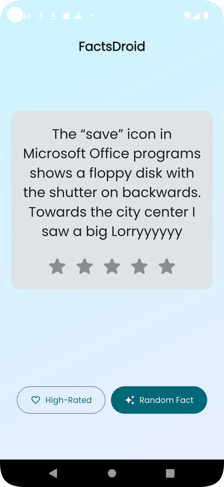

# 8kSec Factsdroid WriteUp

**GOAL**: Intercept network traffic in FactsDroid and view/modify the API requests and responses between FactsDroid and the backend server without statically patching the provided APK. The objective is to successfully implement a Machine-in-The-Middle (MITM) attack that allows you to manipulate the facts being displayed to the user, potentially inserting custom content or modifying the retrieved facts before they reach the application.

Upon installing the app using `adb install factsdroid.apk`, I immediately see this error message when launching the app:

In order to bypass the root check, I injected the [Frida anti-root script](https://codeshare.frida.re/@dzonerzy/fridantiroot/) into my APK:

`frida -U --codeshare dzonerzy/fridantiroot -f com.eightksec.factsdroid`

I was able to successfully bypass the root check:

I had earlier added Burp's CA certificate into my emulator and set up Burp to intercept all the network calls coming from my app by following [this tutorial](https://hacktivity.fr/setting-up-an-android-emulator-for-pentest/).

## SSL

SSL/TLS is at the application layer of the network and it ensures that the traffic transmitted between the client and the server is properly encrypted. When an API request is made, the app performs an SSL/TLS handshake between the client and the server to establish a secure channel.

**SSL Pinning**, on the other hand, is an extra layer of security implemented directly in the app's code to stop **Man-in-the-Middle (MITM)** attacks. Usually, an app trusts any certificate signed by a valid root **Certificate Authority** (**CA**) found in the device's trust store. However, with SSL pinning, instead of relying on the trust store, the app is hardcoded with a specific *pin* which is typically the *server’s public key* or its specific certificate.

During the TLS handshake, the app compares the server's certificate against this hardcoded pin. If they don't match exactly, the app kills the connection immediately, even if the certificate is technically valid or signed by a trusted authority. This prevents a pentester from using a self-signed certificate from a tool like Burp Suite to intercept and read the traffic, which is why we see the error below upon clicking the **Random Fact** button.

Therefore, I used Frida to bypass the SSL CA authenticity check using the following command (since this is a Flutter app):

`frida -U --codeshare dzonerzy/fridantiroot --codeshare TheDauntless/disable-flutter-tls-v1 -f com.eightksec.factsdroid`

After bypassing SSL pinning, I can now see the facts being rendered on the UI:

Ensure that **Verify Invisible Proxying** is enabled from the proxy settings -> Request Handling. After enabling this, I was able to intercept and modify the response to change the fact rendered on the UI.

