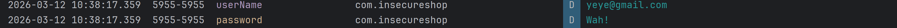

## Static Analysis With Drozer

### Package information

I started by enumerating the permissions declared by the app using the command `run app.package.list -f insecureshop`:

```shell
Package: com.insecureshop
  Application Label: InsecureShop
  Process Name: com.insecureshop
  Version: 1.0
  Data Directory: /data/user/0/com.insecureshop
  APK Path: /data/app/~~FIyUrbvYY3VB_X0IA7U5Iw==/com.insecureshop-Az0TW47ZRtrdfG9MlqBcNQ==/base.apk
  UID: 10110
  GID: [3003]
  Shared Libraries: [/system/framework/android.test.base.jar]
  Shared User ID: null
  Uses Permissions:
  - android.permission.INTERNET
  - android.permission.READ_EXTERNAL_STORAGE
  - android.permission.WRITE_EXTERNAL_STORAGE
  - android.permission.READ_CONTACTS
  - android.permission.WAKE_LOCK
  Defines Permissions:
  - com.insecureshop.permission.READ
```

### The IPC attack surface

To evaluate the attack surface exposed via Android's IPC layer, I ran the command `run app.package.attacksurface com.insecureshop`, which returned the following output:

```shell
Attack Surface:
  6 activities exported
  0 broadcast receivers exported
  1 content providers exported
  1 services exported
    is debuggable
```

The exported IPC components give an attacker several entry points into the app. Depending on the functionality wired to each activity, the content provider, and the service, any of them could be abused from an unrelated app on the device. I also noted that the app is debuggable, which means I can attach a debugger to the process over adb and step through the code at runtime.

### Installing the app

I installed the app with adb and was greeted by the login screen, which normally forces the user to authenticate before reaching any functionality. However, because six activities are exported, I can launch them directly through adb and explore the app without logging in first. I ran `run app.activity.info -a com.insecureshop` to enumerate the exported activities, which returned:

```shell
Package: com.insecureshop
  com.insecureshop.ChooserActivity
    Permission: null
  com.insecureshop.AboutUsActivity
    Permission: null
  com.insecureshop.ProductListActivity
    Permission: null
  com.insecureshop.WebViewActivity
    Permission: null
  com.insecureshop.WebView2Activity
    Permission: null
  com.insecureshop.ResultActivity
    Permission: null
```

Launching the activities individually didn't reveal much on its own, so I moved on to inspecting the content provider using the drozer command `run app.provider.info -a com.insecureshop`:

```shell
Package: com.insecureshop
  Authority: com.insecureshop.provider
    Read Permission: com.insecureshop.permission.READ
    Write Permission: null
    Content Provider: com.insecureshop.contentProvider.InsecureShopProvider
    Multiprocess Allowed: False
    Grant Uri Permissions: False
```

From this output I can see that:

* The app exposes a **content provider** with the authority **`com.insecureshop.provider`**, which other apps can query through the content URI `content://com.insecureshop.provider/products`.
* Read access is gated by the custom permission **`com.insecureshop.permission.READ`** declared in the app's `AndroidManifest.xml`.
* No permission is required for writes (`Write Permission: null`), which can allow unauthorized data modification depending on how the provider is implemented.
* The provider is implemented by the class **`com.insecureshop.contentProvider.InsecureShopProvider`**.
* It does **not support multiprocess access**, so it runs in a single process.
* It **does not grant temporary URI permissions** to other apps.

Read access is partially protected by the custom permission, but write operations are effectively unrestricted, which is worth digging into further once I reach the provider implementation.

### Manual code analysis

To try and bypass the login, I started by looking at the launcher activity that hands off to the Login Activity. Reading through the login logic, the first issue that jumped out was an instance of **OWASP Mobile Top 10 M9: Insecure Data Storage** caused by **unintentional data exposure** — the app writes both the username and password straight to logcat:

```java
Log.d("userName", username);
Log.d("password", password);
```

I confirmed that every value typed into the login form ends up in the log output:



Any app or user with access to the device logs can therefore harvest valid usernames and passwords straight from logcat.

Next, I looked at the `verifyUserNamePassword()` function in the `Util` class. It becomes clear from the code that the app **hardcodes the valid login credentials inside a `HashMap`** instead of retrieving them from a secure backend or database:

```java
private final HashMap<String, String> getUserCreds() {
    HashMap userCreds = new HashMap();
    userCreds.put("shopuser", "!ns3csh0p");
    return userCreds;
}
```

The method builds a `HashMap` containing a single username–password pair, where the username is `shopuser` and the password is `!ns3csh0p`. Because those credentials are embedded directly in the compiled app, anyone with the APK can pull them out through basic reverse engineering.

The `verifyUserNamePassword()` function then:

1. *checks whether the username supplied by the user exists as a key in the map,*
2. *retrieves the corresponding stored password if the username is found, and compares it to the password entered by the user,*
3. *returns `true` if the two values match, and `false` otherwise.*

Because the credentials are hardcoded, logging in with `shopuser` / `!ns3csh0p` succeeds every time. This is a straightforward security weakness — anyone analyzing the app can extract these credentials and gain unauthorized access.

This behavior maps to the **OWASP Mobile Top 10** risk **[M9: Insecure Data Storage](https://owasp.org/www-project-mobile-top-10/2023-risks/m9-insecure-data-storage.html)**. Hardcoding sensitive information such as login credentials inside the application code is unsafe because attackers can easily extract these values by reverse engineering the APK. OWASP defines insecure data storage as any case where sensitive data — passwords, tokens, authentication material — is stored without proper protection, encryption, or access controls, letting an attacker retrieve and abuse the information if they gain access to the app or the device.

In this case, storing the credentials (`shopuser` and `!ns3csh0p`) directly in the application code exposes them to anyone analyzing the app, which can lead to unauthorized access and compromise of user accounts.

**References to security standards:**

* **CWE-798:** *Use of Hard-coded Credentials* — flags any authentication material embedded directly in application code or configuration.
* **CWE-532:** *Insertion of Sensitive Information into Log File* — indicates that logging secrets such as passwords or authentication tokens is unsafe.
* **OWASP MASVS-STORAGE-3:** sensitive data, including authentication credentials, must never be written to logs or other insecure storage.

**Impact:** Hardcoding credentials and simultaneously logging them exposes the app to **unauthorized access and credential theft**, violating secure storage principles and best practices for mobile applications.


### AndroidManifest findings

1. `android:debuggable="true"` — debugging is enabled on the app, making it trivial for a reverse engineer to attach a debugger, dump stack traces, and access debugging helper classes. This maps to **CWE-489: Active Debug Code**.
2. `android:allowBackup="true"` — this flag allows anyone with USB debugging enabled to back up application data off of the device via adb, exposing sensitive files. This maps to **CWE-530: Exposure of Backup File to Unauthorized Control Sphere**.
3. Several activities declare intent filters. Any activity with an intent filter is automatically exported and reachable from other apps. Without an intent filter (and without `android:exported="true"`), the activity would only be startable from within the same app.

### Credentials broadcast in plaintext

On the About page, when the user clicks the *About InsecureShop* button, the `onSendData()` method is called:
```java
Intent intent = new Intent("com.insecureshop.action.BROADCAST");
intent.putExtra("username", userName);
intent.putExtra("password", password);
sendBroadcast(intent);
```

The snippet grabs the *username* and *password* from shared preferences and sends them out as a plain, unprotected broadcast. Because no receiver permission is specified on `sendBroadcast()`, any app on the device can register a receiver for `com.insecureshop.action.BROADCAST` and silently steal the credentials. This is a classic instance of **CWE-925: Improper Verification of Intent by Broadcast Receiver** and maps to **OWASP Mobile Top 10 M3: Insecure Authentication/Authorization** and **M9: Insecure Data Storage**.

### WebViews and deep links

Inspecting the *AndroidManifest.xml*, I noticed that **WebViewActivity** is marked as **BROWSABLE** and registers an **`android.intent.action.VIEW`** intent, which is the tell-tale sign of a deep link. The data section of the intent filter looks like this:
```java
<data
                    android:scheme="insecureshop"
                    android:host="com.insecureshop"/>

```

So the deep link scheme registered in the manifest is `insecureshop://com.insecureshop`, and it's handled by the exported `WebViewActivity`. To test exploitability, I crafted a deep link targeting the `/web` path:

```html
<html>
  <body>
    <a href="insecureshop://com.insecureshop/web?url=https://evil.com">Click me</a>
    <script>
      window.location = "https://evil-insecureshopapp.com";
    </script>
  </body>
</html>
```

Looking at the decompiled source in jadx, the `/web` handler extracts the `url` query parameter and passes it directly to `webview.loadUrl()` with no validation:

```java
data = data4.getQueryParameter("url");
// ...
webview.loadUrl(data);
```

I then confirmed that the deep link triggers the activity and loads the attacker-controlled URL by running:

```bash
adb shell am start -a android.intent.action.VIEW \
  -d "insecureshop://com.insecureshop/web?url=https://evil.com"
```

InsecureShop opened and loaded `evil.com` inside its WebView, confirming that an attacker can force the app to load any URL without restriction.

To simulate the full drive-by scenario, I served the proof-of-concept page above using `python3 -m http.server 8081`, then browsed to it from the Android Studio emulator at `http://10.0.2.2:8081`. Tapping the link inside the emulator's browser fired the deep link, and `evil.com` was loaded inside the InsecureShop WebView.


This vulnerability aligns with **OWASP Mobile Top 10 2024 — M4: Insufficient Input/Output Validation** and **CWE-939: Improper Authorization in Handler for Custom URL Scheme**. Mobile apps that fail to properly validate and sanitize data from external sources — deep links included — are at risk of exactly this kind of abuse. Here, the app never validates the `url` parameter extracted from the deep link before handing it to `webview.loadUrl()`, so an attacker can supply any URL they like. OWASP notes that such weaknesses can lead to unauthorized access to sensitive data and manipulation of app functionality, both of which are achievable here when chained with the insecure WebView settings discussed below.

### Improper URL sanitization

While reviewing `WebViewActivity`, I identified a second deep link path `/webview` that *tries* to restrict URLs to those ending with `insecureshopapp.com`:

```java
if (StringsKt.endsWith$default(queryParameter, "insecureshopapp.com", false, 2, null)) {
    data = data3.getQueryParameter("url");
}
```

The developer tried to implement host validation, but `endsWith()` alone is not enough. The check only verifies that the URL string *ends with* `insecureshopapp.com` — it never parses the URL or validates the actual host component. An attacker can bypass the check by registering a domain such as `evil-insecureshopapp.com` and crafting the following deep link:

```
insecureshop://com.insecureshop/webview?url=https://evil-insecureshopapp.com
```

This passes the `endsWith()` check while loading a fully attacker-controlled domain in the WebView. The correct fix is to parse the URL, extract the actual host with `Uri.getHost()`, and compare it against an explicit allowlist rather than a suffix match:

```java
Uri parsedUrl = Uri.parse(queryParameter);
if (parsedUrl.getHost().equals("insecureshopapp.com")) {
    // safe to load
}
```

As a general rule, any URL passed to `shouldOverrideUrlLoading()`, `loadUrl()`, or `evaluateJavascript()` should be verified against an allowlist of expected hosts before it ever reaches the WebView.

**References:**

* OWASP Mobile Top 10 2024 — M4: Insufficient Input/Output Validation
* CWE-184: Incomplete List of Disallowed Inputs
* CWE-20: Improper Input Validation

### Access to protected components

I also noticed a `PrivateActivity` declared in the manifest with `android:exported="false"`, which is worth revisiting when I explore whether any exported component can be abused to launch it indirectly.

### Content providers

In the Android security model, each app's internal data is protected and other apps cannot reach it directly. They can only access shared data stored in external storage, or internal app data that is deliberately exposed through content providers. Inside **InsecureShopProvider** I found logic that fetches the username and password stored in shared preferences and packs them into a cursor:

```java
MatrixCursor cursor = new MatrixCursor(new String[]{"username", "password"});
String[] strArr = new String[2];
String username = Prefs.INSTANCE.getUsername();
// ...
strArr[0] = username;
String password = Prefs.INSTANCE.getPassword();
// ...
strArr[1] = password;
cursor.addRow(strArr);
return cursor;

```

The URI that triggers this code path is `content://com.insecureshop.provider/insecure`. Any app that queries that URI gets back a cursor containing the `username` and `password` of the logged-in user. The provider does declare a custom permission `android:readPermission="com.insecureshop.permission.READ"`, but because that permission is defined with the default `signature`/`normal` protection level and the app itself sets `android:protectionLevel` weakly, a malicious app can simply declare `<uses-permission android:name="com.insecureshop.permission.READ"/>` in its own manifest and be granted access. This maps to **CWE-926: Improper Export of Android Application Components** and **OWASP Mobile Top 10 M3: Insecure Authentication/Authorization**.

### Backup enabled

`android:allowBackup="true"` is set on the app, which allows any user with USB debugging to pull a full copy of the app's private data off the device using `adb backup`. Combined with the credential logging and hardcoded secrets discussed earlier, this is another path to full credential compromise. Reference: **CWE-530: Exposure of Backup File to Unauthorized Control Sphere**.

### Wake lock

The app requests `android.permission.WAKE_LOCK` in the manifest without any obvious feature that requires keeping the device awake. Over-broad permissions like this widen the app's attack surface and violate the principle of least privilege — worth flagging as a hardening finding even though it isn't directly exploitable on its own.