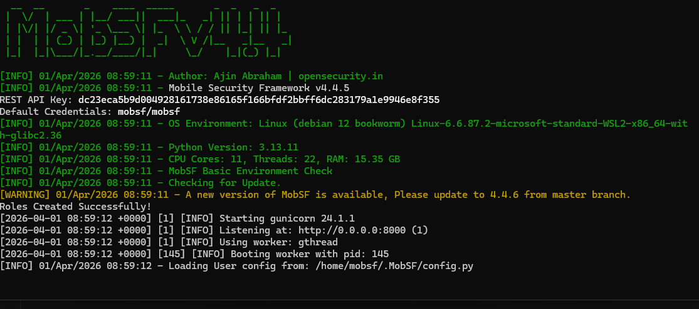
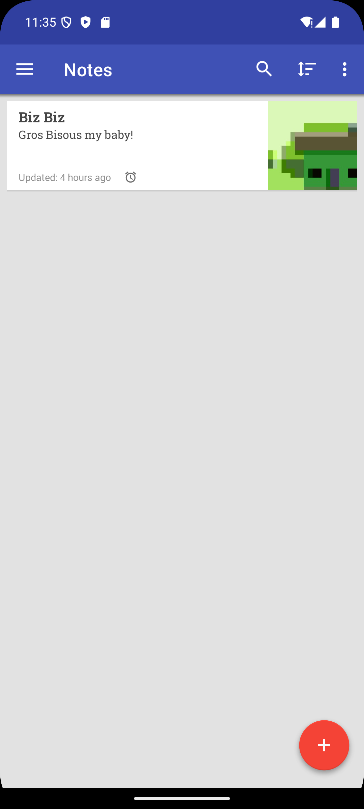

# Tools and Procedures I Use for Mobile Pentesting on Android

## Frida

Used to dynamically inject JavaScript scripts to bypass app functionality such as anti-root checks.

## Grapefruit

I start the Frida server on my emulator and then run `npx igf` to start the Grapefruit web console.

I first install the app I want to test, then select the emulator that already has the Frida server running. I then see a list of all the apps and select the one I want to test. If all goes well, I should see a green connected icon; if I see a red connection error message, I need to analyze the logs in the terminal window running `npx igf` to find the issue.

<video controls src="20260401-0830-15.6677075.mp4" title="Grapefruit walkthrough"></video>

## MobSF

I run MobSF in Docker to help with reconnaissance and static analysis of the Android app.



## Ghidra and IDA

Used to reverse engineer binary `.so` files.

## Blutter

Used to reverse engineer Flutter apps through the [libapp.so file](https://github.com/worawit/blutter). With Blutter, I reverse engineer the native binary file that contains the Dart source code logic. After that, I can analyze the app. I generally use WSL to decompile, for example: `python3 blutter.py /mnt/c/Users/Florence/Desktop/8ksec/DroidPass.apk/DroidPass/lib/arm64-v8a/ output --rebuild`.


## Exploiting Omninotes




# Android Deeplinks

 Deep links are URIs of any scheme that take users directly to specific content in an app. They are used to define custom URLs for an android app. An qpp defines a deeplink is defined in the android manifest by adding an intent filter and also specifying the schema and the host for an application e.g

```xml
<intent-filter>
                <action android:name="android.intent.action.VIEW"/>
                <category android:name="android.intent.category.DEFAULT"/>
                <data
                    android:scheme="androgoat"
                    android:host="vulnapp"/>
            </intent-filter>
```


 Unlike **Applinks** that only handle HTTP and HTTPs, deeplinks can handle any default schema. Applinks include the `android:autoVerify="true"` in the Android Manifest `<intent-filter>`


