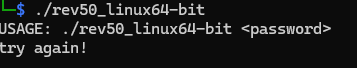
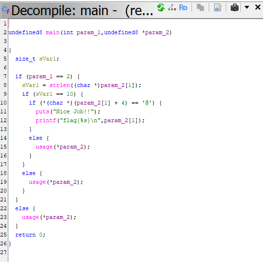
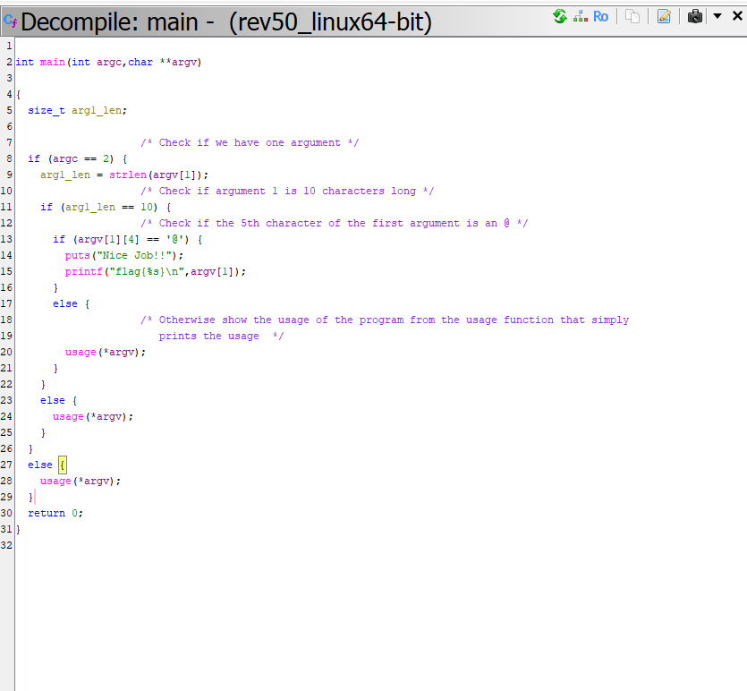

# Reverse Engineering

Decompiling a program from assemnly back to high level language to try and understand what the program does. 

Example uses cases: 

- Vulnerability Analysis
- Malware Research 

## **Binary Analysis Tools Summary (Ghidra Book, Ch. 2)**

#### **1. `file`**
*   **What:** Identifies the file format (ELF, PE, Mach-O), architecture (x86, ARM), and bit-width (32/64-bit).
*   **When:** **Step 1 (Triage).** Use it the moment you receive a mystery file.
*   **Why vs Others:** Use this instead of `nm` or `objdump` initially because it tells you if the file is even an executable or if it is "stripped" (missing names).
*   **Example Command:** `file <filename>`

#### **2. `strings`**
*   **What:** Scans the entire file for sequences of printable characters (ASCII/Unicode).
*   **When:** **Initial Recon.** Use it to find hardcoded passwords, IP addresses, URLs, or developer comments.
*   **Why vs Others:** Unlike `nm`, which only looks at official "names" (symbols), `strings` finds human-readable text hidden anywhere in the binary's raw data.
*   **Example Command:** `strings -a <filename>`

#### **3. `nm`**
*   **What:** Lists the "Symbol Table"—the names of functions and global variables used in the code.
*   **When:** **Function Discovery.** Use it to find the `main` entry point or identify specific logic like `validate_key`.
*   **Why vs Others:** It provides a much cleaner "Table of Contents" than `objdump`. If you just need a list of functions without seeing the code, this is the fastest tool.
*   **Example Command:** `nm -D <filename>`

#### **4. `ldd`**
*   **What:** Prints the shared libraries (dependencies) that the program needs to run.
*   **When:** **Dependency Analysis.** Use it to see what external tools the program relies on (e.g., encryption or networking libraries).
*   **Why vs Others:** Unlike `readelf`, `ldd` shows you exactly where those libraries are located on *your* specific system.
*   **Example Command:** `ldd <filename>`

#### **5. `objdump`**
*   **What:** The "Swiss Army Knife" for displaying headers, section info, and raw disassembly.
*   **When:** **Deep Dive (CLI).** Use it when you want to see the actual assembly code without opening a GUI like Ghidra.
*   **Why vs Others:** It is the only tool in this list that can actually **disassemble** machine code into human-readable assembly instructions.
*   **Example Command:** `objdump -d <filename>`

#### **6. `readelf`**
*   **What:** Displays extremely detailed technical information about the ELF (Linux) file header and sections.
*   **When:** **Structure Analysis.** Use it to find the exact memory addresses of the `.text` (code) or `.data` (variables) sections.
*   **Why vs Others:** It is **safer** than `ldd` because it only reads the file header and never attempts to execute any part of the binary.
*   **Example Command:** `readelf -h <filename>`

---

**NOTE:** If a binary is **Stripped**, `nm` will fail. Your best alternatives are then **`strings`** (to find text clues) or **`objdump -d`** (to manually read the assembly logic).

## Reversing with GHIDRA 

## Challenge 1

Reverse Engineering [CBM hacker's easy_reverse](https://crackmes.one/crackme/5b8a37a433c5d45fc286ad83) with Ghidra. After unzipping the file and getting access to the executable I ran it with the command `./rev50_linux64-bit` and see that it expects me to pass the password as an argument:

I then decompiled the excecutrable file using Ghidra and selected the main function from the Symbol Tree which loads the decompiled main function code in the Decompiled Window as shown below:

I proceed to change the main undefuined signature above to the C standard signature  `int main(int argc, char *argv[])`.

The code now looks much cleaner and easy to read so I proceeded to analyze the code while adding comments:

### 1. The Argument Count (`argc`)

First, the program checks if two arguments are passed using`argc == 2` where `argv[0]` is the name of the program in C. Therefore, `argc == 2` means the program expects exactly one user-provided argument. If you run the program without an argument, it calls the usage function and exits.

### 2. The String Length

Next, it checks the length of the user input using `strlen` to ensure it is exactly 10 characters long `arg1_len == 10`. 

### 3. The Character Check

This is the specific requirement  `argv[1][4] == '@'` that checks if the 5th character of the user provided input is an @ symbol

Given this information we are able to deduce how to obtain the flag by crafting an argument that satistifies all the conditions listed above as shown in the following screenshot:

## Challenge 2

