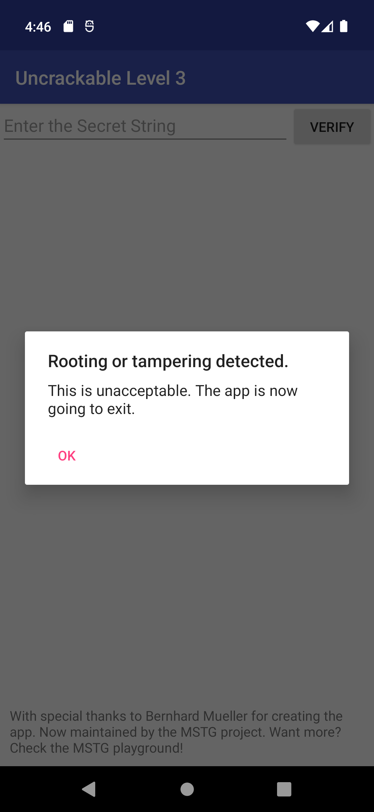
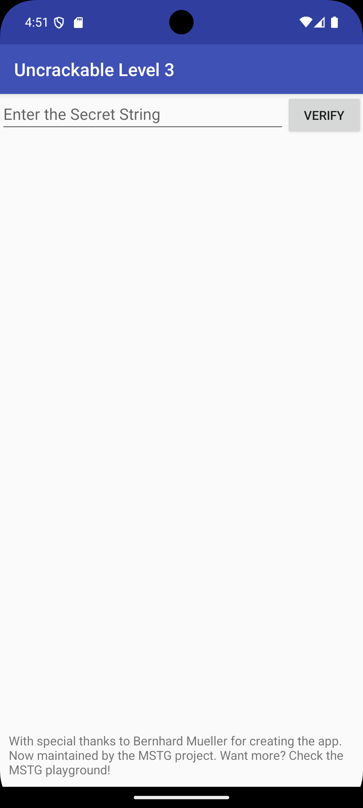

## Step 1: Root detection bypass

As soon as I install and open the app on a rooted emulator, I see that the app implements run time protection measures (both anti-tampering and anti-debugging also seen by the app checking the CRC of the native library to verify that the app has not been decompiled, functionality changed and recompiled again. If it detects tampering it fails with a "tampering detected error") by checking if the app is running on a rooted device.



## Step 2: Install the app on an unrooted emulator

The UI is asking for a string value. 




Step 3: Decompile the apk with Jadx/MobSF and do static analysis

After decompiling I see there is this `check_code()` function that is used to check if the functionality is correct or incorrect. After checking it seems to be calling `bar()` that is a function loaded by the external library `libfoo.so`.

```java
public boolean check_code(String str) {
        return bar(str.getBytes());
    }
```

This shows that the string is hidden in the native code, additionally we have an xor key.

## Step 3: Decompiling the libfoo.so file

I see the function `Java_sg_vantagepoint_uncrackable3_CodeCheck_bar()` function which implemlents the functionality to check if the secret is correct.


